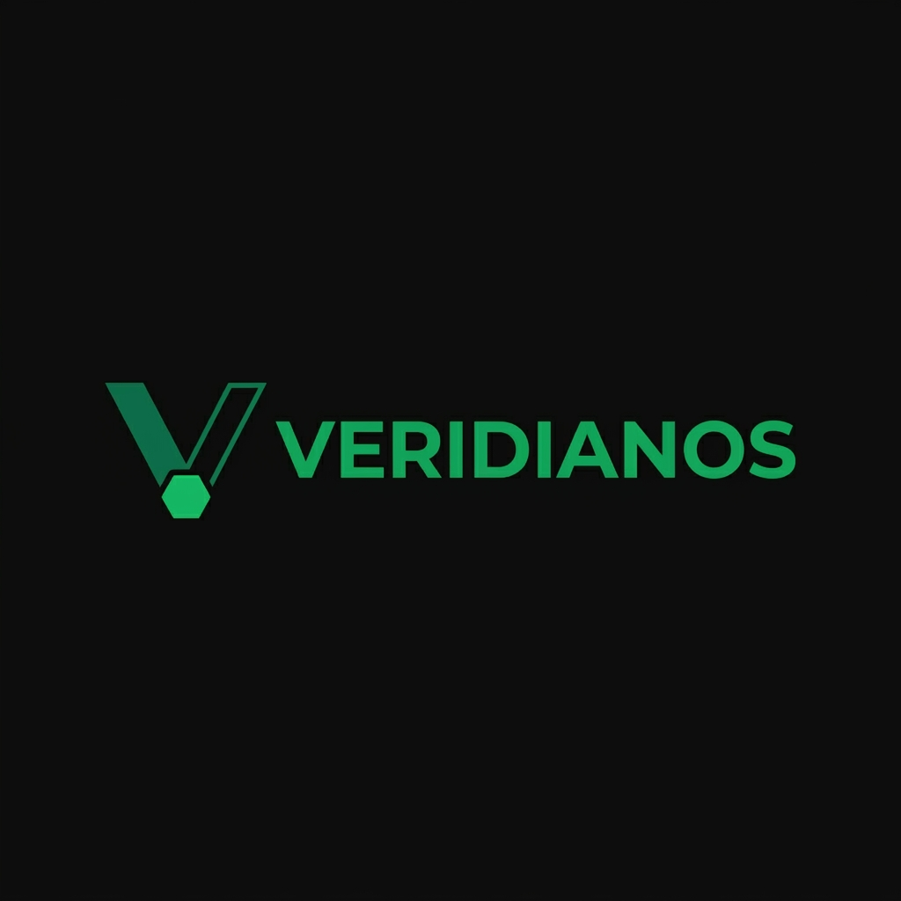

<div align="center">
  

  #  VeridianOS
  
  **The AI-Native, Capability-Based Operating System for the Next Era of Distributed Computing**

  [](https://opensource.org/licenses/MIT)
  [](https://opensource.org/licenses/Apache-2.0)
  [](https://riscv.org/)
  [](https://www.rust-lang.org/)
  [](#-project-roadmap)
</div>

---

##  Introduction

**VeridianOS** is a clean-slate, open-source microkernel operating system written from scratch in **Rust** for the **RISC-V 64** architecture. Built to address the limitations of 40-year-old operating system paradigms, VeridianOS introduces an **AI-native microkernel architecture** designed to host, secure, schedule, and orchestrate cooperative AI agents and distributed multi-kernel coherence protocols natively in kernel-space.

> [!NOTE]
> VeridianOS treats machine learning operations, neural execution graphs, and distributed capability sharing as primary microkernel abstractions rather than user-space application details.

---

##  Key Architectural Pillars

### 1.  AI Agents as First-Class Citizens
Traditional kernels schedule threads; VeridianOS schedules **AI agents**. The microkernel exposes dedicated agent processes (`AgentProcess`) and bidirectional capability-secured channels (`AgentChannel`) to allow agents to safely communicate, spawn child subprocesses, and cooperatively execute workloads without the overhead of heavy user-space runtime layers.

### 2.  Object-Capability Security Model
VeridianOS enforces a zero-trust, capability-based security model inspired by `seL4` and `Fuchsia's Zircon`. There is no ambient authority (no `root` user, no global file permissions).
* Every resource—physical memory, CPU time, agent channel, filesystem node, and hardware device—is represented as a kernel object.
* User processes access these objects exclusively via unforgeable, kernel-managed tokens called **Handles** with strictly attenuated rights bitmasks.

### 3.  Semantic Knowledge Graph Filesystem (SGF)
Replacing hierarchical file paths (`/bin/sh`, `/etc/passwd`), VeridianOS implements a capability-secured **graph database** in supervisor mode.
* **Nodes** represent typed entities (e.g., binaries, raw VMO data, agent states).
* **Edges** represent semantic relationships (e.g., `DEPENDS_ON`, `EXECUTES_WITH`, `SECURED_BY`).
* Files are queried using semantic relationship predicates, enabling relational graph traversal directly through supervisor system calls.

### 4.  Self-Improving Kernel Policies
The **Neural Execution Subsystem (NES)** schedules complex Directed Acyclic Graph (DAG) task structures across heterogeneous hardware queues (CPU, GPU, NPU). 
* Using an online **$\epsilon$-greedy policy router**, the kernel observes execution times using CPU hardware cycle counters (`rdtime` CSR).
* Latencies are folded into kernel-space performance tables via **exponential moving averages (EMA)** ($\alpha = 0.2$), causing scheduling decisions to dynamically converge to the empirically fastest physical hardware.

### 5.  Distributed Multi-Kernel Coherence (Phase 11)
VeridianOS establishes cluster coherence across multiple physical nodes or virtual hardware harts via the **Distributed Kernel Coherence Protocol (DKCP)**:
* **Lock-Free Atomic SPSC Ring Buffers** (`DkcpRing`) facilitate fast inter-hart transport.
* **Distributed Capability Transfer Protocol (DCTP)** securely shares, tracks, and revokes handles across machine boundaries.
* **S-Mode Raft Consensus Engine** replicates Semantic Graph Filesystem (SGF) structural updates across the cluster.

---

##  Microkernel System Layout

```
                  ┌────────────────────────────────────────────────────────────┐
                  │                         USER SPACE                         │
                  │   ┌──────────────┐  ┌──────────────┐  ┌──────────────┐    │
                  │   │   AI Agent   │  │   AI Agent   │  │  User App    │    │
                  │   │   Process A  │  │   Process B  │  │ (POSIX Lyr)  │    │
                  │   └──────┬───────┘  └──────┬───────┘  └──────┬───────┘    │
                  │          │                 │                  │            │
                  │   ┌──────▼─────────────────▼──────────────────▼──────┐    │
                  │   │              Intent Resolution Layer              │    │
                  │   │      (Natural language → OS system calls)        │    │
                  │   └───────────────────────┬────────────────────────── ┘   │
                  ├───────────────────────────┼────────────────────────────────┤
                  │                     SUPERVISOR MODE                        │
                  │   ┌───────────────────────▼────────────────────────────┐   │
                  │   │                  VERIDIAN KERNEL                   │   │
                  │   │  ┌────────────┐  ┌────────────┐  ┌────────────┐   │   │
                  │   │  │ Capability │  │Self-Improve│  │  Semantic  │   │   │
                  │   │  │   Manager  │  │  Scheduler │  │  Graph DB  │   │   │
                  │   │  └────────────┘  └────────────┘  └────────────┘   │   │
                  │   │  ┌────────────┐  ┌────────────┐  ┌────────────┐   │   │
                  │   │  │ Page Table │  │   Agent    │  │  Distributed│  │   │
                  │   │  │  Manager   │  │  Runtime   │  │  Coherence │   │   │
                  │   │  └────────────┘  └────────────┘  └────────────┘   │   │
                  │   └────────────────────────────────────────────────────┘   │
                  └────────────────────────────────────────────────────────────┘
```

---

##  Quick Start (QEMU Emulation)

Boot VeridianOS on a simulated 64-bit RISC-V computer in QEMU with a single command.

### Prerequisites

Ensure you have the Rust toolchain and the QEMU emulator installed:

```bash
# macOS
brew install qemu
curl --proto '=https' --tlsv1.2 -sSf https://sh.rustup.rs | sh
```

### Build & Run

```bash
# Clone the repository
git clone https://github.com/hanvith/VeridianOS.git
cd VeridianOS

# Build everything (user-space binaries & kernel image) and boot in QEMU
make run
```

To exit the QEMU console, press `Ctrl+A` followed by `X`.

---

##  Project Roadmap

- [x] **Phase 1: Bootable RISC-V Microkernel** — Assembly bootloader, linker configuration, UART driver, and supervisor-mode entry.
- [x] **Phase 2: Capability System Foundation** — Handles, handle tables, rights attenuation, and secure trap routing.
- [x] **Phase 3: Page Allocator & Sv39 VM** — Binary Buddy page allocator and three-level page tables mapping user space.
- [x] **Phase 4: Preemptive Thread Scheduler** — Multi-threaded multitasking, context switching, and timer-driven preemption.
- [x] **Phase 5: VirtIO Block Driver & InitRAMFS** — VirtIO block devices, POSIX ustar tar filesystem scanner.
- [x] **Phase 6: ELF Loader & User Mode Transition** — Parse ELF headers, stack initialization, and Ring 3 execution.
- [x] **Phase 7: Neural Execution Subsystem** — Heterogeneous queues (CPU, GPU, NPU) and DAG schedulers.
- [x] **Phase 8: Semantic Graph Filesystem** — Secure graph database replacing hierarchical paths.
- [x] **Phase 9: Agent Runtime** — Kernel-space AI agents, message passing, and lifecycle syscalls (70-74).
- [x] **Phase 10: Self-Improving Kernel Policies** — Latency profiling via cycle counters, $\epsilon$-greedy device router, online EMA stats updates.
- [x] **Phase 11: Distributed Multi-Kernel Coherence** — Atomic SPSC rings, Distributed Capabilities (DCTP), and S-mode Raft replication.

---

##  Academic Foundations

VeridianOS incorporates theories and paradigms from major systems research:

* **AI-Native Kernels**: *LithOS: An Operating System for Efficient Machine Learning on GPUs* (SOSP '25)
* **Memory Safety & Framekernels**: *Asterinas: A Linux ABI-Compatible, Rust-Based Framekernel OS* (USENIX ATC '25)
* **Formal Capability Verification**: *seL4: Formal Verification of an OS Kernel* (SOSP '09) and *Google Fuchsia's Zircon Kernel*.
* **Online Adaptive Systems**: Sutton & Barto, *Reinforcement Learning: An Introduction* (MIT Press, 2018), §2.2 — Action-Value Methods.

---

##  License

VeridianOS is dual-licensed under:
* Apache License, Version 2.0 ([LICENSE-APACHE](LICENSE-APACHE) or http://www.apache.org/licenses/LICENSE-2.0)
* MIT License ([LICENSE-MIT](LICENSE-MIT) or http://opensource.org/licenses/MIT)
