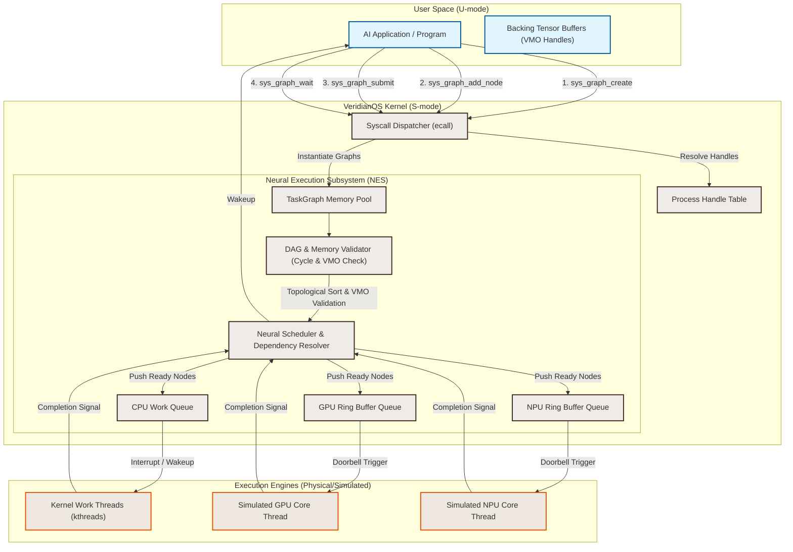

# VeridianOS Phase 7 Design Specification: Neural Scheduler & Heterogeneous Queues

| Attribute | Specification Details |
| :--- | :--- |
| **Document Version** | 1.0.0-draft |
| **Status** | Approved for Implementation |
| **Target Architecture** | RISC-V 64-bit (Sv39 Paging, Supervisor Mode) |
| **Kernel Model** | Capability-Secured Microkernel |
| **Subsystem** | Neural Execution Subsystem (NES) |

---

## 1. Executive Summary & Architecture Overview

Modern Deep Learning and AI workloads are heavily bottlenecked by host-to-accelerator context switching and scheduling latencies. In standard operating systems, executing a neural network layer translates to a user-space framework (e.g., PyTorch, TensorFlow) calling a device driver runtime (e.g., CUDA, ROCm) which invokes kernel-space `ioctl` calls or issues commands to user-space hardware daemons. For short-lived operations (e.g., Pointwise Activations, Vector Addition), this boundary transition overhead dominates execution time.

VeridianOS Phase 7 addresses this inefficiency by introducing the **Neural Execution Subsystem (NES)** directly inside the microkernel. Userspace processes define AI computations as Directed Acyclic Graphs (DAGs) of operator nodes, which are verified, optimized, and dispatched to device-specific queues (**HeterogeneousQueues**) entirely within Supervisor mode (S-mode). By representing compute graphs and execution engines as capability-secured kernel objects, VeridianOS guarantees process isolation and execution safety for hardware accelerators.

### System Architecture



---

## 2. Design Goals

### 2.1 Zero-Overhead Context Switching
Standard operating systems require CPU intervention and context switches for every execution stage of a neural network. For an $N$-layer network, this results in at least $2N$ context switches. VeridianOS Phase 7 allows userspace to define a multi-stage neural network as a single **TaskGraph** in kernel memory and submit it in one system call. The kernel-level scheduler automatically dispatches ready tasks sequentially or concurrently to the corresponding queues without returning to userspace, reducing execution boundaries to exactly two context switches: graph submission and graph completion.

### 2.2 Capability-Secured Compute Enclaves
A recurring vulnerability in shared-resource hardware systems is raw physical address leakage or queue poisoning. VeridianOS enforces a strict capability security model where all memory arrays (tensors) are represented via Virtual Memory Objects (VMOs) in the process's handle table. The accelerator devices and execution graphs themselves are also encapsulated as capability-secured kernel objects:
* A process can only read graph structures if it holds a `Handle` with `Rights::READ`.
* A process can only append nodes if it holds `Rights::WRITE`.
* A process can only submit the graph to a queue if it holds `Rights::EXECUTE` for both the graph and the destination device queue.
The kernel translates capability handles into verified physical base addresses at dispatch time, ensuring memory safety.

### 2.3 Enforced Execution Graph Safety
Submitting circular graphs or graphs with invalid dependencies can crash hardware queues or cause kernel-level deadlocks. Before execution, the NES performs a zero-allocation cycle detection pass using a stack-based Depth-First Search (DFS). Furthermore, the kernel validates that every output tensor does not overlap with read-only mappings, and that all inputs and outputs fall entirely within VMO boundaries owned by the calling process.

---

## 3. Core Abstractions & Rust Implementations

To ensure high-performance, predictable, and memory-safe execution inside a `no_std` kernel environment, all data structures are designed with fixed sizes to avoid dynamic heap fragmentation. They utilize static slab allocations representing kernel resource pools.

### 3.1 Object Type Expansion
We expand the core capability framework's `ObjectType` to govern graph structures and hardware queues:

```rust
// kernel/src/capability/mod.rs

#[derive(Debug, Clone, Copy, PartialEq, Eq)]
pub enum ObjectType {
    None,
    Process,
    Thread,
    Channel,
    VirtualMemoryObject, // VMO representing raw physical backing frame pages
    TaskGraph,           // Representing a DAG computation
    DeviceQueue,         // Representing a heterogeneous device command ring buffer
}
```

### 3.2 Tensor Descriptors and Operator Types

```rust
// kernel/src/nes/types.rs

#[repr(u32)]
#[derive(Debug, Clone, Copy, PartialEq, Eq)]
pub enum DataType {
    F32 = 0,
    F16 = 1,
    BF16 = 2,
    Int8 = 3,
}

#[repr(u32)]
#[derive(Debug, Clone, Copy, PartialEq, Eq)]
pub enum OpType {
    GEMM = 1,
    Convolution = 2,
    VectorAdd = 3,
    Activation = 4, // ReLU, GeLU, etc.
    LayerNorm = 5,
    Softmax = 6,
}

#[repr(u32)]
#[derive(Debug, Clone, Copy, PartialEq, Eq)]
pub enum DeviceType {
    Cpu = 0,
    Gpu = 1,
    Npu = 2,
}

#[repr(C)]
#[derive(Debug, Clone, Copy)]
pub struct TensorDescriptor {
    pub vmo_handle: usize,     // Local process handle ID pointing to a VMO
    pub offset: usize,         // Byte offset inside the physical memory object
    pub size: usize,           // Total buffer size in bytes
    pub shape: [usize; 4],     // Up to 4D tensor dimension tracking
    pub strides: [usize; 4],   // Dimension stride values for memory layout
    pub data_type: DataType,   // Element data type representation
}
```

### 3.3 TaskNode & TaskGraph Representation

The `TaskGraph` contains a fixed array of `TaskNode` objects. Dependencies are represented as an adjacency list of predecessor node indices.

```rust
// kernel/src/nes/graph.rs

pub const MAX_NODES_PER_GRAPH: usize = 64;
pub const MAX_DEPENDENCIES: usize = 8;
pub const MAX_INPUTS: usize = 4;
pub const MAX_OUTPUTS: usize = 2;

#[derive(Debug, Clone, Copy, PartialEq, Eq)]
pub enum NodeState {
    Pending,
    Ready,
    Running,
    Completed,
    Failed(isize),
}

#[repr(C)]
#[derive(Debug, Clone, Copy)]
pub struct TaskNode {
    pub node_id: usize,
    pub op_type: OpType,
    pub execution_target: DeviceType,
    pub state: NodeState,
    
    // Memory references mapped from user VMO handles
    pub num_inputs: usize,
    pub inputs: [TensorDescriptor; MAX_INPUTS],
    
    pub num_outputs: usize,
    pub outputs: [TensorDescriptor; MAX_OUTPUTS],
    
    // DAG Dependency trackers (Predecessor IDs)
    pub dependency_count: usize,
    pub dependencies: [usize; MAX_DEPENDENCIES],
    
    // Dynamic execution state tracks remaining unmet dependencies
    pub remaining_dependencies: usize,
}

pub struct TaskGraph {
    pub graph_id: usize,
    pub owner_pid: usize,
    pub validated: bool,
    pub active_execution: bool,
    
    pub num_nodes: usize,
    pub nodes: [TaskNode; MAX_NODES_PER_GRAPH],
    
    // Adjacency lists for graph traversal (Successors mapping)
    // node_successors[u] contains the list of nodes that depend on u
    pub node_successors: [[usize; MAX_DEPENDENCIES]; MAX_NODES_PER_GRAPH],
    pub successor_counts: [usize; MAX_NODES_PER_GRAPH],
}
```

### 3.4 Heterogeneous Execution Queues

Hardware engines process work via circular ring buffers mapped to either physical hardware slots or S-mode simulation workers.

```rust
// kernel/src/nes/queue.rs

pub const QUEUE_RING_SIZE: usize = 128;

#[repr(C)]
#[derive(Debug, Clone, Copy)]
pub struct QueueDescriptor {
    pub graph_id: usize,
    pub node_id: usize,
    pub op_type: OpType,
    
    // Translated physical addresses (Kernel verifies VMO and populates these fields)
    pub num_inputs: usize,
    pub inputs_phys: [usize; MAX_INPUTS],
    pub input_sizes: [usize; MAX_INPUTS],
    
    pub num_outputs: usize,
    pub outputs_phys: [usize; MAX_OUTPUTS],
    pub output_sizes: [usize; MAX_OUTPUTS],
}

pub struct HeterogeneousQueue {
    pub device_type: DeviceType,
    pub ring: [QueueDescriptor; QUEUE_RING_SIZE],
    pub head: usize,        // Write index: updated by the kernel scheduler
    pub tail: usize,        // Read index: updated by the execution hardware/thread
    pub doorbell_reg: usize, // Physical or simulated MMIO doorbell register address
}

impl HeterogeneousQueue {
    /// Inserts a task descriptor into the ring buffer.
    pub fn enqueue(&mut self, desc: QueueDescriptor) -> Result<(), &'static str> {
        let next_head = (self.head + 1) % QUEUE_RING_SIZE;
        if next_head == self.tail {
            return Err("Queue ring buffer is full");
        }
        self.ring[self.head] = desc;
        self.head = next_head;
        self.trigger_doorbell();
        Ok(())
    }

    /// Triggers the doorbell to notify the execution core.
    fn trigger_doorbell(&self) {
        unsafe {
            let ptr = self.doorbell_reg as *mut u32;
            core::ptr::write_volatile(ptr, 1);
        }
    }
}
```

---

## 4. Capability-Secured Resource Access

The process interacts with the NES exclusively through secure handles. This isolation flow enforces strict separation:

```
[User-Space Program]
       │
       ├─► [Handle ID 3] ──► ObjectType::TaskGraph  ──► Kernel TaskGraph Struct
       ├─► [Handle ID 4] ──► ObjectType::DeviceQueue ──► Kernel GPU Queue Struct
       └─► [Handle ID 5] ──► ObjectType::VMO         ──► Physical Pages (0x80F0_0000)
```

### 4.1 Fine-grained Rights Enforcements
VeridianOS maps graph operations to capability rights flags:

| Action | Required Object Type | Required Rights | Rationale |
| :--- | :--- | :--- | :--- |
| **Add Node** | `ObjectType::TaskGraph` | `Rights::WRITE` | Modifying graph structure requires mutation privileges. |
| **Submit Graph** | `ObjectType::TaskGraph` & `ObjectType::DeviceQueue` | `Rights::EXECUTE` (on graph) & `Rights::WRITE` (on queue) | Prevents processes from hogging hardware engines or running foreign execution trees. |
| **Wait/Poll** | `ObjectType::TaskGraph` | `Rights::READ` | Reading completion status or profiling data requires read rights. |
| **VMO Inputs** | `ObjectType::VirtualMemoryObject` | `Rights::READ` | Input tensors must only be read from readable VMO buffers. |
| **VMO Outputs** | `ObjectType::VirtualMemoryObject` | `Rights::WRITE` | Output tensors must have write capabilities to receive calculations. |

### 4.2 Translation and Verification Logic
When `sys_graph_submit` is called:
1. **Handle Resolution**: The kernel locks the process's `HandleTable` and retrieves the `TaskGraph` reference using the graph handle ID.
2. **Rights Verification**: The kernel checks if `graph_handle.rights` contains `Rights::EXECUTE`.
3. **Queue Verification**: The kernel retrieves the `DeviceQueue` handle and confirms it is indeed a `DeviceQueue` object and contains `Rights::WRITE`.
4. **VMO Translation**: For each node in the graph, the kernel takes the user-provided `vmo_handle` ID, queries the process's handle table, verifies the process owns the VMO, validates the rights (`READ` for input, `WRITE` for output), translates the VMO's base virtual address to the underlying physical frame pages mapped in the page table, and fills in `inputs_phys` and `outputs_phys` in the `QueueDescriptor`.

> [!IMPORTANT]
> The user-space process **never** sees or manipulates physical memory addresses. All coordinates are validated at the kernel boundary before being passed to simulated or real hardware DMA.

---

## 5. System Call Interface Specification

System calls use the standard RISC-V Supervisor binary interface. Registers map as follows:
* **`a7`**: System Call Identifier Number
* **`a0` – `a4`**: Call Arguments
* **`a0`**: Return Value (0 or positive for success; negative value representing standard errno).

```
System Call Numbers:
SYS_GRAPH_CREATE     = 50
SYS_GRAPH_ADD_NODE   = 51
SYS_GRAPH_SUBMIT     = 52
SYS_GRAPH_WAIT       = 53
```

### 5.1 `sys_graph_create`
Allocates a blank task graph from the kernel's static task graph pool and registers a new capability handle inside the process's handle table.

* **Register Mapping**:
  * `a7` = `50`
* **C-Style Signature**:
  ```c
  int sys_graph_create(void);
  ```
* **Return Values**:
  * Success: Handle ID ($0 \le \text{handle\_id} < 256$).
  - Failure:
    - `-ENOMEM` (-12): Graph pool or local process handle table is full.

---

### 5.2 `sys_graph_add_node`
Appends a neural compute operator to the specified task graph.

* **Register Mapping**:
  * `a7` = `51`
  * `a0` = `graph_handle` (usize)
  * `a1` = `op_type` (usize representing the `OpType` enum value)
  * `a2` = `config_ptr` (usize pointing to the user space `NodeConfig` structure)
  * `a3` = `dependency_count` (usize)
  * `a4` = `dependency_array_ptr` (usize pointing to an array of predecessor Node IDs)
* **User-Space Configurations**:
  ```c
  struct NodeConfig {
      uint32_t execution_target; // 0 = CPU, 1 = GPU, 2 = NPU
      uint32_t num_inputs;
      struct TensorDescriptor inputs[4];
      uint32_t num_outputs;
      struct TensorDescriptor outputs[2];
  };
  ```
* **C-Style Signature**:
  ```c
  int sys_graph_add_node(unsigned int graph_handle, 
                         unsigned int op_type, 
                         const struct NodeConfig* config, 
                         unsigned int dependency_count, 
                         const unsigned int* dependencies);
  ```
* **Return Values**:
  * Success: Unique Node ID generated by the kernel (incremental index starting at 0).
  - Failure:
    - `-EBADF` (-9): Invalid `graph_handle` or any VMO handle inside `inputs`/`outputs`.
    - `-EACCES` (-13): Missing `Rights::WRITE` on the graph, or incorrect VMO access rights.
    - `-EINVAL` (-22): Invalid `op_type`, bad execution target, or exceeded maximum dependencies limit.
    - `-EFAULT` (-14): `config_ptr` or `dependency_array_ptr` lies outside the process's virtual memory address space.

---

### 5.3 `sys_graph_submit`
Validates the graph's topology (DAG cycle checks) and security bindings, translates user VMO references to physical coordinates, and queues the starting nodes (zero incoming dependencies) onto the hardware executors.

* **Register Mapping**:
  * `a7` = `52`
  * `a0` = `graph_handle` (usize)
  * `a1` = `queue_handle` (usize)
* **C-Style Signature**:
  ```c
  int sys_graph_submit(unsigned int graph_handle, unsigned int queue_handle);
  ```
* **Return Values**:
  * Success: `0`
  - Failure:
    - `-EBADF` (-9): Invalid `graph_handle` or `queue_handle`.
    - `-EACCES` (-13): Graph handle lacks `Rights::EXECUTE` or device queue lacks `Rights::WRITE`.
    - `-ELOOP` (-40): Loop/Cycle detected in the task graph.
    - `-EINVAL` (-22): Graph is empty, already completed, or currently running.

#### Cycle Detection Logic (Kernel-enforced DFS)
```rust
// kernel/src/nes/validator.rs

/// Traverses the task graph to verify no recursive execution cycles exist.
pub fn validate_dag(graph: &TaskGraph) -> Result<(), &'static str> {
    // 0 = Unvisited, 1 = Visiting (on stack), 2 = Visited (finished)
    let mut state = [0u8; MAX_NODES_PER_GRAPH];

    for i in 0..graph.num_nodes {
        if state[i] == 0 {
            if has_cycle_dfs(i, graph, &mut state) {
                return Err("Cycle detected inside task graph");
            }
        }
    }
    Ok(())
}

fn has_cycle_dfs(node_idx: usize, graph: &TaskGraph, state: &mut [u8]) -> bool {
    state[node_idx] = 1; // Mark as visiting

    // Traverse all nodes that depend on this node
    let count = graph.successor_counts[node_idx];
    for s in 0..count {
        let succ_id = graph.node_successors[node_idx][s];
        
        // Find index of successor node
        if let Some(succ_idx) = (0..graph.num_nodes).find(|&i| graph.nodes[i].node_id == succ_id) {
            if state[succ_idx] == 1 {
                return true; // Visited visiting node -> Backedge (Cycle!)
            }
            if state[succ_idx] == 0 {
                if has_cycle_dfs(succ_idx, graph, state) {
                    return true;
                }
            }
        }
    }

    state[node_idx] = 2; // Mark as visited
    false
}
```

---

### 5.4 `sys_graph_wait`
Blocks the calling thread or polls the task graph's state until it executes to completion or encounters a fault.

* **Register Mapping**:
  * `a7` = `53`
  * `a0` = `graph_handle` (usize)
  * `a1` = `timeout_us` (usize, timeout in microseconds; `0` indicates non-blocking check, `usize::MAX` indicates indefinite blocking wait)
* **C-Style Signature**:
  ```c
  int sys_graph_wait(unsigned int graph_handle, unsigned long timeout_us);
  ```
* **Return Values**:
  * Success: `0` (Graph executed successfully to completion).
  - Failure:
    - `-EBADF` (-9): Invalid `graph_handle`.
    - `-EACCES` (-13): Missing `Rights::READ` on the graph.
    - `-ETIMEDOUT` (-110): Timeout threshold reached before execution completed.
    - Negative values represent internal runtime execution failures of the graph nodes (e.g. out of memory, hardware timeout).

---

## 6. Verification Concept (S-Mode Simulation)

As VeridianOS executes inside a simulated RISC-V environment (QEMU `virt` machine) without dedicated silicon accelerators, we implement a **High-Fidelity Software Simulation Engine** directly in S-mode.

### 6.1 Simulation Framework Architecture
The kernel spawns two dedicated system threads at startup representing the hardware workers: `gpu_worker` and `npu_worker`.
1. **MMIO Doorbell Register simulation**:
   We map a dummy page of physical memory (e.g., `0x8900_0000` for GPU, `0x8900_1000` for NPU) as the doorbell registers.
2. **Polling Loop & Interrupts**:
   The worker threads block on a condition variable until a write to their respective doorbell address is intercepted (or simulated via an atomic update flag).
3. **Execution Latency Emulation**:
   The simulator models compute delays by reading the RISC-V hardware `time` CSR (using assembly instructions `rdtime` or SBI time calls) and yielding the processor core until the simulated operation cost has elapsed:
   
   $$\text{Execution Delay } (\mu\text{s}) = \text{Data Size (KB)} \times \text{Op Scaling Coefficient}$$

   *Example Op Scaling Coefficients:*
   * GEMM: $8\,\mu\text{s}/\text{KB}$
   * Convolution: $12\,\mu\text{s}/\text{KB}$
   * VectorAdd: $1\,\mu\text{s}/\text{KB}$
   * Activation: $0.5\,\mu\text{s}/\text{KB}$

4. **Data Mutations**:
   To prove computational correctness, the simulator processes actual memory operations. For example, a `VectorAdd` node reads values from the physical input page addresses, performs the sum arithmetic, and writes the output directly to the destination physical page, which the user-space program can read.

### 6.2 Pre-emptive Core Dependency Resolution
When a simulated device core finishes processing a command:
1. It updates the state of the active node to `NodeState::Completed`.
2. It acquires the `TaskGraph` lock.
3. For every successor node mapping inside `node_successors[node_id]`:
   - It decrements `remaining_dependencies`.
   - If `remaining_dependencies` hits `0`, it marks the node's state as `Ready`.
   - The scheduler routes the node to its designated target queue:
     * CPU Nodes are executed by standard kernel thread schedulers.
     * GPU/NPU Nodes are enqueued into the corresponding device rings, and doorbells are rung.
4. If all nodes reach `Completed`, the scheduler sets `active_execution = false`, wakes up any thread threads blocked in `sys_graph_wait`, and cleans up execution states.

---

## 7. Execution Scenario & Expected Verification Logs

To verify correctness, we run a validation program in user-space executing a basic feed-forward layer:
$$\mathbf{Y} = \text{ReLU}(\mathbf{W} \mathbf{X} + \mathbf{B})$$

The layer is broken down into three tasks:
1. **Node 0**: `GEMM` (NPU) $\rightarrow$ calculates $\mathbf{T}_1 = \mathbf{W}\mathbf{X}$.
2. **Node 1**: `Activation` (ReLU, CPU) $\rightarrow$ calculates $\mathbf{T}_2 = \text{ReLU}(\mathbf{T}_1)$.
3. **Node 2**: `VectorAdd` (GPU) $\rightarrow$ calculates $\mathbf{Y} = \mathbf{T}_2 + \mathbf{B}$.

### Expected Serial Log Traces on UART

```
[NEURAL_SCHED] Creating new TaskGraph (Graph ID 1) for PID 2
[NEURAL_SCHED] Node 0 added to Graph 1 (GEMM, Target: NPU, Inputs: [VMO 5, VMO 6], Outputs: [VMO 7], Deps: [])
[NEURAL_SCHED] Node 1 added to Graph 1 (Activation, Target: CPU, Inputs: [VMO 7], Outputs: [VMO 8], Deps: [0])
[NEURAL_SCHED] Node 2 added to Graph 1 (VectorAdd, Target: GPU, Inputs: [VMO 8, VMO 9], Outputs: [VMO 10], Deps: [1])
[NEURAL_SCHED] Process PID 2 submitted Graph 1 to HeterogeneousQueue
[NEURAL_SCHED] Validating Graph 1 topology...
[NEURAL_SCHED] Topological sort: [Node 0 -> Node 1 -> Node 2]. No cycles detected.
[NEURAL_SCHED] Translating VMO handles to physical coordinates...
[NEURAL_SCHED]   Node 0 Output (VMO 7) -> Phys Addr 0x86100000 (Size: 16384 bytes)
[NEURAL_SCHED]   Node 1 Output (VMO 8) -> Phys Addr 0x86104000 (Size: 16384 bytes)
[NEURAL_SCHED]   Node 2 Output (VMO 10) -> Phys Addr 0x86108000 (Size: 16384 bytes)
[NEURAL_SCHED] Verification successful. Enqueuing starting nodes.
[NEURAL_SCHED] Enqueued Node 0 (GEMM) to NPU queue (Index: 0). Doorbell 0x89001000 triggered.
[NEURAL_SIM]   [NPU Core 0] Doorbell received. Processing GEMM...
[NEURAL_SIM]   [NPU Core 0] Inputs: [0x86002000, 0x86003000], Output: 0x86100000
[NEURAL_SIM]   [NPU Core 0] Simulating matrix math execution latency: 128 us...
[NEURAL_SIM]   [NPU Core 0] Computation complete.
[NEURAL_SCHED] Interrupt received: NPU Node 0 (GEMM) completed.
[NEURAL_SCHED] Resolving graph dependencies: Node 1 (Activation) dependencies met. State -> READY.
[NEURAL_SCHED] Dispatching Node 1 (Activation) to CPU Worker.
[NEURAL_SIM]   [CPU Core 0] Processing ReLU Activation on buffer 0x86100000. Output written to 0x86104000.
[NEURAL_SCHED] CPU Node 1 (Activation) execution complete.
[NEURAL_SCHED] Resolving graph dependencies: Node 2 (VectorAdd) dependencies met. State -> READY.
[NEURAL_SCHED] Enqueued Node 2 (VectorAdd) to GPU queue (Index: 0). Doorbell 0x89000000 triggered.
[NEURAL_SIM]   [GPU Core 0] Doorbell received. Processing VectorAdd...
[NEURAL_SIM]   [GPU Core 0] Inputs: [0x86104000, 0x86004000], Output: 0x86108000
[NEURAL_SIM]   [GPU Core 0] Simulating math execution latency: 16 us...
[NEURAL_SIM]   [GPU Core 0] Computation complete.
[NEURAL_SCHED] Interrupt received: GPU Node 2 (VectorAdd) completed.
[NEURAL_SCHED] Graph 1 execution finished. Waking up process PID 2 blocked in sys_graph_wait.
```
