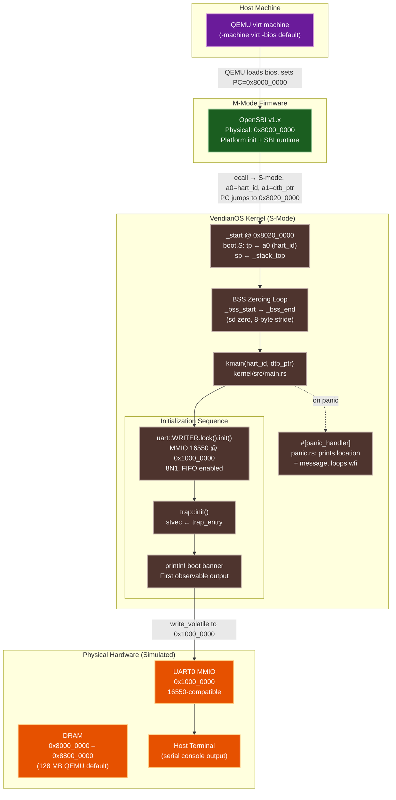

# VeridianOS Phase 1 Design Specification: Bootable RISC-V Microkernel

| Attribute | Specification Details |
| :--- | :--- |
| **Document Version** | 1.0.0 |
| **Status** | Complete |
| **Target Architecture** | RISC-V 64-bit (Supervisor Mode, QEMU virt machine) |
| **Kernel Model** | Microkernel Boot Layer (pre-user-space) |
| **Subsystem** | Hardware Initialization & Serial Console |

---

## 1. Executive Summary & Architecture Overview

Booting a microkernel on bare hardware requires answering a deceptively difficult question: how does the first line of kernel code run when there is no operating system to load it? On RISC-V, the answer is a layered handoff chain. The processor begins in Machine mode (M-mode), which holds the highest privilege. QEMU places **OpenSBI** — the open-source Supervisor Binary Interface firmware — at physical address `0x8000_0000` and transfers control to it automatically. OpenSBI performs platform initialization (interrupt controller setup, timer calibration, SBI runtime installation) and then drops privilege to Supervisor mode (S-mode) before jumping to the kernel entry point at `0x8020_0000`.

Phase 1 of VeridianOS owns exactly this handoff window: from the first instruction at `_start` in `boot.S` through UART initialization, BSS zeroing, and the first `println!` on the serial console. No heap allocator exists yet. No page table is active beyond the identity mapping OpenSBI left behind. No process abstraction exists. Phase 1 is the proof that the kernel can speak — that at least one byte reaches the developer's terminal before any higher-level subsystem runs.

The design imposes three hard constraints that every decision in this phase must satisfy: deterministic hardware entry (every boot reaches the same state regardless of QEMU invocation flags), a zero-allocation boot path (no dynamic memory before the page allocator is ready), and observable UART output before any subsystem initializes (so that any subsequent crash during phase 2+ can be diagnosed by reading the serial log).

### System Architecture



---

## 2. Design Goals

### 2.1 Deterministic Hardware Entry

The RISC-V Privileged Specification does not guarantee which hart (hardware thread) OpenSBI will designate as the boot hart or what value it will hold in `a0`. A naive implementation that assumes hart 0 boots first will silently fail on multi-hart configurations where OpenSBI elects a different hart. VeridianOS Phase 1 addresses this by treating `a0` as opaque: the boot hart ID is moved into the thread pointer register (`tp`) unconditionally, then the boot sequence proceeds for any hart that OpenSBI designates. Secondary harts are only activated later, via SBI HSM calls from `smp::init()`, and they enter through a separate `_secondary_start` label with per-hart stack offsets of $8192 \times \text{hart\_id}$ bytes below `_stack_top`.

The boot path produces a provably consistent memory state at the `kmain` entry: `sp` is valid, `tp` holds the hart ID, all BSS bytes are zero, and `a1` still contains the Device Tree Blob physical address passed by OpenSBI.

### 2.2 Zero-Allocation Boot Path

The kernel heap is not initialized until `memory::init(dtb_ptr)` runs inside `kmain`. Every data structure used between `_start` and that call must therefore live entirely in static storage or on the stack. The UART driver (`Uart` struct) is a zero-sized wrapper around an MMIO base address constant — it allocates nothing. The `WRITER` global is a `Mutex<Uart>` backed by a `spin::Mutex` stored in the `.bss` section (zeroed by the BSS loop before `kmain` runs), requiring no heap. The linker script enforces this discipline by placing the heap region (`_heap_start`) well after `_bss_end`, making a pre-heap allocation an immediate null dereference that the developer will see as a UART-silent crash.

The BSS zeroing loop itself is written in assembly using 8-byte double-word stores (`sd zero, 0(t0)`) for maximum throughput on 64-bit aligned sections, and terminates in $\lceil (\_bss\_end - \_bss\_start) / 8 \rceil$ iterations.

### 2.3 Observable UART Output Before Any Subsystem

A kernel that crashes silently during initialization is almost impossible to debug. Phase 1 guarantees that the UART driver is the first subsystem initialized — before the trap vector is set, before memory management runs, before the capability table is touched. This ordering ensures that even a page fault during `memory::init` produces a `TRAP` string on the terminal (via the assembly `trap_entry` in `boot.S` which writes directly to `0x1000_0000`) rather than a silent hang. Observability is a correctness property, not a convenience feature.

---

## 3. Core Components & Rust Implementations

### 3.1 Assembly Entry Point (`boot.S`)

The entry section is placed first in the linker output by using the `.text.entry` section, ensuring it lands at exactly `0x8020_0000`.

```asm
# kernel/src/arch/riscv64/boot.S (abridged)

.attribute arch, "rv64gc"

.section .text.entry
.globl _start

_start:
    # Preserve boot hart ID in thread-pointer register (tp).
    # OpenSBI places hart_id in a0; we must not clobber it before kmain.
    mv      tp, a0

    # Stack pointer: boot hart always uses the top of the shared stack region.
    # _stack_top is defined in linker.ld as BASE_ADDRESS + text + data + bss + 64K.
    la      sp, _stack_top

    j       _boot_hart_init

.globl _secondary_start
_secondary_start:
    mv      tp, a0              # hart_id for this secondary hart
    la      sp, _stack_top
    li      t0, 8192            # 8 KB per hart
    mul     t0, a0, t0
    sub     sp, sp, t0          # sp = _stack_top - (hart_id * 8192)
    call    ksecondary_main

_secondary_park:
    wfi
    j       _secondary_park

_boot_hart_init:
    # Zero BSS: uninitialized globals must be zero before Rust runs.
    la      t0, _bss_start
    la      t1, _bss_end
_zero_bss:
    beq     t0, t1, _bss_done
    sd      zero, 0(t0)
    addi    t0, t0, 8
    j       _zero_bss
_bss_done:
    # a0 = hart_id (still valid from _start)
    # a1 = dtb_ptr (preserved by OpenSBI convention)
    call    kmain

_park_hart:
    wfi
    j       _park_hart
```

The `switch_context` function in the same file saves and restores the 14 callee-saved registers (`ra`, `sp`, `s0`–`s11`) used by later phases for cooperative thread switching. The `trap_entry` label provides a minimal assembly fault handler that writes `TRAP\n` directly to MMIO register `0x1000_0000` using five `sb` instructions, then spins in a `wfi` loop — no Rust runtime required.

### 3.2 Linker Script (`linker.ld`)

The linker script controls the physical placement of every kernel section and exports boundary symbols that the assembly and Rust code reference by name.

```ld
/* kernel/src/arch/riscv64/linker.ld */

OUTPUT_ARCH(riscv)
ENTRY(_start)

BASE_ADDRESS = 0x80200000;  /* OpenSBI hands control here */

SECTIONS {
    . = BASE_ADDRESS;

    /* .text.entry must be first so _start lands at BASE_ADDRESS exactly */
    .text : {
        _text_start = .;
        *(.text.entry)       /* boot.S _start */
        *(.text .text.*)
        _text_end = .;
    }

    . = ALIGN(4K);
    .rodata : { _rodata_start = .; *(.rodata .rodata.*) _rodata_end = .; }

    . = ALIGN(4K);
    .data   : { _data_start = .;  *(.data .data.*)     _data_end = .;   }

    /* BSS: zeroed by _zero_bss loop before kmain is called */
    . = ALIGN(4K);
    .bss    : { _bss_start = .;   *(.bss .bss.*)       _bss_end = .;    }

    . = ALIGN(4K);
    _stack_bottom = .;
    . += 64K;               /* 8 harts × 8 KB each */
    _stack_top = .;

    . = ALIGN(4K);
    _heap_start = .;
    . += 16M;               /* kernel heap — not usable until memory::init() */
    _heap_end = .;

    . = ALIGN(4K);
    _free_mem_start = .;    /* page allocator takes over here */
    _kernel_end = .;
}
```

The address arithmetic for the boot hart stack can be expressed as:

$\text{sp}_{\text{boot}} = \text{BASE\_ADDRESS} + |\text{.text}| + |\text{.rodata}| + |\text{.data}| + |\text{.bss}| + 64\,\text{KiB}$

Secondary hart stacks are carved from the same 64 KiB region in 8 KiB slices, leaving room for up to eight harts without touching the heap.

### 3.3 UART 16550 Driver (`uart.rs`)

The QEMU `virt` machine exposes a 16550-compatible UART at physical address `0x1000_0000`. The driver communicates exclusively through `write_volatile` and `read_volatile` to prevent the compiler from reordering or eliding MMIO accesses.

```rust
// kernel/src/uart.rs

use core::fmt::{self, Write};
use spin::Mutex;

/// Physical base address of UART0 on the QEMU virt board.
const UART0_BASE: usize = 0x1000_0000;

pub struct Uart {
    base_address: usize,
}

impl Uart {
    pub const fn new(base_address: usize) -> Self {
        Self { base_address }
    }

    /// Configure the UART: 38.4K baud, 8N1, FIFO enabled, RX interrupts on.
    pub fn init(&self) {
        let ptr = self.base_address as *mut u8;
        unsafe {
            ptr.add(1).write_volatile(0x00); // IER: disable all interrupts
            ptr.add(3).write_volatile(0x80); // LCR: set DLAB to access divisor
            ptr.add(0).write_volatile(0x03); // DLL: divisor low byte (38.4K baud)
            ptr.add(1).write_volatile(0x00); // DLM: divisor high byte
            ptr.add(3).write_volatile(0x03); // LCR: 8N1, clear DLAB
            ptr.add(2).write_volatile(0x07); // FCR: enable + clear TX/RX FIFOs
            ptr.add(1).write_volatile(0x01); // IER: enable RX interrupt
        }
    }

    /// Spin until the Transmit Holding Register is empty, then write one byte.
    pub fn putc(&self, c: u8) {
        let ptr = self.base_address as *mut u8;
        unsafe {
            // LSR offset 5, bit 5 = THRE (Transmit Holding Register Empty)
            while (ptr.add(5).read_volatile() & 0x20) == 0 {}
            ptr.add(0).write_volatile(c); // THR at offset 0
        }
    }
}

impl Write for Uart {
    fn write_str(&mut self, s: &str) -> fmt::Result {
        for byte in s.bytes() { self.putc(byte); }
        Ok(())
    }
}

/// Global, lock-protected UART instance usable from any core.
pub static WRITER: Mutex<Uart> = Mutex::new(Uart::new(UART0_BASE));

#[macro_export]
macro_rules! print {
    ($($arg:tt)*) => {{
        let mut writer = $crate::uart::WRITER.lock();
        use core::fmt::Write;
        let _ = write!(writer, $($arg)*);
    }};
}

#[macro_export]
macro_rules! println {
    () => { $crate::print!("\n") };
    ($($arg:tt)*) => { $crate::print!("{}\n", format_args!($($arg)*)) };
}
```

The UART register map for the 16550 in DLAB-clear mode:

| Offset | Register | Access | Purpose |
| :--- | :--- | :--- | :--- |
| `+0` | THR / RBR | W / R | Transmit Holding / Receive Buffer |
| `+1` | IER | R/W | Interrupt Enable Register |
| `+2` | FCR / IIR | W / R | FIFO Control / Interrupt Identification |
| `+3` | LCR | R/W | Line Control (word length, DLAB, stop bits) |
| `+5` | LSR | R | Line Status (bit 5 = THRE, bit 0 = DR) |

### 3.4 Panic Handler (`panic.rs`)

The `#[panic_handler]` attribute marks the function the Rust compiler calls on any `unwrap()` failure, assertion, or explicit `panic!()`. Because this runs in a `no_std` kernel, the handler cannot use the standard library's thread-unwinding infrastructure. Instead it prints diagnostics over UART and loops in a low-power `wfi` halt.

```rust
// kernel/src/panic.rs

use crate::println;
use core::panic::PanicInfo;

#[panic_handler]
fn panic(info: &PanicInfo) -> ! {
    println!("\n==================================================");
    println!("KERNEL PANIC DETECTED");
    println!("==================================================");

    if let Some(location) = info.location() {
        println!("Location: file '{}' at line {}", location.file(), location.line());
    } else {
        println!("Location: unknown");
    }

    println!("Message:  {}", info.message());
    println!("==================================================");
    println!("System halted. Reboot required.");

    loop {
        // wfi: CPU sleeps until next interrupt, reducing power in halt state.
        unsafe { core::arch::asm!("wfi"); }
    }
}
```

---

## 4. Kernel Entry Sequence (`main.rs`)

Phase 1 owns the first three steps of `kmain`. Steps 4 and beyond belong to later phases but are shown here for context.

```rust
// kernel/src/main.rs (Phase 1 relevant portion)

#[unsafe(no_mangle)]
pub extern "C" fn kmain(hart_id: usize, dtb_ptr: usize) -> ! {
    // Step 1: UART — first action, no other subsystem runs before this.
    uart::WRITER.lock().init();

    // Step 2: Trap vector — stvec points to trap_entry in boot.S.
    trap::init();

    // Step 3: Boot banner — proves UART is live before anything else.
    println!("================================================================");
    println!(" VeridianOS Version 0.1.0-alpha");
    println!(" AI-Native, Capability-Based Architecture (RISC-V 64)");
    println!("================================================================");
    println!("[BOOT] Booting CPU Hart ID: {}", hart_id);
    println!("[BOOT] Device Tree Blob at physical address: 0x{:X}", dtb_ptr);

    // Step 4+: memory::init, capability setup, scheduler, etc. (later phases)
    // ...
}
```

The `trap::init()` call writes the address of the assembly `trap_entry` label into the `stvec` CSR (Supervisor Trap Vector Base Address Register). Until this call completes, any hardware exception (misaligned access, illegal instruction, etc.) will jump to an undefined address and likely hang silently. Phase 1 places UART init before `trap::init()` specifically so that the UART is ready to emit `TRAP` via the direct assembly path even if something goes wrong during trap vector setup.

---

## 5. Syscall ABI

Phase 1 does not expose any syscall interface. User space does not exist yet — the kernel has not initialized the process abstraction, page tables for U-mode, or the `ecall` dispatch table. The first syscall handler (`SYS_WRITE = 1`) is registered in Phase 3 after the capability system and process isolation are in place.

This section is intentionally absent. A stub is recorded here to make the absence explicit:

| Syscall Number | Name | Phase Introduced |
| :--- | :--- | :--- |
| (none) | — | Phase 1 has no user-space boundary |
| `SYS_WRITE = 1` | Write to UART | Phase 3 |
| `SYS_EXIT = 2` | Terminate process | Phase 3 |
| `SYS_HANDLE_CLOSE = 3` | Close capability handle | Phase 2 |

---

## 6. Verification Scenario & Expected UART Log

To verify Phase 1 is working correctly, run:

```bash
make run
```

This invokes QEMU with the kernel ELF binary as the payload. OpenSBI's own startup messages appear first (they cannot be suppressed), followed immediately by the VeridianOS banner. A Phase 1 boot is proven successful when the following sequence appears on the terminal before any phase-2 memory init messages.

### Expected UART Log Traces

```
OpenSBI v1.3
   ____                    _____ ____ _____
  / __ \                  / ____|  _ \_   _|
 | |  | |_ __   ___ _ __ | (___ | |_) || |
 | |  | | '_ \ / _ \ '_ \ \___ \|  _ < | |
 | |__| | |_) |  __/ | | |____) | |_) || |_
  \____/| .__/ \___|_| |_|_____/|____/_____|
        | |
        |_|

Platform Name             : riscv-virtio,qemu
Boot HART ID              : 0
Boot HART ISA             : rv64imafdch_zicsr_zifencei
...

[DEBUG] Linker sections:
  .text:         0x80200000 - 0x80220000
  .rodata:       0x80221000 - 0x80228000
  .data:         0x80229000 - 0x8022A000
  .bss:          0x8022B000 - 0x8022C000
  Stack:         0x8022C000 - 0x8023C000
  Heap:          0x8023D000 - 0x9023D000
================================================================
 __      __        _     _ _             ____   _____
 \ \    / /       (_)   | (_)           / __ \ / ____|
  \ \  / /__ _ __ _  __| |_  __ _ _ __ | |  | | (___
   \ \/ / _ \ '__| |/ _` | |/ _` | '_ \| |  | |\___ \
    \  /  __/ |  | | (_| | | (_| | | | | |__| |____) |
     \/ \___|_|  |_|\__,_|_|\__,_|_| |_|\____/|_____/
================================================================
               VeridianOS Version 0.1.0-alpha
  Concept: AI-Native, Capability-Based Architecture (RISC-V 64)
================================================================

[BOOT] Booting CPU Hart ID: 0
[BOOT] Device Tree Blob located at physical address: 0x87000000
```

### What Each Line Proves

| Log Line | Invariant Verified |
| :--- | :--- |
| OpenSBI banner appears | QEMU loaded firmware; M-mode initialized correctly |
| `[DEBUG] Linker sections:` printed | `kmain` reached; UART init succeeded; `write_volatile` path works |
| `.bss:` start address printed | BSS zeroing loop completed; Rust globals are initialized |
| `Stack:` address range printed | Stack pointer is valid; no stack overflow during UART init |
| `VeridianOS Version 0.1.0-alpha` | `println!` macro works end-to-end through the Mutex guard |
| `[BOOT] Booting CPU Hart ID: 0` | OpenSBI hart_id was correctly saved in `tp` and passed to `kmain` |
| `[BOOT] Device Tree Blob at 0x87000000` | `a1` was preserved through `_start` → `_boot_hart_init` → `call kmain` |

### Failure Diagnosis

If the VeridianOS banner does not appear after the OpenSBI output:

- **Blank screen after OpenSBI**: The kernel binary was not loaded at `0x8020_0000`. Verify that `linker.ld` sets `BASE_ADDRESS = 0x80200000` and that the `make` recipe passes `-kernel kernel.bin` to QEMU with no `-bios none` flag.
- **`TRAP` appears before the banner**: An exception fired before `uart::init()` completed, possibly due to a misaligned static or a null dereference. The assembly `trap_entry` wrote `TRAP\n` directly over MMIO. Check the Makefile for `-cpu rv64` flags and verify the kernel ELF architecture.
- **BSS-related crash**: If the banner appears but a subsequent print truncates, the BSS loop may have stopped short. Confirm the linker exports `_bss_start` and `_bss_end` with the correct alignment.
- **KERNEL PANIC** message: The `#[panic_handler]` fired and used `println!`. The location and message fields in the output indicate the exact source position to investigate.
