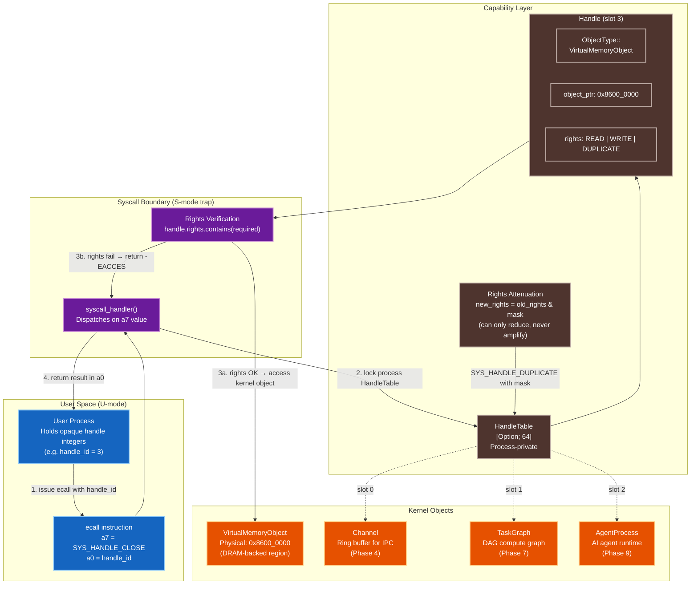

# VeridianOS Phase 2 Design Specification: Capability System Foundation

| Attribute | Specification Details |
| :--- | :--- |
| **Document Version** | 1.0.0 |
| **Status** | Complete |
| **Target Architecture** | RISC-V 64-bit (Supervisor Mode, QEMU virt machine) |
| **Kernel Model** | Capability-Secured Microkernel |
| **Subsystem** | Capability Authority Model (Handles, Rights, HandleTable) |

---

## 1. Executive Summary & Architecture Overview

Traditional operating systems grant processes access to resources through **ambient authority**: a process running as root can read any file, open any socket, or signal any process — not because it holds an explicit token saying so, but because its identity (UID 0) implicitly carries that power. This model fails catastrophically in multi-tenant and AI-native workloads: a compromised process inherits the full authority of its parent, a confused library can be tricked into acting on behalf of an attacker, and there is no mechanism to grant a subprocess exactly the rights it needs without also granting everything else.

VeridianOS replaces ambient authority with **capabilities** — unforgeable tokens of authority issued by the kernel. A capability is a `Handle`: a kernel-allocated integer index into a process-private `HandleTable`. Each `Handle` references one kernel object (a memory region, a communication channel, a compute graph, an agent process) and carries a `Rights` bitmask that specifies precisely which operations are permitted on that object through that handle. User space never receives a raw pointer or a kernel address — it receives an opaque integer that means nothing outside the kernel's translation layer.

Phase 2 establishes the three interlocking abstractions that every subsequent phase builds on: the `Rights` bitflags type, the `ObjectType` classification enum, the `Handle` struct that binds them together with a kernel object pointer, and the `HandleTable` that gives each process a private, bounded namespace of handles. This phase also introduces the first two handle management syscalls: `SYS_HANDLE_CLOSE` and `SYS_HANDLE_DUPLICATE`.

### System Architecture



---

## 2. Design Goals

### 2.1 No Ambient Authority

Every resource access in VeridianOS is mediated through a handle. There is no concept of a privileged process identity that implicitly grants access to resources not backed by a capability. When a process starts, its `HandleTable` is empty — it can do nothing until the kernel grants it handles. When a process forks or spawns a child, the child receives only the handles explicitly transferred to it over a channel; it does not inherit the parent's full table. This property eliminates the **confused deputy problem**: a library that accepts a handle from a caller can only use that handle's rights, not the rights of the library's own process context.

Formally, if a process $P$ holds a handle $h$ with rights $R_h$, and $P$ passes $h$ to a service $S$, the service can perform at most the operations permitted by $R_h$, regardless of any other handles $S$ holds for the same underlying object. Authority does not flow through the object identity — it flows through the token.

### 2.2 Rights Can Only Be Attenuated, Never Amplified

The fundamental security invariant of the capability model is **monotonic rights reduction**. When a process duplicates a handle, it may specify a rights mask $M$ such that the new handle carries rights $R' = R_{\text{original}} \cap M$. It is impossible to produce a handle with rights strictly greater than the source handle, because:

$$R' = R_{\text{original}} \cap M \subseteq R_{\text{original}}$$

No syscall path in the kernel creates a handle with rights not drawn from an existing granted set. The only root of authority is the initial capability table populated during kernel boot for the root process, from which all other handles descend through a chain of attenuations and transfers. This property is verified at each `SYS_HANDLE_DUPLICATE` call by the `rights.contains()` check before the new handle is inserted.

### 2.3 Handles Are Opaque Integers to User Space

User space sees handle IDs as `usize` integers — indices into its own `HandleTable` in the kernel. These integers carry no semantic information about the object type, the physical address, or the rights granted. A process cannot forge a handle by guessing an integer; the kernel validates every handle ID against the calling process's own table before any operation proceeds. Out-of-range IDs (greater than or equal to `MAX_HANDLES = 64`) and IDs with `None` in their slot both return `-EBADF` before any object logic runs.

---

## 3. Core Abstractions & Rust Implementations

All capability primitives live in `kernel/src/capability/` and are designed for a `no_std` kernel environment: no heap allocation is required, and all data structures have fixed sizes that fit in the `.bss` or stack sections.

### 3.1 `Rights` Bitflags

```rust
// kernel/src/capability/rights.rs

use bitflags::bitflags;

bitflags! {
    /// Permission bitmask for a capability handle.
    ///
    /// Rights are combined with bitwise OR and tested with `contains()`.
    /// They can only be attenuated (ANDed down), never amplified.
    #[derive(Debug, Clone, Copy, PartialEq, Eq)]
    pub struct Rights: u32 {
        /// Read the object's contents or query its state.
        const READ      = 1 << 0;  // 0x01

        /// Write to or mutate the object's contents.
        const WRITE     = 1 << 1;  // 0x02

        /// Execute code mapped from the object (VMOs only).
        const EXECUTE   = 1 << 2;  // 0x04

        /// Duplicate this handle (optionally with reduced rights).
        const DUPLICATE = 1 << 3;  // 0x08

        /// Transfer this handle to another process via a channel.
        const TRANSFER  = 1 << 4;  // 0x10

        /// All rights combined — used for root process bootstrapping only.
        const DEFAULT = Self::READ.bits()
            | Self::WRITE.bits()
            | Self::EXECUTE.bits()
            | Self::DUPLICATE.bits()
            | Self::TRANSFER.bits();
    }
}
```

The rights-to-operation mapping for each `ObjectType` is documented in the table below:

| Operation | Required Rights | Relevant Object Types |
| :--- | :--- | :--- |
| Read memory / query state | `READ` | `VirtualMemoryObject`, `TaskGraph`, `AgentProcess` |
| Write memory / append node | `WRITE` | `VirtualMemoryObject`, `TaskGraph`, `Channel` |
| Execute mapped code | `EXECUTE` | `VirtualMemoryObject` |
| Submit compute graph | `EXECUTE` | `TaskGraph` (+ `WRITE` on `DeviceQueue`) |
| Duplicate handle | `DUPLICATE` | Any |
| Transfer handle over channel | `TRANSFER` | Any |

### 3.2 `ObjectType` Enumeration

```rust
// kernel/src/capability/mod.rs

/// Classification of every resource a process can hold a capability to.
///
/// The kernel checks this field at every syscall dispatch to ensure the
/// operation is appropriate for the object (e.g., you cannot EXECUTE a Channel).
#[derive(Debug, Clone, Copy, PartialEq, Eq)]
pub enum ObjectType {
    /// Slot is unused — handle table entry is logically empty.
    None,

    /// An isolated process address space (Phase 3+).
    Process,

    /// A schedulable thread of execution (Phase 5).
    Thread,

    /// A bidirectional IPC ring buffer (Phase 4).
    Channel,

    /// A physical-memory-backed virtual memory region (Phase 2+).
    VirtualMemoryObject,

    /// A DAG computation graph for heterogeneous execution (Phase 7).
    TaskGraph,

    /// A hardware device command queue (Phase 7).
    DeviceQueue,

    /// A typed node in the semantic graph filesystem (Phase 8).
    GraphNode,

    /// A tracked AI agent process (Phase 9).
    AgentProcess,

    /// An IPC channel connecting two AI agents (Phase 9).
    AgentChannel,
}
```

### 3.3 `Handle` Struct

```rust
// kernel/src/capability/mod.rs

/// A capability handle: an unforgeable reference to a kernel object
/// with a bounded set of permitted operations.
///
/// The `object_ptr` field stores the kernel-virtual address of the object
/// being governed. User space never sees this address — it sees only the
/// handle table index (the `usize` returned by insert()).
#[derive(Debug, Clone, Copy)]
pub struct Handle {
    /// Discriminator used to validate operation compatibility.
    pub object_type: ObjectType,

    /// Kernel-virtual address of the governed resource.
    /// For VMOs this is the physical base address; for Channels it is
    /// the address of the ring buffer struct; etc.
    pub object_ptr: usize,

    /// Permitted operations via this specific handle instance.
    /// A duplicate of this handle may carry a strict subset of these rights.
    pub rights: Rights,
}

impl Handle {
    /// Construct a new handle. Called only by kernel code, never by user space.
    pub const fn new(object_type: ObjectType, object_ptr: usize, rights: Rights) -> Self {
        Self { object_type, object_ptr, rights }
    }

    /// Produce an attenuated copy of this handle with rights masked to `mask`.
    ///
    /// Returns `Err` if the caller does not hold `Rights::DUPLICATE` or if
    /// `mask` requests rights the source handle does not carry.
    pub fn attenuate(&self, mask: Rights) -> Result<Handle, &'static str> {
        if !self.rights.contains(Rights::DUPLICATE) {
            return Err("source handle does not carry DUPLICATE right");
        }
        // Attenuation: new rights are the intersection — never a superset.
        let new_rights = self.rights & mask;
        Ok(Handle::new(self.object_type, self.object_ptr, new_rights))
    }
}
```

### 3.4 `HandleTable` with `insert`, `get`, `remove`

```rust
// kernel/src/capability/mod.rs

/// Maximum number of concurrent handles per process.
/// Fixed size — no heap allocation required.
pub const MAX_HANDLES: usize = 64;

/// The process-private capability namespace.
///
/// Each process owns exactly one HandleTable. The kernel stores it inside
/// the Process struct (Phase 3). User space refers to entries by their
/// array index (the handle_id returned by insert()).
pub struct HandleTable {
    slots: [Option<Handle>; MAX_HANDLES],
}

impl HandleTable {
    /// Create an empty table. All slots are None (BSS-compatible).
    pub const fn new() -> Self {
        Self { slots: [None; MAX_HANDLES] }
    }

    /// Allocate the first free slot and return its index as the handle_id.
    ///
    /// Complexity: O(MAX_HANDLES) linear scan.
    /// Returns Err if the table is full (all 64 slots occupied).
    pub fn insert(&mut self, handle: Handle) -> Result<usize, &'static str> {
        for (idx, slot) in self.slots.iter_mut().enumerate() {
            if slot.is_none() {
                *slot = Some(handle);
                return Ok(idx);
            }
        }
        Err("handle table is full")
    }

    /// Retrieve a copy of the handle at `handle_id`.
    ///
    /// Returns EBADF-equivalent if handle_id >= MAX_HANDLES or slot is None.
    pub fn get(&self, handle_id: usize) -> Result<Handle, &'static str> {
        if handle_id >= MAX_HANDLES {
            return Err("handle_id out of range");
        }
        self.slots[handle_id].ok_or("no handle at requested slot")
    }

    /// Close a handle: remove it from the table and return it to the caller.
    ///
    /// After this call the handle_id is invalid. The kernel object itself
    /// is not necessarily destroyed — other handles to the same object may exist.
    pub fn remove(&mut self, handle_id: usize) -> Result<Handle, &'static str> {
        if handle_id >= MAX_HANDLES {
            return Err("handle_id out of range");
        }
        self.slots[handle_id].take().ok_or("no handle at requested slot")
    }

    /// Set a specific slot directly. Used during process bootstrapping to
    /// place well-known handles at known indices.
    pub fn set(&mut self, handle_id: usize, handle: Handle) -> Result<(), &'static str> {
        if handle_id >= MAX_HANDLES {
            return Err("handle_id out of range");
        }
        self.slots[handle_id] = Some(handle);
        Ok(())
    }
}
```

The memory footprint of a `HandleTable` is fixed at compile time:

$$|\text{HandleTable}| = \text{MAX\_HANDLES} \times |\text{Option\textless Handle\textgreater}|$$

On a 64-bit target with `Handle` consisting of three fields (`ObjectType` as `u32` padded to 8 bytes + `object_ptr` as `usize` + `rights` as `u32` padded to 8 bytes), `sizeof(Handle) = 24` bytes. `sizeof(Option<Handle>) = 24` bytes (discriminant fits in padding). Therefore the total table size is $64 \times 24 = 1536$ bytes — well within L1 cache for a single process lookup.

---

## 4. Capability-Secured Resource Access Pattern

The kernel enforces capability checks identically across all object types. Every syscall that touches a kernel object follows this four-step protocol:

```
[User Process issues ecall with handle_id in a0]
         │
         ▼
[1. Bounds check: handle_id < MAX_HANDLES?]
         │ No  → return -EBADF
         │ Yes ↓
[2. Slot check: slots[handle_id].is_some()?]
         │ No  → return -EBADF
         │ Yes ↓
[3. Type check: handle.object_type == expected?]
         │ No  → return -EINVAL
         │ Yes ↓
[4. Rights check: handle.rights.contains(required_rights)?]
         │ No  → return -EACCES
         │ Yes ↓
[5. Perform the operation on handle.object_ptr]
```

This ordering is intentional: returning `-EBADF` for an invalid slot before checking rights prevents an attacker from using the error code to probe which handle IDs are occupied by other processes (though in practice each process sees only its own table).

### Object-to-Operation Rights Matrix

| Syscall | Object Type Required | Rights Required | Phase |
| :--- | :--- | :--- | :--- |
| `SYS_HANDLE_CLOSE` | Any | (none — close does not require rights) | 2 |
| `SYS_HANDLE_DUPLICATE` | Any | `DUPLICATE` | 2 |
| `SYS_WRITE` | (implicit UART) | (kernel-internal) | 3 |
| `SYS_MAP` | `VirtualMemoryObject` | `READ` (+ `WRITE` for writable map) | 3 |
| `SYS_CHANNEL_SEND` | `Channel` | `WRITE` | 4 |
| `SYS_CHANNEL_RECV` | `Channel` | `READ` | 4 |
| `SYS_GRAPH_ADD_NODE` | `TaskGraph` | `WRITE` | 7 |
| `SYS_GRAPH_SUBMIT` | `TaskGraph` + `DeviceQueue` | `EXECUTE` + `WRITE` | 7 |
| `SYS_AGENT_SPAWN` | `AgentProcess` | `WRITE` | 9 |

---

## 5. System Call Interface Specification

System calls use the standard RISC-V Supervisor Binary Interface. Register conventions:
* **`a7`**: System Call Identifier Number
* **`a0`–`a4`**: Call Arguments (left to right)
* **`a0`**: Return Value (`>= 0` for success; negative errno for failure)

```
Phase 2 Handle Management Syscall Numbers:
SYS_HANDLE_CLOSE     = 3
SYS_HANDLE_DUPLICATE = 4
```

### 5.1 `sys_handle_close`

Releases a handle from the calling process's handle table. This deallocates the slot, freeing it for reuse by `insert()`. It does not necessarily destroy the underlying kernel object — objects are reference counted and destroyed only when no handles remain.

* **Register Mapping**:
  * `a7` = `3`
  * `a0` = `handle_id` (usize — the index to close)
* **C-Style Signature**:
  ```c
  int sys_handle_close(unsigned int handle_id);
  ```
* **Return Values**:
  * Success: `0`
  * Failure:
    * `-EBADF` (-9): `handle_id >= MAX_HANDLES` or slot is `None` (handle was never allocated or already closed).

**Implementation note**: `SYS_HANDLE_CLOSE` is the only handle operation that does not require the caller to hold any specific rights on the handle being closed. Any process can close any handle it owns. This matches Fuchsia Zircon semantics and prevents the paradox of needing a right to relinquish a right.

---

### 5.2 `sys_handle_duplicate`

Creates a new handle in the caller's table pointing to the same kernel object as an existing handle, with rights optionally reduced by a caller-provided bitmask. The source handle must carry `Rights::DUPLICATE`. The new handle's rights satisfy:

$$R_{\text{new}} = R_{\text{source}} \cap \text{rights\_mask}$$

* **Register Mapping**:
  * `a7` = `4`
  * `a0` = `source_handle_id` (usize)
  * `a1` = `rights_mask` (usize — a `Rights` bitmask; pass `0x1F` to keep all rights)
* **C-Style Signature**:
  ```c
  int sys_handle_duplicate(unsigned int source_handle_id, unsigned int rights_mask);
  ```
* **Return Values**:
  * Success: New handle ID ($0 \le \text{new\_id} < 64$).
  * Failure:
    * `-EBADF` (-9): `source_handle_id` is invalid or slot is empty.
    * `-EACCES` (-13): Source handle does not carry `Rights::DUPLICATE`.
    * `-EINVAL` (-22): `rights_mask` requests bits not defined in `Rights` (reserved bits set).
    * `-EMFILE` (-24): Handle table is full — all 64 slots are occupied.

**Rights amplification impossibility**: Because $R_{\text{new}} = R_{\text{source}} \cap \text{mask}$, and intersection can only produce a set no larger than $R_{\text{source}}$, it is impossible for any sequence of `sys_handle_duplicate` calls to produce a handle with rights $R' \supsetneq R_{\text{source}}$. The only way to obtain rights is from a kernel-originated grant (during process creation or resource allocation).

---

## 6. Security Invariants & Formal Properties

### 6.1 Amplification Impossibility Proof

Let $\mathcal{H}$ be the set of all handles in all process handle tables at any point in time, and let $R(h)$ denote the rights of handle $h \in \mathcal{H}$.

**Theorem**: For any handle $h'$ produced by `sys_handle_duplicate(h, mask)`, it holds that $R(h') \subseteq R(h)$.

**Proof**: The kernel implementation sets $R(h') = R(h) \cap \text{mask}$. By the definition of set intersection, $A \cap B \subseteq A$ for all sets $A$ and $B$. Therefore $R(h') = R(h) \cap \text{mask} \subseteq R(h)$. $\square$

**Corollary**: Since all handles derive from the root process's initial capability table through chains of `sys_handle_duplicate` calls and transfers, and no syscall path can amplify rights, the root process's initial grants form a strict upper bound on the rights any process can ever hold for any object.

### 6.2 Confused Deputy Prevention

The confused deputy attack works by tricking a privileged program into using its own authority on behalf of an unprivileged caller. In ambient-authority systems, a library function receives a filename from the caller and opens it using the library process's own file descriptor — if the library is setuid, the caller gains unearned access.

In VeridianOS, this attack is structurally impossible at the handle level. When a user process passes a `handle_id` to a service over a channel, the kernel records the rights that accompanied the handle transfer. The service can only use those transferred rights — not the rights the service holds on other handles for the same object. A service cannot escalate the caller's authority by substituting its own higher-privileged handle.

### 6.3 Handle Table Isolation

Each process's `HandleTable` is stored inside its `Process` struct in kernel memory. The kernel never exposes a reference to one process's table to another process. When process A sends a handle to process B over a channel, the kernel:

1. Looks up the handle in A's table and validates rights.
2. Creates a new `Handle` value (optionally with reduced rights if a mask was specified in the transfer).
3. Inserts the new value into B's table.
4. Optionally removes the original from A's table (move semantics) or leaves it (copy semantics).

The handle IDs in process A's table and process B's table are independent indices — the same kernel object may appear at index 5 in A and index 12 in B. The opaque integer never leaks information about the object across process boundaries.

---

## 7. Verification Scenario & Expected UART Log

To verify Phase 2, the kernel boot sequence in `kmain` creates a root process, inserts a VMO handle, and then exercises the handle table operations. The following log is produced before the phase-3 memory management test.

### Verification Sequence

```rust
// kernel/src/main.rs (Phase 2 verification block)

// Allocate root process (PID 1)
let mut root_process = Process::new(1);

// Grant a VMO capability pointing to a DRAM region at 0x8600_0000
let dummy_vmo_addr = 0x8600_0000;
let vmo_handle = Handle::new(
    ObjectType::VirtualMemoryObject,
    dummy_vmo_addr,
    Rights::READ | Rights::WRITE | Rights::DUPLICATE,
);
let handle_id = root_process
    .handle_table
    .insert(vmo_handle)
    .expect("Failed to insert dummy VMO capability");

println!(
    "[BOOT] Capability inserted: Handle ID {} -> VMO at 0x{:X}",
    handle_id, dummy_vmo_addr
);

// Verify retrieval
let retrieved = root_process.handle_table.get(handle_id)
    .expect("Handle retrieval failed");
println!("[BOOT] Handle retrieved: type={:?}, rights={:?}",
    retrieved.object_type, retrieved.rights);

// Verify attenuation: produce a read-only duplicate
let ro_handle = retrieved.attenuate(Rights::READ)
    .expect("Attenuation failed");
let ro_id = root_process.handle_table.insert(ro_handle)
    .expect("Failed to insert attenuated handle");
println!("[BOOT] Attenuated handle inserted: ID {} -> rights={:?}",
    ro_id, ro_handle.rights);

// Verify that the read-only handle cannot be duplicated (no DUPLICATE right)
let dup_result = ro_handle.attenuate(Rights::READ);
match dup_result {
    Err(msg) => println!("[BOOT] Rights enforcement OK: attenuate denied -> '{}'", msg),
    Ok(_) => println!("[BOOT] ERROR: attenuation should have been denied!"),
}

// Close the original handle
root_process.handle_table.remove(handle_id)
    .expect("Handle close failed");
println!("[BOOT] Handle {} closed successfully.", handle_id);
```

### Expected UART Log Traces

```
[BOOT] Creating root system process...
[BOOT] Capability inserted: Handle ID 0 -> VMO at 0x86000000
[BOOT] Handle retrieved: type=VirtualMemoryObject, rights=READ | WRITE | DUPLICATE
[BOOT] Attenuated handle inserted: ID 1 -> rights=READ
[BOOT] Rights enforcement OK: attenuate denied -> 'source handle does not carry DUPLICATE right'
[BOOT] Handle 0 closed successfully.
[BOOT] Root process active.
```

### What Each Log Line Proves

| Log Line | Invariant Verified |
| :--- | :--- |
| `Capability inserted: Handle ID 0` | `insert()` found the first free slot and returned index 0 |
| `type=VirtualMemoryObject, rights=READ \| WRITE \| DUPLICATE` | `get()` correctly retrieves the stored handle with unmodified rights |
| `Attenuated handle inserted: ID 1 -> rights=READ` | Attenuation correctly computes `Rights::READ \| WRITE \| DUPLICATE & Rights::READ = READ` |
| `attenuate denied -> 'source handle does not carry DUPLICATE right'` | The read-only handle (rights=READ) correctly fails the `DUPLICATE` rights check — amplification is impossible |
| `Handle 0 closed successfully.` | `remove()` took the handle out of slot 0, slot is now `None` |

### Failure Diagnosis

If the expected log does not appear:

- **`Handle retrieval failed` panic**: `insert()` returned an index but `get()` failed. Check that `MAX_HANDLES` is 64 and that `slots` is initialized to `[None; 64]` (requires BSS zeroing from Phase 1 to have run correctly).
- **`ERROR: attenuation should have been denied!`**: The `attenuate()` method failed to check `Rights::DUPLICATE` before performing the intersection. Verify that `self.rights.contains(Rights::DUPLICATE)` is evaluated before `self.rights & mask`.
- **`Failed to insert dummy VMO capability`**: The handle table is full. This cannot happen for the root process before any other inserts; check if a previous phase left handles in the table.
- **Incorrect rights value printed**: The `Rights` bitflags `Display` impl may format compound values differently across `bitflags` versions. The raw bit value `0x09` corresponds to `READ | DUPLICATE` — compare numerically if the string format differs.
