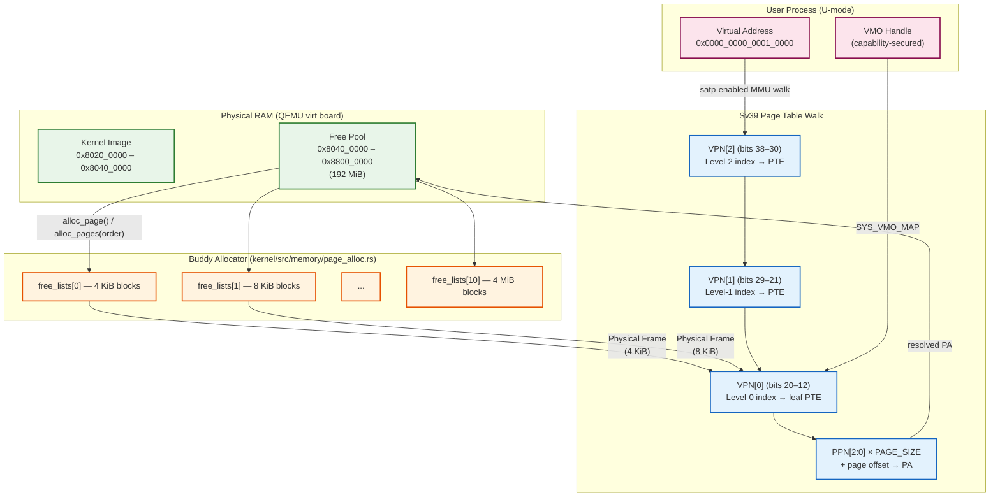

# VeridianOS Phase 3 Design Specification: Page Allocator & Sv39 Virtual Memory

| Attribute | Specification Details |
| :--- | :--- |
| **Document Version** | 1.0.0 |
| **Status** | Complete |
| **Target Architecture** | RISC-V 64-bit (Sv39 Paging, Supervisor Mode) |
| **Kernel Model** | Capability-Secured Microkernel |
| **Subsystem** | Memory Management Subsystem |

---

## 1. Executive Summary & Architecture Overview

Phase 3 establishes the physical and virtual memory foundation upon which every higher-level VeridianOS abstraction depends. It consists of two tightly coupled components: a Binary Buddy Allocator that manages physical RAM in power-of-two frame blocks, and an Sv39 three-level page table implementation that maps per-process virtual address spaces to those physical frames.

The Buddy Allocator divides the available physical RAM range (`0x8040_0000` through `0x8800_0000`) into free lists at orders 0 through 10, covering 4 KiB to 4 MiB. Allocation is O(log N) in the number of orders: the allocator scans upward from the requested order, splits a larger block if needed, and returns the lower half while inserting the upper half (the "buddy") into the appropriate smaller free list. Freeing reverses the process, merging adjacent buddies upward until no further merges are possible.

The Sv39 paging mode uses a 39-bit virtual address space with a three-level radix tree of 512-entry page tables. Each level consumes nine bits of the virtual address to index into a 4 KiB page table page. The leaf entry carries a 44-bit Physical Page Number (PPN) plus flag bits encoding permission, accessed, dirty, global, and user status. The kernel lives in a direct-mapped identity region; user processes receive isolated address spaces with only kernel mappings shared at the top-level page table.

Virtual Memory Objects (VMOs) encapsulate a contiguous physical allocation behind a capability handle. User-space programs never touch physical addresses directly — they call `SYS_VMO_CREATE` to obtain a handle, `SYS_VMO_MAP` to insert it into their address space, and `SYS_VMO_UNMAP` to remove it.

### System Architecture



---

## 2. Design Goals

### 2.1 O(log N) Physical Page Allocation

The Buddy Allocator maintains 11 segregated free lists (orders 0 through 10). An allocation at order $k$ requires scanning at most $10 - k$ higher-order lists before finding a splittable block. Each split inserts one buddy entry into a lower list in O(1). The worst-case allocation therefore completes in $O(10) = O(\log_2 N_{max})$ steps where $N_{max} = 2^{10} = 1024$ pages, making allocation time independent of total free memory.

$$T_{alloc}(k) \leq (10 - k) \text{ list traversals}, \quad 0 \leq k \leq 10$$

Free operations merge buddies using the XOR trick:

$$\text{buddy\_addr} = \text{addr} \oplus (2^k \times \texttt{PAGE\_SIZE})$$

Merging also runs in O(log N) as it traverses at most 10 levels upward.

### 2.2 Per-Process Isolated Address Spaces

Every user process receives a private `PageTable` root, populated at creation with a copy of the kernel's top-level entries (all indices except the user-space slot). User-space mappings occupy virtual addresses below `0x4000_0000_0000` (the Sv39 user half). The kernel resides above `0xFFFF_FFC0_0000_0000`. This split guarantees that a user-space page table walk cannot reach kernel leaf entries, and that the kernel's mappings are visible from any address space for trap handling without a page-table switch.

### 2.3 Direct-Mapped Kernel Region

The kernel identity-maps the full RAM range `0x8020_0000 – 0x8800_0000` and the UART MMIO region at `0x1000_0000` before enabling paging. Under identity mapping, virtual address equals physical address, eliminating the need for physical-to-virtual translation in kernel code paths. All Buddy Allocator metadata nodes (`PageNode`) are therefore addressable directly from the physical address returned by the allocator, without any translation layer.

---

## 3. Buddy Allocator

### 3.1 Data Structures

The allocator stores its free-list metadata in-band: the first bytes of each free physical block are reinterpreted as a `PageNode` header containing an intrusive linked-list pointer.

```rust
// kernel/src/memory/page_alloc.rs

/// The size of a single physical page in bytes (4 KiB).
pub const PAGE_SIZE: usize = 4096;

/// Intrusive free-list node stored at the start of each free physical block.
/// Stored in-band to avoid requiring a separate heap allocator.
#[repr(C)]
struct PageNode {
    next: Option<*mut PageNode>,
}

/// Complete state of the physical page allocator.
pub struct PageAllocatorState {
    /// 11 segregated free lists, indexed by order (0 = 4 KiB, 10 = 4 MiB).
    free_lists: [Option<*mut PageNode>; 11],
    /// Inclusive lower bound of the managed physical address range.
    start_addr: usize,
    /// Exclusive upper bound of the managed physical address range.
    end_addr:   usize,
}

// SAFETY: PageAllocatorState is only accessed through the ALLOCATOR spinlock
// (spin::Mutex). The raw *mut PageNode pointers alias physical memory that
// the allocator owns exclusively while those blocks are free. No aliased
// mutable references exist outside a locked critical section.
unsafe impl Send for PageAllocatorState {}
unsafe impl Sync for PageAllocatorState {}
```

### 3.2 Initialization

`init` aligns the start address upward and the end address downward to `PAGE_SIZE`, then greedily assigns the largest naturally aligned power-of-two block at each address to the corresponding free list.

```rust
// kernel/src/memory/page_alloc.rs

fn init(&mut self, start_addr: usize, end_addr: usize) {
    let start_aligned = (start_addr + PAGE_SIZE - 1) & !(PAGE_SIZE - 1);
    let end_aligned   = end_addr & !(PAGE_SIZE - 1);
    self.start_addr   = start_aligned;
    self.end_addr     = end_aligned;
    self.free_lists   = [None; 11];

    let mut curr_addr = start_aligned;
    while curr_addr < end_aligned {
        // Select the largest order whose block fits and whose start is aligned.
        for order in (0..=10).rev() {
            let block_size = (1 << order) * PAGE_SIZE;
            if curr_addr.is_multiple_of(block_size)
                && curr_addr + block_size <= end_aligned
            {
                unsafe { self.push_front(order, curr_addr); }
                curr_addr += block_size;
                break;
            }
        }
    }
}
```

### 3.3 Allocation Algorithm

```rust
// kernel/src/memory/page_alloc.rs

pub fn alloc_pages(&mut self, order: usize) -> Option<usize> {
    if order >= 11 { return None; }

    // Fast path: exact-fit block already available.
    // SAFETY: pop_front reads the PageNode header of a free block via a raw
    // pointer. The block is exclusively owned by this free list until returned.
    unsafe {
        if let Some(addr) = self.pop_front(order) {
            core::ptr::write_bytes(addr as *mut u8, 0, (1 << order) * PAGE_SIZE);
            return Some(addr);
        }
    }

    // Slow path: find a larger block and split it down to the requested order.
    for higher_order in (order + 1)..11 {
        unsafe {
            if let Some(block_addr) = self.pop_front(higher_order) {
                let mut curr_order = higher_order;
                while curr_order > order {
                    curr_order -= 1;
                    // The upper half (buddy) is inserted into the smaller list.
                    let buddy_addr = block_addr + (1 << curr_order) * PAGE_SIZE;
                    self.push_front(curr_order, buddy_addr);
                }
                core::ptr::write_bytes(
                    block_addr as *mut u8, 0, (1 << order) * PAGE_SIZE,
                );
                return Some(block_addr);
            }
        }
    }

    None // Out of physical memory.
}
```

### 3.4 Free and Buddy-Merge Algorithm

```rust
// kernel/src/memory/page_alloc.rs

pub fn free_pages(&mut self, mut addr: usize, mut order: usize) {
    // Invariant: addr is page-aligned and within the managed range.
    assert!(addr.is_multiple_of(PAGE_SIZE));
    assert!(addr >= self.start_addr && addr < self.end_addr);

    unsafe {
        while order < 10 {
            let block_size = (1 << order) * PAGE_SIZE;
            // XOR trick: the buddy's address differs from ours by exactly
            // one bit at position log2(block_size).
            let buddy_addr = addr ^ block_size;

            // SAFETY: remove_block traverses a free list of previously
            // freed, kernel-owned physical pages. No aliased references exist.
            if self.remove_block(order, buddy_addr) {
                // Buddy is free — merge into a block of order + 1.
                addr   = core::cmp::min(addr, buddy_addr);
                order += 1;
            } else {
                break; // Buddy is allocated; stop merging.
            }
        }
        self.push_front(order, addr);
    }
}
```

### 3.5 Public API

```rust
// kernel/src/memory/page_alloc.rs

static ALLOCATOR: Mutex<PageAllocatorState> = Mutex::new(PageAllocatorState::new());

/// Initialize the allocator with the physical RAM range available to the kernel.
pub fn init(start_addr: usize, end_addr: usize) {
    ALLOCATOR.lock().init(start_addr, end_addr);
}

/// Allocate a 4 KiB physical page. Returns the physical address or None.
pub fn alloc_page() -> Option<usize> { alloc_pages(0) }

/// Allocate 2^order contiguous 4 KiB pages. Returns the physical base address.
pub fn alloc_pages(order: usize) -> Option<usize> {
    ALLOCATOR.lock().alloc_pages(order)
}

/// Free a previously allocated 4 KiB page.
///
/// # Safety
/// `addr` must be a valid, allocated page address not accessed after this call.
pub unsafe fn free_page(addr: usize) { unsafe { free_pages(addr, 0); } }
```

---

## 4. Sv39 Page Table

### 4.1 Address Translation Model

RISC-V Sv39 translates a 39-bit virtual address to a 56-bit physical address through a three-level radix tree. The 39 significant bits are partitioned as follows:

```
 63        39  38      30  29      21  20      12  11         0
 [sign-ext ] [ VPN[2]  ] [ VPN[1]  ] [ VPN[0]  ] [ page offset ]
              9 bits       9 bits       9 bits       12 bits
```

Each VPN field is a 9-bit index into a 512-entry `PageTable`. The leaf PTE encodes the Physical Page Number in bits 53:10:

```
 63   54  53              10  9   8  7  6  5  4  3  2  1  0
 [ RSV ] [     PPN[2:0]    ] [RSW] [D][A][G][U][X][W][R][V]
          44 bits
```

| Bit | Name | Meaning |
| :--- | :--- | :--- |
| V | Valid | Entry is active; MMU hardware will use it |
| R | Read | Page is readable |
| W | Write | Page is writable (implies R must also be set) |
| X | Execute | Page is executable |
| U | User | Accessible from U-mode; kernel clears this for kernel pages |
| G | Global | TLB need not tag with ASID |
| A | Accessed | Set by hardware on read |
| D | Dirty | Set by hardware on write |

Physical address of the mapped frame:

$$PA = \text{PPN} \times \texttt{PAGE\_SIZE} + \text{page\_offset}$$

### 4.2 Page Table Entry Implementation

```rust
// kernel/src/memory/page_table.rs

use bitflags::bitflags;

bitflags! {
    #[derive(Debug, Clone, Copy, PartialEq, Eq)]
    pub struct PageTableFlags: u64 {
        const VALID   = 1 << 0;
        const READ    = 1 << 1;
        const WRITE   = 1 << 2;
        const EXECUTE = 1 << 3;
        const USER    = 1 << 4;
        const GLOBAL  = 1 << 5;
        const ACCESSED= 1 << 6;
        const DIRTY   = 1 << 7;
    }
}

/// A single 64-bit Sv39 page table entry.
#[derive(Clone, Copy)]
#[repr(transparent)]
pub struct PageTableEntry(u64);

impl PageTableEntry {
    pub const fn empty() -> Self { Self(0) }
    pub fn is_valid(&self) -> bool { (self.0 & PageTableFlags::VALID.bits()) != 0 }

    /// Extract PPN and return the corresponding physical address.
    /// PPN occupies bits 53:10 of the PTE (44 bits total).
    pub fn physical_address(&self) -> usize {
        ((self.0 >> 10) & 0x003F_FFFF_FFFF) as usize * PAGE_SIZE
    }

    /// Write a new physical address and flag set into this entry.
    pub fn set(&mut self, phys_addr: usize, flags: PageTableFlags) {
        assert!(phys_addr.is_multiple_of(PAGE_SIZE));
        let ppn = (phys_addr / PAGE_SIZE) as u64;
        self.0 = (ppn << 10) | flags.bits();
    }
}
```

### 4.3 Three-Level Walk and Page Mapping

```rust
// kernel/src/memory/page_table.rs

/// A 512-entry page table occupying exactly one 4 KiB page.
#[repr(C, align(4096))]
pub struct PageTable {
    entries: [PageTableEntry; 512],
}

impl PageTable {
    /// Extract the 9-bit index at a given level from a virtual address.
    /// Level 2 = bits 38:30, Level 1 = bits 29:21, Level 0 = bits 20:12.
    const fn index(virt_addr: usize, level: usize) -> usize {
        (virt_addr >> (12 + level * 9)) & 0x1FF
    }

    /// Walk the page table tree, optionally allocating intermediate nodes.
    ///
    /// # Safety
    /// Requires that the kernel identity mapping is active so that physical
    /// addresses of intermediate page tables can be dereferenced as pointers.
    unsafe fn walk_mut(
        &mut self, virt_addr: usize, create: bool,
    ) -> Option<&mut PageTableEntry> {
        let mut table = self;
        for level in (1..=2).rev() {            // Walk L2 → L1 → stop before L0
            let idx   = Self::index(virt_addr, level);
            let entry = &mut table.entries[idx];
            if entry.is_valid() {
                let ptr = entry.physical_address() as *mut PageTable;
                table = unsafe { &mut *ptr };
            } else {
                if !create { return None; }
                // Allocate a fresh zeroed page for the next-level table.
                let new_pa = page_alloc::alloc_page()?;
                unsafe {
                    core::ptr::write_bytes(new_pa as *mut u8, 0, PAGE_SIZE);
                }
                entry.set(new_pa, PageTableFlags::VALID);
                table = unsafe { &mut *(new_pa as *mut PageTable) };
            }
        }
        let leaf_idx = Self::index(virt_addr, 0);
        Some(&mut table.entries[leaf_idx])
    }

    /// Map a 4 KiB virtual page to a physical frame with the given flags.
    ///
    /// # Safety
    /// An invalid or overlapping mapping will cause page-fault traps or
    /// silent data corruption on the next TLB fill for that address.
    pub unsafe fn map(
        &mut self,
        virt_addr: usize,
        phys_addr: usize,
        flags: PageTableFlags,
    ) -> Result<(), &'static str> {
        assert!(virt_addr.is_multiple_of(PAGE_SIZE));
        assert!(phys_addr.is_multiple_of(PAGE_SIZE));
        let leaf = unsafe { self.walk_mut(virt_addr, true) }
            .ok_or("Failed to allocate sub-level page table")?;
        if leaf.is_valid() { return Err("Virtual address is already mapped"); }
        leaf.set(
            phys_addr,
            flags | PageTableFlags::VALID
                  | PageTableFlags::ACCESSED
                  | PageTableFlags::DIRTY,
        );
        Ok(())
    }

    /// Unmap a virtual page, clearing its leaf PTE.
    pub unsafe fn unmap(&mut self, virt_addr: usize) -> Result<(), &'static str> {
        assert!(virt_addr.is_multiple_of(PAGE_SIZE));
        let leaf = unsafe { self.walk_mut(virt_addr, false) }
            .ok_or("Virtual address is not mapped")?;
        if !leaf.is_valid() { return Err("Virtual address is not mapped"); }
        leaf.clear();
        Ok(())
    }
}
```

### 4.4 Activating a Page Table via `satp`

The `satp` CSR encodes the paging mode and the Physical Page Number of the root page table:

$$\texttt{satp} = (\underbrace{8}_{\text{MODE=Sv39}} \ll 60) \;|\; \frac{\text{root\_PA}}{\texttt{PAGE\_SIZE}}$$

```rust
// kernel/src/memory/page_table.rs

impl PageTable {
    /// Compute the satp value for this page table in Sv39 mode.
    pub fn satp(&self) -> usize {
        let phys_addr = self as *const PageTable as usize;
        let ppn       = phys_addr / PAGE_SIZE;
        let mode_sv39 = 8usize << 60;
        mode_sv39 | ppn
    }

    /// Write satp and flush the TLB. Must be called with a valid mapping in place.
    ///
    /// # Safety
    /// The page table must map all code and data the CPU will access immediately
    /// after this instruction. A missing mapping causes an instantaneous fault.
    pub unsafe fn activate(&self) {
        let satp_val = self.satp();
        unsafe {
            core::arch::asm!("csrw satp, {}", in(reg) satp_val);
            // sfence.vma invalidates all TLB entries so the new mappings take effect.
            core::arch::asm!("sfence.vma");
        }
    }
}
```

The kernel's global page table is stored in `KERNEL_PAGE_TABLE` (a `Mutex<PageTable>`). Per-process page tables copy all non-user top-level entries from it so that trap entry, which does not switch `satp`, can still reach kernel code.

```rust
// kernel/src/memory/page_table.rs

pub fn copy_kernel_mappings(&mut self) {
    let kpt = crate::memory::KERNEL_PAGE_TABLE.lock();
    for i in 0..512 {
        // Index 1 is reserved for the user-space half; all others are kernel.
        if i != 1 { self.entries[i] = kpt.entries[i]; }
    }
}
```

---

## 5. Virtual Memory Objects (VMOs)

A Virtual Memory Object encapsulates a contiguous run of physical pages behind a capability handle. User-space programs obtain a VMO handle through `SYS_VMO_CREATE` and interact with it only through capability-secured syscalls. The kernel resolves the handle to the underlying `Vmo` struct, verifies rights, and performs all physical address arithmetic internally.

### 5.1 VMO Struct

```rust
// kernel/src/memory/vmo.rs  (planned — currently integrated via handle table)

/// A capability-secured contiguous physical memory region.
#[repr(C)]
pub struct Vmo {
    /// Physical address of the first byte of this VMO's backing storage.
    pub phys_start: usize,
    /// Total size in bytes (must be a multiple of PAGE_SIZE).
    pub size: usize,
    /// Access rights bitmask (READ, WRITE, EXECUTE) as defined in capability::Rights.
    pub rights: u32,
}
```

### 5.2 Capability Security Model

A process may only access a VMO through a `Handle` in its own `HandleTable`. The kernel never exposes raw physical addresses to user-space:

```
[User Process]
       │
       └─► [Handle ID 5] ──► ObjectType::VirtualMemoryObject
                                     │
                              Kernel resolves →  Vmo { phys_start: 0x8610_0000,
                                                        size: 0x1000,
                                                        rights: READ | WRITE }
```

Rights are enforced at the syscall boundary:

| Operation | Required Right |
| :--- | :--- |
| Read VMO contents | `Rights::READ` |
| Write VMO contents | `Rights::WRITE` |
| Map VMO as executable | `Rights::EXECUTE` |
| Unmap VMO | `Rights::WRITE` |

---

## 6. System Call Interface Specification

System calls use the standard RISC-V `ecall` convention:
- **`a7`**: System call number
- **`a0` – `a4`**: Arguments
- **`a0`**: Return value (non-negative = success; negative = negated errno)

```
SYS_VMO_CREATE  = 30
SYS_VMO_MAP     = 31
SYS_VMO_UNMAP   = 32
```

### 6.1 `SYS_VMO_CREATE` (30)

Allocates a physical memory region of the requested size, wraps it in a `Vmo` struct, and inserts a new capability handle into the calling process's handle table.

**Register Mapping:**

| Register | Value |
| :--- | :--- |
| `a7` | `30` |
| `a0` | `size` — allocation size in bytes (rounded up to `PAGE_SIZE` multiple) |

**C-style Signature:**
```c
int sys_vmo_create(size_t size);
```

**Return Values:**
- Success: handle ID ($0 \leq \text{handle\_id} < 256$).
- `-ENOMEM` (-12): Physical allocator out of memory or handle table full.
- `-EINVAL` (-22): `size` is zero.

**Kernel Implementation Sketch:**
```rust
// kernel/src/syscall/mod.rs

fn sys_vmo_create(size: usize) -> isize {
    if size == 0 { return -22; } // EINVAL
    let pages  = (size + PAGE_SIZE - 1) / PAGE_SIZE;
    let order  = pages.next_power_of_two().trailing_zeros() as usize;
    let phys   = page_alloc::alloc_pages(order)?;
    let vmo    = Vmo { phys_start: phys, size: pages * PAGE_SIZE, rights: 0b111 };
    let handle = Handle::new(ObjectType::VirtualMemoryObject, Rights::READ | Rights::WRITE);
    process::with_current_process(|p| p.handle_table.insert(handle))
        .map(|id| id as isize)
        .unwrap_or(-12) // ENOMEM
}
```

---

### 6.2 `SYS_VMO_MAP` (31)

Maps a VMO into the calling process's virtual address space at the given virtual address. The kernel walks the process's `PageTable`, allocating intermediate page table pages as needed, and sets leaf PTEs pointing to the VMO's physical frames.

**Register Mapping:**

| Register | Value |
| :--- | :--- |
| `a7` | `31` |
| `a0` | `vmo_handle` — handle ID referencing a `VirtualMemoryObject` |
| `a1` | `virt_addr` — target virtual address (must be page-aligned) |
| `a2` | `flags` — permission bits (`R=1`, `W=2`, `X=4`, `U=8`) |

**C-style Signature:**
```c
int sys_vmo_map(unsigned int vmo_handle, uintptr_t virt_addr, unsigned int flags);
```

**Return Values:**
- Success: `0`.
- `-EBADF` (-9): `vmo_handle` does not refer to a valid `VirtualMemoryObject`.
- `-EACCES` (-13): Handle rights do not include the requested permission flags.
- `-EINVAL` (-22): `virt_addr` is not page-aligned or falls in the kernel half.
- `-ENOMEM` (-12): Allocating an intermediate page table page failed.
- `-EEXIST` (-17): The virtual address range is already mapped.

---

### 6.3 `SYS_VMO_UNMAP` (32)

Unmaps a previously mapped VMO from the calling process's virtual address space. The leaf PTEs are cleared; the physical frames remain allocated until the VMO handle is closed.

**Register Mapping:**

| Register | Value |
| :--- | :--- |
| `a7` | `32` |
| `a0` | `vmo_handle` — handle ID of the VMO to unmap |
| `a1` | `virt_addr` — virtual address at which the VMO is currently mapped |

**C-style Signature:**
```c
int sys_vmo_unmap(unsigned int vmo_handle, uintptr_t virt_addr);
```

**Return Values:**
- Success: `0`.
- `-EBADF` (-9): Invalid `vmo_handle`.
- `-EACCES` (-13): Handle lacks `Rights::WRITE`.
- `-EINVAL` (-22): `virt_addr` is not mapped to this VMO.

---

## 7. Verification: Expected Behavior and UART Log Traces

### 7.1 Boot-Time Memory Initialization

At boot, `memory::init` runs the following sequence before enabling paging:

1. Initializes the heap allocator from linker-script symbols `_heap_start` / `_heap_end`.
2. Calls `page_alloc::init(free_mem_start, 0x8800_0000)` to populate the buddy free lists.
3. Runs `page_alloc::test_page_alloc()` to verify allocation, splitting, and buddy merging.
4. Identity-maps `0x8020_0000 – 0x8800_0000` and the UART MMIO region.
5. Writes `satp` and executes `sfence.vma`.

### 7.2 `hello` Program Load and Page Table Walk

After the kernel loads the `hello` ELF from RAMFS and spawns its process:

1. `SYS_VMO_CREATE` allocates one physical frame for the program's stack.
2. `SYS_VMO_MAP` maps it at virtual address `0x0000_0000_0008_0000` with `R | W | U` flags.
3. The ELF loader maps the text segment as `R | X | U` and the data segment as `R | W | U`.
4. The process's `satp` is written to point to its private root page table.

### 7.3 Expected UART Log Traces

```
[BOOT MEMORY] Heap initialized: start=0x80200000, size=4 MB
[BOOT MEMORY] free_mem_start = 0x80400000
[PAGE_ALLOC] init: range [0x80400000, 0x88000000) — 32768 pages available
[PAGE_ALLOC] free_lists[10] = 0x80400000 (4 MiB block)
[PAGE_ALLOC] free_lists[10] = 0x80800000 (4 MiB block)
[PAGE_ALLOC] ...
[TEST] Running Buddy Allocator Unit Tests...
[TEST] alloc_pages(0) -> 0x80400000 [OK]
[TEST] alloc_pages(0) -> 0x80401000 [OK]
[TEST] alloc_pages(2) -> 0x80404000 [OK]
[TEST] free_pages(0x80404000, 2): merge order 2 -> 3 -> 4 [OK]
[TEST] Buddy Allocator Unit Tests Passed successfully!
[PAGE_TABLE] Identity-mapping 0x80200000 – 0x88000000 (R|W|X)
[PAGE_TABLE] Mapping UART MMIO 0x10000000 (R|W)
[PAGE_TABLE] satp = 0x8000000000080200, sfence.vma issued
[TRAP] Trap vector initialized: stvec = 0x802XXXXX
[PROCESS] PID 2 created: page table at 0x85100000
[VMO] SYS_VMO_CREATE(size=4096) -> handle=5, phys=0x85200000
[VMO] SYS_VMO_MAP(handle=5, virt=0x80000, flags=R|W|U) -> OK
[VMO] Sv39 walk: VPN[2]=0 -> PTE@0x85101000, VPN[1]=0 -> PTE@0x85102000, VPN[0]=0x80 -> leaf PTE set PPN=0x85200
[PROCESS] PID 2 entering U-mode at ELF entry 0x10074
```

The leaf PTE set log line confirms that all three levels of the Sv39 walk resolved correctly and that the physical frame `0x85200000` is reachable at virtual address `0x80000` within the process's address space.
