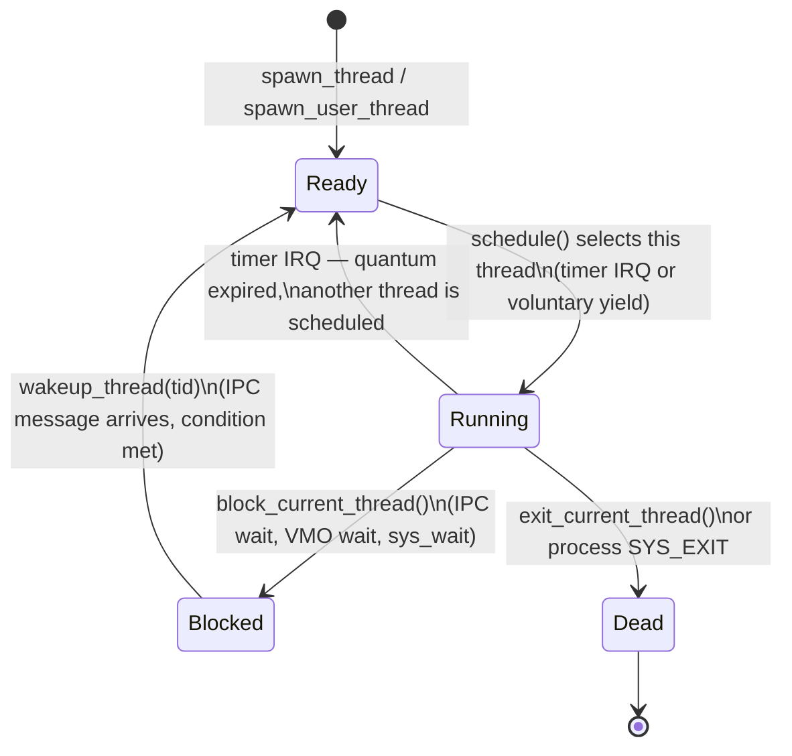
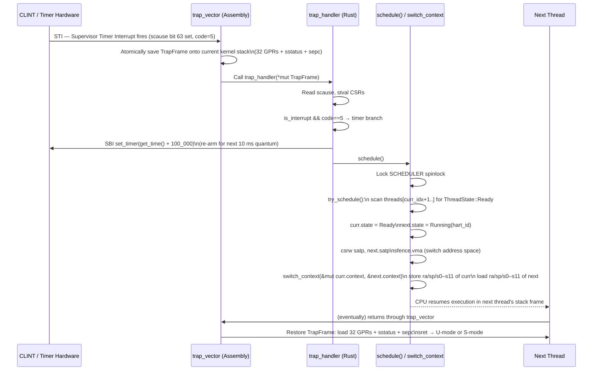

# VeridianOS Phase 4 Design Specification: Preemptive Thread Scheduler

| Attribute | Specification Details |
| :--- | :--- |
| **Document Version** | 1.0.0 |
| **Status** | Complete |
| **Target Architecture** | RISC-V 64-bit (Sv39 Paging, Supervisor Mode) |
| **Kernel Model** | Capability-Secured Microkernel |
| **Subsystem** | Thread Scheduler |

---

## 1. Executive Summary & Architecture Overview

Phase 4 introduces preemptive multitasking to VeridianOS. The scheduler implements a fixed-time-quantum round-robin policy driven by the RISC-V Supervisor Timer Interrupt (STI). Every 10 milliseconds the hardware fires an interrupt, the kernel saves the running thread's full register state, selects the next ready thread in a circular sweep of the `SCHEDULER.threads` array, restores that thread's state, and returns to it via `sret`.

The implementation has three cooperating pieces:

1. **Timer setup** — the kernel programs the CLINT via SBI `set_timer` at boot and re-arms it on every timer interrupt, producing a 10 ms quantum.
2. **Trap handler** — the assembly trampoline `trap_vector` saves all 32 RISC-V general-purpose registers plus `sstatus` and `sepc` into a `TrapFrame` on the interrupt stack, then dispatches to `trap_handler`. The timer-interrupt branch calls `schedule()`.
3. **Context switch** — `switch_context` (implemented in assembly) stores the callee-saved registers (`ra`, `sp`, `s0`–`s11`) of the current thread into its `ThreadContext` and loads those of the next thread. The caller-saved registers are already on the stack in the `TrapFrame`.

Threads also support cooperative blocking: a thread waiting on an IPC channel calls `block_current_thread`, which sets its state to `Blocked` and immediately invokes `schedule()` without waiting for the timer.

The scheduler is protected by a single `spin::Mutex<SchedulerState>`. Context switches are O(1) in the number of ready threads up to `MAX_THREADS = 16`.

---

## 2. Thread State Machine



### State Definitions

| State | Meaning |
| :--- | :--- |
| `Ready` | Thread is runnable and waiting in the scheduler queue |
| `Running(hart_id)` | Thread is currently executing on the specified hardware hart |
| `Blocked` | Thread is suspended waiting for an external event; not selected by the scheduler |
| `Exited` | Thread has called `exit_current_thread`; its slot will not be scheduled again |

---

## 3. Timer Interrupt and Context Switch Sequence



---

## 4. Design Goals

### 4.1 Preemptive 10 ms Time Quantum

The kernel uses the RISC-V `time` CSR, exposed through the SBI `get_time` call, to read the current cycle count. The CLINT timer is configured with:

$$T_{\text{next}} = T_{\text{current}} + 100{,}000 \text{ ticks}$$

On a QEMU `virt` machine running at 10 MHz (the default CLINT frequency), 100,000 ticks correspond to exactly 10 milliseconds per quantum. The timer is re-armed inside `trap_handler` before `schedule()` is called, so the next interrupt is always a full quantum away regardless of how long the scheduler itself takes.

No thread can run longer than one quantum without being preempted, because the STI is unconditionally re-armed and the scheduler always picks the next `Ready` thread. A thread that has no ready peers continues running — the scheduler returns without performing a context switch if `try_schedule()` finds no candidate.

### 4.2 O(1) Context Switch

`switch_context` is a pure register save/restore with no memory allocation and no lock acquisition. The function stores 14 registers (ra, sp, s0–s11) into the `current` `ThreadContext` and loads 14 registers from the `next` `ThreadContext`. The total cost is 28 memory operations plus a CSR write for `satp` and `sfence.vma`. This is independent of the number of threads in the system.

The containing `try_schedule()` performs a linear scan of `MAX_THREADS = 16` slots to find the next ready thread. Because MAX_THREADS is a small compile-time constant, this is effectively O(1) in practice and avoids a heap-allocated run queue.

### 4.3 Cooperative Blocking for IPC

Preemption handles CPU-bound threads, but a thread waiting for a message on an IPC channel should not burn its entire quantum polling. `block_current_thread` sets the current thread's state to `Blocked` and immediately calls `schedule()`, yielding the CPU before the quantum expires. This is cooperative in the sense that the thread itself initiates the yield, but preemption remains active: if a thread never blocks and never calls `sys_yield`, the timer interrupt will still evict it after 10 ms.

When the awaited condition is met — for example, when a message arrives on a channel — the kernel calls `wakeup_thread(tid)`, which transitions the thread back to `Ready`. On the next scheduler invocation (either a timer interrupt or a voluntary yield from another thread), the woken thread becomes eligible for selection.

---

## 5. TrapFrame Structure

The `TrapFrame` is the complete CPU snapshot saved by `trap_vector` on every trap entry. Its layout must match the assembly offsets in `kernel/src/arch/riscv64/trap.S` exactly.

```rust
// kernel/src/trap.rs

/// Complete CPU state captured on trap entry.
/// Must match assembly offsets in trap.S exactly.
/// Total size: 34 × 8 = 272 bytes.
#[repr(C)]
#[derive(Debug, Clone, Copy)]
pub struct TrapFrame {
    /// General-purpose registers x0–x31.
    /// x0 (zero) is saved as a placeholder to keep indexing uniform.
    /// Significant registers:
    ///   x1  = ra  (return address)
    ///   x2  = sp  (stack pointer — user stack on U-mode trap)
    ///   x10 = a0  (syscall return value / first argument)
    ///   x17 = a7  (syscall number)
    pub regs: [usize; 32],
    /// Supervisor Status register (sstatus).
    /// Bit 8 (SPP): 0 = trap came from U-mode, 1 = from S-mode.
    pub sstatus: usize,
    /// Supervisor Exception Program Counter (sepc).
    /// Points to the instruction that caused the trap.
    /// For syscalls (ecall), the handler advances sepc by 4 before returning.
    pub sepc: usize,
}
```

All 32 general-purpose registers are saved because the interrupted thread may have been using any of them (caller-saved registers are volatile across a function call but must survive a preemptive interrupt). The callee-saved registers (`s0`–`s11`) are additionally stored in `ThreadContext` during a context switch so that resumed threads see a consistent callee-saved state even across scheduler invocations where the TrapFrame is consumed.

---

## 6. ThreadContext and Context Switch

### 6.1 ThreadContext (Callee-Saved Registers Only)

```rust
// kernel/src/process/thread.rs

/// The 14 callee-saved registers that must survive a scheduler context switch.
///
/// The RISC-V calling convention requires that ra, sp, and s0–s11 be
/// preserved across function calls. switch_context stores these from the
/// outgoing thread and restores them for the incoming thread.
#[repr(C)]
#[derive(Debug, Default, Clone, Copy)]
pub struct ThreadContext {
    pub ra: usize,       // x1  — return address (resumes at the right instruction)
    pub sp: usize,       // x2  — stack pointer  (switches to the next thread's kernel stack)
    pub s: [usize; 12], // x8–x9, x18–x27  — callee-saved general registers
}
```

### 6.2 switch_context Assembly

```asm
# kernel/src/arch/riscv64/switch.S
#
# extern "C" fn switch_context(current: *mut ThreadContext, next: *const ThreadContext)
#
# a0 = pointer to current ThreadContext (write)
# a1 = pointer to next   ThreadContext (read)
#
# Stores callee-saved registers of the current thread, then loads those
# of the next thread. The function "returns" into the next thread's context
# because ra is loaded from next.ra.

.globl switch_context
switch_context:
    # --- Save current thread's callee-saved state ---
    sd  ra,  0*8(a0)        # Save return address
    sd  sp,  1*8(a0)        # Save stack pointer
    sd  s0,  2*8(a0)        # Save s0–s11
    sd  s1,  3*8(a0)
    sd  s2,  4*8(a0)
    sd  s3,  5*8(a0)
    sd  s4,  6*8(a0)
    sd  s5,  7*8(a0)
    sd  s6,  8*8(a0)
    sd  s7,  9*8(a0)
    sd  s8, 10*8(a0)
    sd  s9, 11*8(a0)
    sd  s10,12*8(a0)
    sd  s11,13*8(a0)

    # --- Restore next thread's callee-saved state ---
    ld  ra,  0*8(a1)        # Load return address → CPU will jump here on ret
    ld  sp,  1*8(a1)        # Load next thread's stack pointer
    ld  s0,  2*8(a1)
    ld  s1,  3*8(a1)
    ld  s2,  4*8(a1)
    ld  s3,  5*8(a1)
    ld  s4,  6*8(a1)
    ld  s5,  7*8(a1)
    ld  s6,  8*8(a1)
    ld  s7,  9*8(a1)
    ld  s8, 10*8(a1)
    ld  s9, 11*8(a1)
    ld  s10,12*8(a1)
    ld  s11,13*8(a1)

    ret                     # Jump to next thread's ra
```

The `ret` instruction is the atomic hand-off point: execution continues on the next thread's stack at the instruction address stored in `next.context.ra`. For a newly spawned thread that has never run before, `ra` is set to the thread entry function by `Thread::init_context`.

---

## 7. Timer Setup via SBI and CLINT

The RISC-V SBI (Supervisor Binary Interface) provides a machine-mode abstraction for the CLINT timer. The kernel does not access CLINT MMIO directly; instead it calls the SBI extension `TIME` (extension ID `0x54494D45`).

### 7.1 SBI Timer Call

```rust
// kernel/src/sbi.rs  (excerpt)

/// Read the current value of the machine-mode time CSR via SBI.
pub fn get_time() -> usize {
    let time: usize;
    unsafe {
        core::arch::asm!(
            "rdtime {}", out(reg) time,
        );
    }
    time
}

/// Program the CLINT to fire the next Supervisor Timer Interrupt.
///
/// `stime_value` is an absolute machine-mode time tick count.
/// The STI fires when the hardware `time` CSR equals or exceeds this value.
pub fn set_timer(stime_value: usize) {
    // SBI call: EID=0x54494D45 ("TIME"), FID=0x00 (sbi_set_timer)
    unsafe {
        core::arch::asm!(
            "li a7, 0x54494D45",   // Extension ID: TIME
            "li a6, 0",            // Function  ID: sbi_set_timer
            "mv a0, {0}",          // Argument:     stime_value
            "ecall",               // Trap to M-mode SBI firmware
            in(reg) stime_value,
            out("a0") _,
            out("a6") _,
            out("a7") _,
        );
    }
}
```

### 7.2 Timer Interrupt Enable Sequence

At boot `trap::init` configures the timer and enables the STI in `sie`:

```rust
// kernel/src/trap.rs

pub fn init() {
    unsafe {
        // 1. Point stvec at the assembly trap entry point.
        core::arch::asm!("csrw stvec, {}", in(reg) trap_vector as usize);

        // 2. Enable SUM (Supervisor User Memory access) for kernel reads
        //    of user-space pointers passed in syscall arguments.
        core::arch::asm!("csrs sstatus, {}", in(reg) 0x40000usize);

        // 3. Enable STIE — Supervisor Timer Interrupt Enable (sie bit 5).
        core::arch::asm!("csrs sie, {}", in(reg) 0x20usize);

        // 4. Arm the first timer interrupt: 10 ms from now.
        //    QEMU virt CLINT runs at 10 MHz → 100,000 ticks = 10 ms.
        crate::sbi::set_timer(crate::sbi::get_time() + 100_000);
    }
}
```

On every timer interrupt, `trap_handler` re-arms the timer before calling `schedule()`:

```rust
// kernel/src/trap.rs  (timer branch inside trap_handler)

if is_interrupt && code == 5 {
    // Re-arm the CLINT for the next quantum before doing any scheduling work.
    // This ensures the next interrupt fires 10 ms from NOW, not from when
    // the scheduler finishes.
    crate::sbi::set_timer(crate::sbi::get_time() + 100_000);
    crate::process::thread::schedule();
}
```

---

## 8. Thread Lifecycle and Struct

### 8.1 Thread Struct

```rust
// kernel/src/process/thread.rs

/// 16 KiB kernel stack, 16-byte aligned as required by RISC-V ABI.
#[repr(align(16))]
pub struct Stack(pub [u8; 16384]);

/// The primary kernel-level thread structure.
#[repr(C)]
#[repr(align(16))]
pub struct Thread {
    /// Unique thread identifier, monotonically increasing.
    pub tid: usize,
    /// PID of the owning process. Kernel threads use PID 0.
    pub pid: usize,
    /// Current lifecycle state.
    pub state: ThreadState,
    /// Callee-saved register snapshot (updated on context switch).
    pub context: ThreadContext,
    /// Heap-allocated kernel stack. None for the boot thread (uses boot stack).
    pub stack: Option<alloc::boxed::Box<Stack>>,
    /// The satp value for this thread's address space.
    /// Kernel threads share KERNEL_PAGE_TABLE.satp().
    pub satp: usize,
    /// U-mode entry point address. Set by spawn_user_thread; None for kernel threads.
    pub user_entry: Option<usize>,
    /// U-mode stack pointer. Set by spawn_user_thread; None for kernel threads.
    pub user_sp: Option<usize>,
    /// Saved TrapFrame from the most recent trap into this thread.
    /// Used by the enclave and exception subsystems.
    pub saved_user_context: Option<crate::trap::TrapFrame>,
}
```

### 8.2 Thread Creation

```rust
// kernel/src/process/thread.rs

impl Thread {
    pub fn new(tid: usize, satp: usize, pid: usize) -> Self {
        Self {
            tid,
            pid,
            state: ThreadState::Ready,
            context: ThreadContext::default(),
            // Allocate the kernel stack on the heap. The Box pins the stack
            // in memory; the address must not change after init_context is called.
            stack: Some(alloc::boxed::Box::new(Stack([0; 16384]))),
            satp,
            user_entry: None,
            user_sp:    None,
            saved_user_context: None,
        }
    }

    /// Initialize ra and sp in ThreadContext.
    ///
    /// IMPORTANT: Must be called AFTER the Thread is placed in its final
    /// memory location (e.g., inside the scheduler's threads array).
    /// Moving the Thread struct after this call invalidates context.sp.
    pub fn init_context(&mut self, entry: fn() -> !) {
        if let Some(ref stack) = self.stack {
            // Stack grows downward; top = base + size.
            let stack_top = &**stack as *const Stack as usize + 16384;
            assert!(stack_top.is_multiple_of(16), "Stack top must be 16-byte aligned");
            self.context.sp = stack_top;
            self.context.ra = entry as usize;
        }
    }
}
```

### 8.3 Scheduler State

```rust
// kernel/src/process/thread.rs

/// Maximum concurrently tracked threads across all harts.
pub const MAX_THREADS: usize = 16;

struct SchedulerState {
    /// Thread table — fixed-size to avoid heap allocation in the scheduler path.
    threads: [Option<Thread>; MAX_THREADS],
    /// Per-hart index of the currently running thread slot.
    /// Indexed by hart_id (0..4).
    current_idx: [usize; 4],
}

static SCHEDULER: Mutex<SchedulerState> = Mutex::new(SchedulerState::new());
```

### 8.4 Round-Robin Selection

```rust
// kernel/src/process/thread.rs

fn try_schedule(&mut self) -> bool {
    let hart_id  = get_hart_id();
    let curr_idx = self.current_idx[hart_id];
    let mut next_idx = curr_idx;

    // Linear scan from curr+1 wrapping around. Stops when a Ready thread is found
    // or when we have checked every slot without success.
    let found = loop {
        next_idx = (next_idx + 1) % MAX_THREADS;
        if let Some(ref t) = self.threads[next_idx] {
            if t.state == ThreadState::Ready { break true; }
        }
        if next_idx == curr_idx { break false; }
    };

    if found {
        // SAFETY: curr_ptr and next_ptr are distinct indices into the threads
        // array. We obtain two mutable references to different elements of the
        // same slice using raw pointer aliasing, which is sound because the
        // indices are verified to differ before this block is entered.
        let current_ptr = &mut self.threads[curr_idx] as *mut Option<Thread>;
        let next_ptr    = &mut self.threads[next_idx] as *mut Option<Thread>;

        unsafe {
            if let (Some(curr), Some(next)) = (&mut *current_ptr, &mut *next_ptr) {
                // Mark the outgoing thread as Ready (unless it is Blocked or Exited).
                if let ThreadState::Running(h) = curr.state {
                    if h == hart_id { curr.state = ThreadState::Ready; }
                }
                next.state = ThreadState::Running(hart_id);
                self.current_idx[hart_id] = next_idx;

                // Switch address space before the register swap so that the
                // incoming thread's stack is accessible as soon as switch_context
                // changes sp.
                core::arch::asm!("csrw satp, {}", in(reg) next.satp);
                core::arch::asm!("sfence.vma");

                switch_context(&mut curr.context, &next.context);
                return true;
            }
        }
    }
    false
}
```

---

## 9. System Call Interface: SYS_THREAD_YIELD

A thread may voluntarily surrender its remaining quantum by invoking `SYS_THREAD_YIELD`. The kernel immediately runs `schedule()`, transferring the CPU to the next ready thread. If no other thread is ready, the caller resumes without interruption.

**System Call Number:**

```
SYS_YIELD = 6
```

**Register Mapping:**

| Register | Value |
| :--- | :--- |
| `a7` | `6` |
| `a0` | (unused — set to `0` by convention) |

**C-style Signature:**
```c
int sys_yield(void);
```

**Return Values:**
- Success: `0` (always; the scheduler never fails a yield).

**Kernel Implementation:**

```rust
// kernel/src/syscall/mod.rs

fn sys_yield() -> isize {
    // Advance sepc past the ecall instruction before returning to user-space.
    // (sepc adjustment is performed by the common syscall dispatch path.)
    crate::process::thread::schedule();
    0
}
```

**User-Space Assembly:**

```asm
# Inline assembly for a RISC-V U-mode yield call.
li   a7, 6          # SYS_YIELD
li   a0, 0          # argument: unused
ecall               # trap to S-mode kernel
# a0 = 0 on return
```

**Syscall Dispatch in trap_handler:**

```rust
// kernel/src/trap.rs  (ecall branch, scause == 8 for U-mode ecall)

unsafe {
    let tf = &mut *tf_ptr;
    let syscall_num = tf.regs[17]; // a7
    let a0 = tf.regs[10];
    // Advance past the ecall instruction.
    tf.sepc += 4;

    let ret = match syscall_num {
        numbers::SYS_YIELD => sys_yield(),
        numbers::SYS_WRITE => sys_write(a0, tf.regs[11]),
        numbers::SYS_EXIT  => sys_exit(a0 as i32),
        _ => -38, // ENOSYS
    };
    tf.regs[10] = ret as usize; // a0 = return value
}
```

---

## 10. Verification: Two Threads Interleaving

### 10.1 Test Program Description

The verification scenario spawns two kernel threads (`thread_a` and `thread_b`) alongside the boot thread. Each thread increments a per-thread counter and prints its state on each iteration. The timer interrupt at 10 ms intervals drives preemption; neither thread calls `sys_yield` voluntarily.

```rust
// user/hello/src/main.rs  (simplified verification fragment)

fn thread_a() -> ! {
    let mut count = 0usize;
    loop {
        crate::println!("[THREAD_A] tick={}", count);
        count += 1;
        // Busy loop; preemption is driven entirely by the timer interrupt.
        for _ in 0..500_000 { core::hint::spin_loop(); }
    }
}

fn thread_b() -> ! {
    let mut count = 0usize;
    loop {
        crate::println!("[THREAD_B] tick={}", count);
        count += 1;
        for _ in 0..500_000 { core::hint::spin_loop(); }
    }
}

// In kmain:
process::thread::spawn_thread(thread_a).expect("spawn thread_a");
process::thread::spawn_thread(thread_b).expect("spawn thread_b");
process::thread::schedule(); // Boot thread yields to first ready thread.
```

### 10.2 Expected UART Log Output

The following interleaving demonstrates correct preemptive scheduling. Timer interrupts appear as `[SCHED]` lines; thread output appears between them. The exact ordering of A and B ticks relative to timer lines may vary by CPU speed, but each thread must produce output before the next timer fires.

```
[BOOT] Scheduler initializing. Boot hart ID: 0
[BOOT] Thread context initialized: tid=1, sp=0x8620_0000, ra=0x8020_XXXX
[BOOT] Thread context initialized: tid=2, sp=0x8630_0000, ra=0x8020_YYYY
[TRAP] Trap vector initialized: stvec = 0x802ZZZZZ
[SCHED] Timer IRQ. Hart 0. Re-arm CLINT: next_tick=100000
[SCHED] Hart 0: curr=0 (boot, Ready) -> next=1 (thread_a, Running)
[SCHED] satp switch: 0x8000000000080200 -> 0x8000000000080200 (same kernel PT)
[THREAD_A] tick=0
[THREAD_A] tick=1
[THREAD_A] tick=2
[SCHED] Timer IRQ. Hart 0. Re-arm CLINT: next_tick=200000
[SCHED] Hart 0: curr=1 (thread_a, Ready) -> next=2 (thread_b, Running)
[THREAD_B] tick=0
[THREAD_B] tick=1
[THREAD_B] tick=2
[SCHED] Timer IRQ. Hart 0. Re-arm CLINT: next_tick=300000
[SCHED] Hart 0: curr=2 (thread_b, Ready) -> next=1 (thread_a, Running)
[THREAD_A] tick=3
[THREAD_A] tick=4
[SCHED] Timer IRQ. Hart 0. Re-arm CLINT: next_tick=400000
[SCHED] Hart 0: curr=1 (thread_a, Ready) -> next=2 (thread_b, Running)
[THREAD_B] tick=3
[THREAD_B] tick=4
```

### 10.3 Verification Checklist

| Check | Expected Evidence |
| :--- | :--- |
| Timer fires every ~10 ms | `next_tick` increments by 100,000 each log line |
| Both threads execute | Both `[THREAD_A]` and `[THREAD_B]` lines appear before termination |
| Round-robin order preserved | A → B → A → B alternation in scheduler log |
| No deadlock | Output continues indefinitely without hanging |
| satp switch correct | No page-fault traps between thread switches |
| Stack isolation | Thread A's counter never appears in Thread B's print and vice versa |

### 10.4 Cooperative Blocking Verification

To verify `block_current_thread` and `wakeup_thread`, a separate test has `thread_a` block after tick 2 and has the boot thread wake it after 30 ms:

```
[THREAD_A] tick=2
[THREAD_A] blocking self (tid=1)
[SCHED] Hart 0: thread 1 state -> Blocked. Yielding.
[SCHED] Hart 0: curr=1 (Blocked) -> next=2 (thread_b, Running)
[THREAD_B] tick=0
[THREAD_B] tick=1
[THREAD_B] tick=2
[THREAD_B] tick=3
[BOOT] Waking thread tid=1
[SCHED] wakeup_thread(1): state Blocked -> Ready
[SCHED] Hart 0: curr=2 (thread_b, Ready) -> next=1 (thread_a, Running)
[THREAD_A] tick=3
```

Thread B produces four ticks while Thread A is blocked, confirming that a blocked thread does not consume CPU time and that `wakeup_thread` correctly returns it to the ready queue.
