# VeridianOS Phase 5 Design Specification: VirtIO Block Driver & InitRAMFS

| Attribute | Specification Details |
| :--- | :--- |
| **Document Version** | 1.0.0 |
| **Status** | Complete |
| **Target Architecture** | RISC-V 64-bit (Sv39 Paging, Supervisor Mode) |
| **Kernel Model** | Capability-Secured Microkernel |
| **Subsystem** | Storage Bootstrap — VirtIO Block Driver & InitRAMFS |

---

## 1. Executive Summary & Architecture Overview

Before any user-space binary can execute, the kernel needs a mechanism to find and read it. Phase 5 solves this by wiring two subsystems together: a polling VirtIO block driver that reads raw sectors from the QEMU-emulated disk, and a POSIX ustar TAR parser (InitRAMFS) that indexes the resulting buffer so named ELF binaries can be retrieved in O(N) time without dynamic allocation.

The backing store is a POSIX ustar TAR archive (`disk.img`) built at compile time with standard `tar cf --format=ustar` and presented to QEMU as a `virtio-blk` device. This pairing is deliberate: ustar's fixed 512-byte header blocks align exactly with the VirtIO sector size, making the entire pipeline zero-copy from DMA buffer to in-kernel file index. No heap fragmentation occurs during parsing because all data structures use statically-bounded arrays and a single bulk-read into a pre-allocated 4 MB kernel buffer.

The phase ends with `RamFs::find("hello")` returning a `&'static [u8]` slice — the raw ELF bytes that Phase 6's loader will consume.

### System Architecture

```mermaid
graph TD
    subgraph HostBuild ["Build Host"]
        TAR["disk.img\n(ustar TAR archive)\nhello · neural_test · ..."]
    end

    subgraph QEMU ["QEMU virt Machine"]
        VirtIODev["virtio-blk Device\nMMIO base: 0x10001000\n512-byte sectors"]
    end

    subgraph KernelS ["VeridianOS Kernel (S-mode)"]
        direction TB

        subgraph VirtIODriver ["VirtIO Block Driver\nkernel/src/virtio/blk.rs"]
            DescRing["Descriptor Ring\n[Desc 0: BlkReq header]\n[Desc 1: 512-byte data buf]\n[Desc 2: status byte]"]
            AvailRing["Available Ring\n(kernel → device)"]
            UsedRing["Used Ring\n(device → kernel, polled)"]
            Doorbell["Queue Notify\nMMIO write 0x10001050"]
        end

        BlockBuf["4 MB Kernel Buffer\n(heap-allocated Vec<u8>)\nsectors_to_read × 512 bytes"]

        subgraph InitRAMFS ["InitRAMFS Parser\nkernel/src/fs/ramfs.rs"]
            UstarParse["ustar Header Walk\n512-byte block stride"]
            FileIndex["FileEntry Index\n[name; 100] + data_offset + data_len\nstatic [Option<FileEntry>; 64]"]
            FindFn["RamFs::find(name)\n→ &'static [u8]"]
        end
    end

    TAR -->|"QEMU -drive file=disk.img,if=virtio"| VirtIODev
    VirtIODev -->|"DMA → desc[1] data buf"| DescRing
    DescRing --> AvailRing
    AvailRing -->|"Doorbell write"| Doorbell
    Doorbell -->|"Device processes request"| UsedRing
    UsedRing -->|"Polling: used.idx != last_used_idx"| BlockBuf
    BlockBuf -->|"Bulk copy all sectors"| UstarParse
    UstarParse -->|"Regular files only (typeflag '0')"| FileIndex
    FileIndex --> FindFn
    FindFn -->|"&'static [u8] ELF bytes"| PhaseNext["Phase 6: ELF Loader"]

    classDef build fill:#e8f5e9,stroke:#2e7d32,stroke-width:2px;
    classDef qemu fill:#fff3e0,stroke:#e65100,stroke-width:2px;
    classDef driver fill:#e3f2fd,stroke:#1565c0,stroke-width:2px;
    classDef ramfs fill:#fce4ec,stroke:#880e4f,stroke-width:2px;
    classDef buf fill:#f3e5f5,stroke:#4a148c,stroke-width:2px;

    class TAR build;
    class VirtIODev,Doorbell qemu;
    class DescRing,AvailRing,UsedRing driver;
    class BlockBuf buf;
    class UstarParse,FileIndex,FindFn ramfs;
```



---

## 2. Design Goals

### 2.1 Zero-Copy VirtIO Descriptors

The VirtIO specification defines a split-virtqueue mechanism where the kernel places DMA buffer addresses directly into descriptor table entries without copying data through an intermediate staging buffer. For each sector read, the kernel populates a 3-descriptor chain: a read-only request header (`VirtioBlkReq`) giving the target sector number, a device-writeable 512-byte data buffer where the disk controller deposits the sector content via DMA, and a device-writeable 1-byte status field. Because the data buffer is part of the static `VirtioBlkState` or a slice into the caller-supplied output buffer, no extra copy occurs between disk controller and kernel memory.

For the bulk InitRAMFS load path (`RamFs::load_from_disk`), the caller supplies a pointer to the pre-allocated `Vec<u8>` backing buffer directly to `blk::read_sectors`, which issues sequential single-sector requests writing each 512 bytes in place. The resulting buffer is the canonical single source of truth; the `FileEntry` index stores byte offsets into it rather than copying file contents a second time.

### 2.2 ustar Header Parsing Without Dynamic Allocation

A ustar TAR archive is a sequence of 512-byte blocks. Every file begins with a header block followed immediately by data blocks rounded up to the next 512-byte boundary. This layout makes forward-only streaming parsing trivial: the parser maintains a single `offset: usize` cursor, casts `buf[offset]` as a `*const UstarHeader`, extracts the file size from the `size` field (an ASCII octal string), computes `data_offset = offset + 512`, advances `offset += 512 + data_blocks * 512`, and records a `FileEntry` in a statically-sized array.

No heap allocation occurs during parsing. The `files: [Option<FileEntry>; MAX_FILES]` array is embedded in the `RamFsState` struct protected by a `spin::Mutex`. The parser supports up to `MAX_FILES = 64` entries, which is sufficient for the full Phase 12 binary set.

### 2.3 Named Binary Lookup for Process Spawning

After parsing, `RamFs::find(name: &str)` performs a linear scan of the `FileEntry` index comparing the query string byte-by-byte against each entry's null-padded `name` field. When a match is found, it computes `&buf[data_offset..data_offset + data_len]` as a raw pointer into the static kernel buffer and transmutes it to a `&'static [u8]`. This lifetime is sound because the buffer is heap-allocated once and never freed or moved — it persists for the lifetime of the kernel.

This design means `SYS_SPAWN` (syscall 5) can resolve a binary name to an ELF byte slice in a single kernel call with no filesystem traversal overhead.

---

## 3. VirtIO Block Queue Implementation

### 3.1 MMIO Layout and Initialization Sequence

QEMU's `virt` machine maps up to 8 VirtIO MMIO slots starting at `0x10001000` with a stride of `0x1000`. The driver scans each slot at kernel boot, reads the `VIRTIO_MMIO_MAGIC` register (`0x74726976` = `"virt"`), and checks `VIRTIO_MMIO_DEVICE_ID` for the block device value (`2`). Once the correct slot is found, it follows the VirtIO 1.2 initialization sequence:

1. Write `ACKNOWLEDGE` to `STATUS`.
2. Write `ACKNOWLEDGE | DRIVER` to `STATUS`.
3. Negotiate features (Phase 5 accepts the minimal feature set).
4. Write `FEATURES_OK` to `STATUS`.
5. Set up the queue: write queue index `0` to `QUEUE_SEL`, confirm `QUEUE_NUM_MAX >= QUEUE_SIZE`, write `QUEUE_NUM`, write the physical addresses of the descriptor table, available ring, and used ring to the four `QUEUE_DESC_*` / `QUEUE_DRIVER_*` / `QUEUE_DEVICE_*` registers.
6. Write `QUEUE_READY = 1`.
7. Write `DRIVER_OK` to `STATUS`.

### 3.2 Descriptor Ring Layout

Each entry in the descriptor table is a `VirtqDesc`:

```rust
// kernel/src/virtio/mod.rs

/// VirtQueue Descriptor Table Entry (VirtIO Spec §2.7.5)
#[repr(C)]
pub struct VirtqDesc {
    /// Guest physical address of the buffer
    pub addr: u64,
    /// Length of the buffer in bytes
    pub len: u32,
    /// Flags: VIRTQ_DESC_F_NEXT (1) chains to next; VIRTQ_DESC_F_WRITE (2) = device-writeable
    pub flags: u16,
    /// Index of the next descriptor in the chain (valid only if NEXT flag set)
    pub next: u16,
}
```

For a block read request the kernel builds a 3-entry chain:

| Index | `addr` | `len` | `flags` | Role |
| :--- | :--- | :--- | :--- | :--- |
| 0 | `&blk_req as *const _ as u64` | `size_of::<VirtioBlkReq>()` | `NEXT` | Request header (kernel → device) |
| 1 | `data_buf.as_ptr() as u64` | `SECTOR_SIZE (512)` | `NEXT \| WRITE` | Data buffer (device → kernel, DMA writeable) |
| 2 | `&status as *const u8 as u64` | `1` | `WRITE` | Status byte (device → kernel) |

```rust
// kernel/src/virtio/blk.rs

/// Populate the 3-descriptor read chain for one sector.
/// Called once per sector inside `read_sectors`.
fn build_read_chain(
    state: &mut VirtioBlkState,
    descs: &mut [VirtqDesc],
    sector: u64,
    data_ptr: usize,
) {
    state.blk_req = VirtioBlkReq {
        blk_type: VIRTIO_BLK_T_IN, // 0 = read
        reserved: 0,
        sector,
    };
    state.status = 0xFF; // Sentinel — device will overwrite with 0x00 on success

    descs[0] = VirtqDesc {
        addr: &state.blk_req as *const _ as u64,
        len: core::mem::size_of::<VirtioBlkReq>() as u32,
        flags: VIRTQ_DESC_F_NEXT,
        next: 1,
    };
    descs[1] = VirtqDesc {
        addr: data_ptr as u64,
        len: SECTOR_SIZE as u32,
        flags: VIRTQ_DESC_F_NEXT | VIRTQ_DESC_F_WRITE,
        next: 2,
    };
    descs[2] = VirtqDesc {
        addr: &state.status as *const u8 as u64,
        len: 1,
        flags: VIRTQ_DESC_F_WRITE,
        next: 0,
    };
}
```

### 3.3 Available Ring, Used Ring, and Doorbell

The available ring is the producer side: the kernel writes the head descriptor index into `avail.ring[avail.idx % QUEUE_SIZE]`, increments `avail.idx`, then writes the queue index (`0`) to `VIRTIO_MMIO_QUEUE_NOTIFY` to ring the doorbell. The device processes the chain and writes a `VirtqUsedElem { id, len }` into the used ring, incrementing `used.idx`. The driver polls `used.idx != last_used_idx` in a tight loop, then reads `status` to confirm `VIRTIO_BLK_S_OK (0x00)`.

```rust
// kernel/src/virtio/blk.rs

/// Submit one read request and spin until the device completes it.
fn submit_and_poll(state: &mut VirtioBlkState, avail: &mut VirtqAvail, used: &VirtqUsed) {
    // Place descriptor chain head into available ring
    let slot = state.avail_idx as usize % QUEUE_SIZE;
    avail.ring[slot] = 0; // Descriptor chain head is always index 0
    avail.idx = avail.idx.wrapping_add(1);

    // Doorbell: notify device that a new entry is in the available ring
    // SAFETY: mmio_base is valid MMIO mapped by kernel at boot; write is volatile.
    unsafe {
        mmio_write(state.mmio_base, VIRTIO_MMIO_QUEUE_NOTIFY, 0);
    }

    // Poll the used ring until the device advances its index
    loop {
        core::hint::spin_loop();
        // SAFETY: used ring is device-writeable; fence prevents stale read.
        let used_idx = unsafe { core::ptr::read_volatile(&used.idx) };
        if used_idx != state.last_used_idx {
            state.last_used_idx = state.last_used_idx.wrapping_add(1);
            break;
        }
    }
}
```

---

## 4. ustar TAR Format & InitRAMFS Parser

### 4.1 512-Byte ustar Header Layout

Every file in a POSIX ustar TAR archive is preceded by exactly one 512-byte header block. All numeric fields are ASCII octal strings, null-terminated or space-terminated:

```rust
// kernel/src/fs/ramfs.rs

/// A ustar TAR header block (exactly 512 bytes).
/// IEEE Std 1003.1 / POSIX ustar format.
#[repr(C)]
struct UstarHeader {
    name:     [u8; 100],  // Filename (null-terminated)
    mode:     [u8; 8],    // File permissions (octal ASCII)
    uid:      [u8; 8],    // Owner UID (octal ASCII)
    gid:      [u8; 8],    // Owner GID (octal ASCII)
    size:     [u8; 12],   // File size in bytes (octal ASCII) — KEY FIELD
    mtime:    [u8; 12],   // Modification time (octal ASCII)
    checksum: [u8; 8],    // Header checksum
    typeflag: u8,         // '0' or 0 = regular file; '5' = directory
    linkname: [u8; 100],  // Symlink target (unused in initramfs)
    magic:    [u8; 6],    // "ustar\0" — identifies POSIX ustar format
    version:  [u8; 2],   // "00"
    uname:    [u8; 32],   // Owner username
    gname:    [u8; 32],   // Owner group name
    devmajor: [u8; 8],    // Device major (unused)
    devminor: [u8; 8],    // Device minor (unused)
    prefix:   [u8; 155],  // Path prefix (prepended to name for long paths)
    _padding: [u8; 12],   // Pad to exactly 512 bytes
}
// static_assert: core::mem::size_of::<UstarHeader>() == 512
```

### 4.2 Octal ASCII Parsing

TAR stores all numeric metadata as null-terminated ASCII octal strings. The parser must convert these to machine integers without the standard library:

```rust
// kernel/src/fs/ramfs.rs

/// Parse a null-or-space terminated ASCII octal field from a TAR header.
///
/// TAR numeric fields terminate with either a NUL byte (0x00) or a space
/// (0x20). This handles both conventions as found in real archives.
fn parse_octal(bytes: &[u8]) -> usize {
    let mut result = 0usize;
    for &b in bytes {
        if b == 0 || b == b' ' {
            break;                            // End-of-field sentinel
        }
        if (b'0'..=b'7').contains(&b) {
            result = result * 8 + (b - b'0') as usize;
        }
    }
    result
}
```

### 4.3 Archive Walking and File Index Construction

`RamFs::load_from_disk` reads all sectors into the 4 MB kernel buffer, then walks the buffer in 512-byte strides building the `FileEntry` index:

```rust
// kernel/src/fs/ramfs.rs

/// Walk the ustar archive in the kernel buffer and build the file index.
/// Called from `RamFs::load_from_disk` after `blk::read_sectors` completes.
fn parse_archive(state: &mut RamFsState) {
    let mut offset = 0usize;
    let buf_ptr = state.buf.as_ref().unwrap().as_ptr();
    let loaded_bytes = state.loaded_bytes;

    while offset + 512 <= loaded_bytes {
        // SAFETY: offset is always aligned to a 512-byte TAR block boundary;
        // the buffer is valid for loaded_bytes and initialized by read_sectors.
        let header = unsafe { &*(buf_ptr.add(offset) as *const UstarHeader) };

        // End-of-archive: two consecutive all-zero 512-byte blocks.
        if header.name[0] == 0 {
            break;
        }

        // Verify ustar magic ("ustar") at offset 257 in the header.
        let is_ustar = &header.magic[..5] == b"ustar";

        let file_size  = parse_octal(&header.size);
        let data_offset = offset + 512; // data follows immediately after header block

        // Index regular files only (typeflag '0' or binary 0x00).
        let is_regular = header.typeflag == b'0' || header.typeflag == 0;

        if is_ustar && is_regular && state.file_count < MAX_FILES {
            let mut entry = FileEntry {
                name: [0u8; 100],
                data_offset,
                data_len: file_size,
            };
            entry.name.copy_from_slice(&header.name);
            state.files[state.file_count] = Some(entry);
            state.file_count += 1;
        }

        // Advance: 1 header block + ceil(file_size / 512) data blocks.
        let data_blocks = file_size.div_ceil(512);
        offset += 512 + data_blocks * 512;
    }
}
```

### 4.4 Named Lookup

```rust
// kernel/src/fs/ramfs.rs

impl RamFs {
    /// Return a static byte slice for the named file, or None if not found.
    ///
    /// # Safety
    /// The returned slice is a pointer into the static `RAMFS` buffer.
    /// It remains valid for the entire kernel lifetime.
    pub fn find(name: &str) -> Option<&'static [u8]> {
        let state = RAMFS.lock();

        for i in 0..state.file_count {
            if let Some(ref entry) = state.files[i]
                && name_matches(&entry.name, name)
            {
                let start = entry.data_offset;
                let end   = start + entry.data_len;
                if end <= state.loaded_bytes {
                    if let Some(ref buf) = state.buf {
                        // SAFETY: buf is never freed; start/end are within loaded_bytes.
                        let ptr = unsafe { buf.as_ptr().add(start) };
                        return Some(unsafe {
                            core::slice::from_raw_parts(ptr, entry.data_len)
                        });
                    }
                }
            }
        }
        None
    }
}
```

---

## 5. Disk Image Build Target

The disk image is constructed by the Makefile `disk` target after all user-space ELF binaries are compiled for `riscv64gc-unknown-none-elf`:

```makefile
# Makefile (project root)

DISK_IMG := disk.img

# Step 1: Build all user-space programs as release ELF binaries.
disk: build_hello build_neural_test build_semantic_test \
      build_agent_test build_policy_test build_smp_test build_enclave_test
	@echo "[DISK] Building disk image: $(DISK_IMG)"

	# Step 2: Create a POSIX ustar TAR from the compiled ELF binaries.
	# --format=ustar guarantees the kernel parser receives a known header layout.
	# No compression — the kernel reads raw sectors.
	cd target/riscv64gc-unknown-none-elf/release && \
	    tar cf ../../../$(DISK_IMG) --format=ustar \
	        hello neural_test semantic_test agent_test \
	        policy_test smp_test enclave_test

	@echo "[DISK] Created $(DISK_IMG) (ustar TAR):"
	@tar tf $(DISK_IMG)

# Step 3: QEMU receives the image as a virtio-blk device.
run: build
	qemu-system-riscv64 \
	    -machine virt \
	    -bios default \
	    -kernel target/riscv64gc-unknown-none-elf/release/veridian-kernel \
	    -drive file=$(DISK_IMG),if=none,format=raw,id=hd0 \
	    -device virtio-blk-device,drive=hd0 \
	    -nographic
```

QEMU presents `disk.img` to the kernel at MMIO slot `0x10001000` as a `virtio-blk` device. The kernel driver scans slots on boot, discovers device ID 2 at that address, and initializes the queue.

---

## 6. Syscall ABI Involvement

Phase 5 itself adds no new syscalls. However, the InitRAMFS is the mandatory precondition for `SYS_SPAWN`:

```
SYS_SPAWN = 5
```

| Register | Value | Description |
| :--- | :--- | :--- |
| `a7` | `5` | Syscall number `SYS_SPAWN` |
| `a0` | `name_ptr: usize` | Pointer to null-terminated binary name string in user memory |
| `a1` | `name_len: usize` | Length of the name string |
| `a2` | `0` | Reserved |
| **Return `a0`** | `tid >= 0` or negative | Thread ID of the new process, or `-ENOENT` (-2) if name not found in InitRAMFS |

The kernel syscall handler for `SYS_SPAWN` calls `RamFs::find(name)` to obtain the ELF byte slice, then passes it to `process::spawn`. If `find` returns `None`, the syscall returns `-ENOENT`.

### Error Codes for SYS_SPAWN

| Return Value | Constant | Meaning |
| :--- | :--- | :--- |
| `tid >= 0` | — | Success; tid is the new thread's ID |
| `-2` | `-ENOENT` | Binary name not found in InitRAMFS |
| `-12` | `-ENOMEM` | Process table full or out of physical memory |
| `-22` | `-EINVAL` | ELF magic invalid or wrong architecture |

---

## 7. Memory Layout Summary

| Region | Address Range | Size | Purpose |
| :--- | :--- | :--- | :--- |
| VirtIO MMIO slot 0 | `0x10001000` – `0x10001FFF` | 4 KB | VirtIO block device registers |
| VirtQueue buffer | Kernel heap (4 KB-aligned) | 8 KB | Descriptor table + avail/used rings |
| InitRAMFS buffer | Kernel heap | 4 MB (max) | Bulk sector read destination |
| FileEntry index | `RAMFS` static (stack-local inside Mutex) | `MAX_FILES × ~120 bytes` | Name-to-offset lookup table |

---

## 8. Verification: Expected UART Log

When the kernel boots with a correctly built `disk.img`, the following lines appear on UART in order. Any deviation indicates a driver or parser fault.

```
[VIRTIO] Scanning 8 MMIO slots starting at 0x10001000...
[VIRTIO] Slot 0 (0x10001000): magic=0x74726976 device_id=2 -> VirtIO Block device found.
[VIRTIO_BLK] Negotiating features...
[VIRTIO_BLK] Queue 0: desc_table=0x80300000, avail=0x80301000, used=0x80302000
[VIRTIO_BLK] QUEUE_READY set. Driver initialized. Capacity: 256 sectors (128 KB).
[RAMFS] Reading 256 sectors (128 KB) from disk...
[RAMFS] Sector   0: OK  (status=0x00)
[RAMFS] Sector   1: OK  (status=0x00)
...
[RAMFS] Sector 255: OK  (status=0x00)
[RAMFS] Parsed archive: 7 file(s) found:
  [00] hello                            (18432 bytes)
  [01] neural_test                      (22016 bytes)
  [02] semantic_test                    (20480 bytes)
  [03] agent_test                       (19968 bytes)
  [04] policy_test                      (19456 bytes)
  [05] smp_test                         (20992 bytes)
  [06] enclave_test                     (21504 bytes)
[RAMFS] InitRAMFS ready. File lookup active.
[PROCESS] RamFs::find("hello") -> 18432 bytes at offset 0x200 in RAMFS buffer.
```

If the VirtIO handshake fails (wrong magic, device ID mismatch, or `FEATURES_OK` not set by the device), the kernel panics with:

```
[VIRTIO_BLK] PANIC: No VirtIO block device found in any MMIO slot.
```

If the TAR magic check fails for every entry (corrupted image or wrong format), the archive walk terminates immediately:

```
[RAMFS] Parsed archive: 0 file(s) found:
[RAMFS] WARNING: No files indexed. Was disk.img built with --format=ustar?
```
