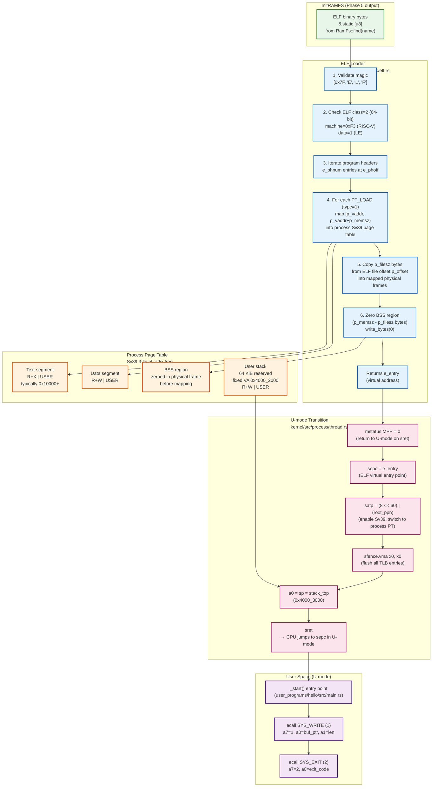

# VeridianOS Phase 6 Design Specification: ELF Loader & User Mode Transition

| Attribute | Specification Details |
| :--- | :--- |
| **Document Version** | 1.0.0 |
| **Status** | Complete |
| **Target Architecture** | RISC-V 64-bit (Sv39 Paging, Supervisor Mode) |
| **Kernel Model** | Capability-Secured Microkernel |
| **Subsystem** | Process Execution — ELF Loader & Userspace ABI |

---

## 1. Executive Summary & Architecture Overview

Phase 6 is the first moment a user-space program runs on VeridianOS. Three problems must be solved in sequence: parsing a standard ELF64 binary, constructing a per-process Sv39 virtual address space, and transferring CPU control from S-mode to U-mode at the ELF entry point without returning to a kernel context.

The ELF loader (`kernel/src/process/elf.rs`) validates the binary header, iterates over all `PT_LOAD` program header entries, allocates physical page frames for each segment, copies file content into those frames, and zeroes any BSS region (`p_memsz > p_filesz`). Segment permissions from the ELF `p_flags` field map directly to Sv39 page table leaf flags (`R`, `W`, `X`). The resulting entry point address is returned to the process spawner.

The process spawner (`kernel/src/process/mod.rs`) then allocates a 4 KB user stack at a canonical fixed virtual address, installs the process in the global `PROCESS_TABLE`, captures the `satp` value, and calls `thread::spawn_user_thread`. That function sets `mstatus.MPP = 0` (U-mode), writes the entry point to `sepc`, the stack top to `sp`, switches to the process page table via `satp`, flushes the TLB with `sfence.vma`, and executes `sret` — at which point the CPU is running unprivileged user code.

From that first instruction in U-mode, user programs communicate with the kernel exclusively through the `ecall` instruction, placing the syscall number in `a7` and arguments in `a0`–`a5`.

### System Architecture



---

## 2. Design Goals

### 2.1 PT_LOAD Segments at Correct Virtual Addresses

The ELF specification allows `PT_LOAD` segments to request arbitrary virtual addresses (`p_vaddr`). The loader must honor these exactly — it cannot relocate segments without a dynamic linker. For each `PT_LOAD` entry, the loader computes the page-aligned range `[p_vaddr & ~(PAGE_SIZE-1), (p_vaddr + p_memsz + PAGE_SIZE - 1) & ~(PAGE_SIZE-1)]` and allocates a fresh physical page frame for each page in that range. When two program headers reference virtual pages that overlap within the same 4 KB page boundary (common for combined text/data sections), the loader merges permissions via bitwise OR rather than allocating a duplicate frame.

This means the text segment at a typical address such as `0x10000` lands at exactly `0x10000` in the process's virtual address space. The ELF entry point (`e_entry`) is a virtual address within this segment; the kernel writes it directly to `sepc` before `sret`.

### 2.2 Stack at Fixed Canonical Virtual Address

User stacks are placed at a fixed virtual address to simplify early-phase debugging and avoid page-table conflicts with ELF segments. `Process::alloc_stack` always places the guard page at `0x40001000` (unmapped — any underflow access triggers a Store/AMO Page Fault back to the kernel) and the live stack page at `0x40002000`, making the initial stack pointer `sp = 0x40003000` (one page above the base, pointing to the high address of the stack page).

This layout was fixed after ASLR was temporarily disabled: a randomized offset derived from `get_time() ^ pid` occasionally placed the stack VA inside the same Sv39 Level-1 subtree as an ELF `PT_LOAD` segment near `0x40000000`, causing page-table alias faults at U-mode entry. The canonical fixed layout avoids this until a full ASLR audit of all segment VA ranges is complete.

### 2.3 ecall ABI for Syscalls

User programs issue syscalls exclusively through the RISC-V `ecall` instruction. There is no `vDSO`, no shared library, and no signal trampoline in Phase 6. The ABI is minimal and symmetric with the kernel's `trap.rs` handler: syscall number in `a7`, arguments in `a0`–`a5`, return value in `a0`. The kernel saves the full trap frame, dispatches on the syscall number, modifies `a0` in the saved frame, then returns to user mode via `sret`.

---

## 3. ELF64 Data Structures

### 3.1 ELF64 File Header

```rust
// kernel/src/process/elf.rs

/// ELF Magic identifying all ELF files (first 4 bytes of e_ident).
const ELF_MAGIC: [u8; 4] = [0x7F, b'E', b'L', b'F'];

/// ELF64 file header — 64 bytes at offset 0.
///
/// The `e_phoff` field locates the program header table.
/// The `e_entry` field gives the virtual address of the first instruction.
#[repr(C)]
#[derive(Debug, Clone, Copy)]
pub struct Elf64Header {
    pub e_ident:     [u8; 16], // Magic, class, data, version, OS/ABI, padding
    pub e_type:      u16,      // ET_EXEC (2) for static executables
    pub e_machine:   u16,      // 0xF3 = EM_RISCV
    pub e_version:   u32,      // Must be 1 (EV_CURRENT)
    pub e_entry:     u64,      // Virtual address of program entry point
    pub e_phoff:     u64,      // Byte offset of program header table
    pub e_shoff:     u64,      // Byte offset of section header table (unused)
    pub e_flags:     u32,      // Architecture-specific flags
    pub e_ehsize:    u16,      // Size of this header (64 bytes)
    pub e_phentsize: u16,      // Size of one program header entry (56 bytes)
    pub e_phnum:     u16,      // Number of program header entries
    pub e_shentsize: u16,      // Size of one section header entry (unused)
    pub e_shnum:     u16,      // Number of section header entries (unused)
    pub e_shstrndx:  u16,      // Section name string table index (unused)
}
```

### 3.2 ELF64 Program Header

```rust
// kernel/src/process/elf.rs

/// ELF64 Program Header entry — 56 bytes each.
///
/// Each entry describes one memory segment. The loader processes only
/// PT_LOAD entries (p_type == 1); all other types are ignored.
#[repr(C)]
#[derive(Debug, Clone, Copy)]
pub struct Elf64Phdr {
    pub p_type:   u32,  // PT_LOAD = 1; PT_NULL = 0; PT_DYNAMIC = 2; etc.
    pub p_flags:  u32,  // Permission flags: PF_X=1, PF_W=2, PF_R=4
    pub p_offset: u64,  // Byte offset of segment data in the ELF file
    pub p_vaddr:  u64,  // Target virtual address in the process address space
    pub p_paddr:  u64,  // Physical address (unused for S-mode ELFs)
    pub p_filesz: u64,  // Number of bytes to copy from file
    pub p_memsz:  u64,  // Total size of segment in memory (>= p_filesz; BSS = memsz-filesz)
    pub p_align:  u64,  // Alignment constraint (must be power of 2)
}
```

### 3.3 Program Header Flag-to-PageTable Mapping

| ELF `p_flags` bit | Value | RISC-V Sv39 leaf flag | Meaning |
| :--- | :--- | :--- | :--- |
| `PF_X` | `0x1` | `PageTableFlags::EXECUTE` | Pages are executable (text segment) |
| `PF_W` | `0x2` | `PageTableFlags::WRITE` | Pages are writeable (data/BSS/stack) |
| `PF_R` | `0x4` | `PageTableFlags::READ` | Pages are readable (always set for LOAD) |
| *(always)* | — | `PageTableFlags::USER \| PageTableFlags::VALID` | Page is accessible in U-mode |

---

## 4. `load_elf` Step-by-Step

```rust
// kernel/src/process/elf.rs

/// Parse and load an ELF64 binary into the given Sv39 page table.
///
/// Returns the ELF entry point virtual address (`e_entry`) on success.
/// The caller is responsible for allocating and setting up the user stack
/// before transferring control to the returned entry point.
pub fn load_elf(elf_data: &[u8], page_table: &mut PageTable) -> Result<usize, &'static str> {
    // Step 1 — Validate minimum size.
    if elf_data.len() < core::mem::size_of::<Elf64Header>() {
        return Err("ELF data is too small to contain header");
    }

    // Step 2 — Cast header pointer.
    // SAFETY: elf_data is &'static [u8] from RAMFS; alignment of u8 slice
    // satisfies repr(C) packed header; size validated in step 1.
    let header = unsafe { &*(elf_data.as_ptr() as *const Elf64Header) };

    // Step 3 — Verify ELF magic, class, endianness, and target architecture.
    if header.e_ident[0..4] != ELF_MAGIC {
        return Err("Invalid ELF magic");
    }
    if header.e_ident[4] != 2 {
        return Err("Unsupported ELF class (must be ELF64)");
    }
    if header.e_ident[5] != 1 {
        return Err("Unsupported ELF data format (must be Little Endian)");
    }
    if header.e_machine != 0xF3 {
        return Err("Unsupported architecture (must be RISC-V, e_machine=0xF3)");
    }

    let ph_offset = header.e_phoff as usize;
    let ph_num    = header.e_phnum as usize;
    let ph_size   = header.e_phentsize as usize;

    // Step 4 — Bounds-check the program header table.
    if ph_offset + ph_num * ph_size > elf_data.len() {
        return Err("Program headers extend beyond ELF data");
    }

    // Step 5 — Iterate PT_LOAD segments.
    for i in 0..ph_num {
        let ph_ptr = unsafe {
            elf_data.as_ptr().add(ph_offset + i * ph_size) as *const Elf64Phdr
        };
        let phdr = unsafe { &*ph_ptr };

        if phdr.p_type != 1 {
            continue; // Skip PT_NULL, PT_DYNAMIC, PT_NOTE, etc.
        }

        let start_vaddr    = phdr.p_vaddr as usize;
        let file_end_vaddr = start_vaddr + phdr.p_filesz as usize;
        let end_vaddr      = start_vaddr + phdr.p_memsz as usize;

        // Align segment bounds to 4 KB page boundaries.
        let start_page = start_vaddr & !(PAGE_SIZE - 1);
        let end_page   = (end_vaddr + PAGE_SIZE - 1) & !(PAGE_SIZE - 1);

        // Derive Sv39 leaf flags from p_flags.
        let mut seg_flags = PageTableFlags::USER | PageTableFlags::VALID;
        if (phdr.p_flags & 1) != 0 { seg_flags |= PageTableFlags::EXECUTE; }
        if (phdr.p_flags & 2) != 0 { seg_flags |= PageTableFlags::WRITE;   }
        if (phdr.p_flags & 4) != 0 { seg_flags |= PageTableFlags::READ;    }

        // Step 6 — Allocate a physical frame for every page in the segment.
        for page_vaddr in (start_page..end_page).step_by(PAGE_SIZE) {
            let phys_frame = map_or_merge_page(page_table, page_vaddr, seg_flags)?;

            // Step 7 — Copy file bytes into the frame (intersection of page and file range).
            let copy_start = core::cmp::max(page_vaddr, start_vaddr);
            let copy_end   = core::cmp::min(page_vaddr + PAGE_SIZE, file_end_vaddr);

            if copy_start < copy_end {
                let offset_in_page = copy_start - page_vaddr;
                let offset_in_file = copy_start - start_vaddr + phdr.p_offset as usize;
                let len = copy_end - copy_start;
                unsafe {
                    let dst = (phys_frame + offset_in_page) as *mut u8;
                    let src = elf_data.as_ptr().add(offset_in_file);
                    core::ptr::copy_nonoverlapping(src, dst, len);
                }
            }
            // Step 8 — BSS bytes are already zero: alloc_page zeroes the frame before use.
        }
    }

    // Step 9 — Return the ELF virtual entry point.
    Ok(header.e_entry as usize)
}

/// Allocate a new frame for page_vaddr, or merge flags into an existing mapping.
/// Returns the physical address of the frame backing the page.
fn map_or_merge_page(
    pt: &mut PageTable,
    page_vaddr: usize,
    flags: PageTableFlags,
) -> Result<usize, &'static str> {
    if let Some(entry) = pt.get_entry_mut(page_vaddr) {
        if entry.is_valid() {
            // Page already mapped by a prior segment — merge permissions.
            let merged = entry.flags() | flags;
            let phys   = entry.physical_address();
            entry.set(phys, merged);
            return Ok(phys);
        }
    }
    // Allocate a new zeroed physical page frame.
    let frame = crate::memory::alloc_page()
        .ok_or("load_elf: out of physical memory")?;
    unsafe {
        core::ptr::write_bytes(frame as *mut u8, 0, PAGE_SIZE);
        pt.map(
            page_vaddr,
            frame,
            flags | PageTableFlags::VALID | PageTableFlags::ACCESSED | PageTableFlags::DIRTY,
        )?;
    }
    Ok(frame)
}
```

---

## 5. U-mode Transition

### 5.1 Process and Stack Setup

After `load_elf` returns the entry point, `process::spawn` allocates the user stack and registers the process:

```rust
// kernel/src/process/mod.rs

pub fn spawn(name: &str, elf_data: &'static [u8]) -> Result<usize, &'static str> {
    // Create isolated page table with kernel mappings mirrored in.
    let pid = NEXT_PID.fetch_add(1, Ordering::Relaxed);
    let mut process = Process::new(pid);

    // Load ELF first so alloc_stack avoids VA conflicts with PT_LOAD segments.
    let entry_point = elf::load_elf(elf_data, &mut process.page_table)?;

    // Allocate 4 KB user stack (guard at 0x40001000, live at 0x40002000).
    let (_stack_va, stack_top) = process.alloc_stack()?;
    // stack_top = 0x40003000 — the initial sp value handed to the user program.

    // Insert process into global table and capture satp for this address space.
    let satp = insert_process_and_get_satp(process)?;

    // Spawn the kernel thread that will sret into U-mode at entry_point.
    let tid = thread::spawn_user_thread(entry_point, stack_top, satp, pid)?;
    Ok(tid)
}
```

Stack virtual memory layout:

```
0x40003000  ← initial sp (stack_top, passed to sret path)
0x40002000  ← stack_va  (4 KB, READ | WRITE | USER)
0x40001000  ← guard_va  (unmapped — page fault on underflow)
0x40000000  ← base reserved
```

### 5.2 mstatus, sepc, satp, and sret

The kernel thread that performs the U-mode transition executes the following assembly sequence after disabling interrupts and switching to the process page table:

```rust
// kernel/src/process/thread.rs (U-mode entry trampoline, inline asm)

/// Transfer control to the user program at `entry` with stack pointer `sp`.
/// This function never returns — it exits via sret into U-mode.
unsafe fn enter_user_mode(entry: usize, sp: usize, satp_val: usize) -> ! {
    core::arch::asm!(
        // 1. Set mstatus.MPP = 00 (U-mode) and enable interrupts in U-mode (MPIE=1).
        //    Read mstatus, clear MPP bits [12:11], set MPIE bit [7].
        "li      t0, 0x1800",       // MPP mask (bits 12:11)
        "csrc    mstatus, t0",      // Clear MPP -> return to U-mode on mret/sret
        "li      t0, 0x80",         // SPIE bit [7] for sstatus (supervisor equiv.)
        "csrs    sstatus, t0",      // Set SPIE — user mode will have interrupts enabled

        // 2. Write the ELF entry point into sepc.
        //    sret jumps to sepc.
        "csrw    sepc, {entry}",

        // 3. Switch to the process page table.
        //    satp format: MODE=8 (Sv39) | ASID=0 | PPN=root_page_frame >> 12
        "csrw    satp, {satp}",

        // 4. Flush all TLB entries (required after changing satp).
        "sfence.vma x0, x0",

        // 5. Set the user stack pointer in the sp register.
        "mv      sp, {sp}",

        // 6. Return from supervisor — CPU switches to U-mode and jumps to sepc.
        "sret",

        entry = in(reg) entry,
        satp  = in(reg) satp_val,
        sp    = in(reg) sp,
        options(noreturn),
    );
}
```

The `satp` value encodes the Sv39 paging mode and the physical page number of the root page table:

```
satp = (8 << 60) | (0 << 44) | (root_phys_addr >> 12)
        ↑ Sv39     ↑ ASID=0   ↑ root PPN
```

After `sret`, the CPU is in U-mode. It cannot access S-mode registers, cannot modify page tables, and cannot execute privileged instructions. The only way back to the kernel is `ecall`.

---

## 6. Syscall ABI Specification

All user-kernel communication uses the standard RISC-V `ecall` convention. There is no intermediate library layer in Phase 6 — user programs invoke `ecall` directly via inline assembly.

### 6.1 Register Mapping

| Register | Role |
| :--- | :--- |
| `a7` | Syscall number (identifies the requested kernel service) |
| `a0` | Argument 0 / Return value |
| `a1` | Argument 1 |
| `a2` | Argument 2 |
| `a3` | Argument 3 |
| `a4` | Argument 4 |
| `a5` | Argument 5 |

Return values follow the same sign convention used by Linux on RISC-V: zero or positive values indicate success; negative values are negated `errno` codes.

### 6.2 User-Space ecall Wrapper

```rust
// user_programs/hello/src/main.rs

/// Execute a VeridianOS syscall.
///
/// Syscall ABI:
///   a7 = syscall number
///   a0 = arg0 (also used for return value)
///   a1 = arg1
///   a2 = arg2
#[inline(always)]
pub fn syscall(id: usize, arg0: usize, arg1: usize, arg2: usize) -> isize {
    let ret;
    unsafe {
        core::arch::asm!(
            "ecall",
            in("a7")       id,
            in("a0")       arg0,
            in("a1")       arg1,
            in("a2")       arg2,
            lateout("a0")  ret,
        );
    }
    ret
}
```

### 6.3 SYS_WRITE (1) — Write to UART Console

Writes a UTF-8 string from the user's virtual address space to the kernel UART console.

| Register | Value | Description |
| :--- | :--- | :--- |
| `a7` | `1` | `SYS_WRITE` |
| `a0` | `buf_ptr: usize` | Virtual address of the string buffer in U-mode |
| `a1` | `len: usize` | Length of the string in bytes |
| `a2` | `0` | Reserved (must be zero) |
| **Return `a0`** | `len` or negative | Number of bytes written, or `-EFAULT (-14)` if `buf_ptr` is invalid |

The kernel validates that `[buf_ptr, buf_ptr + len)` lies entirely within user-accessible mapped pages before reading any bytes. A pointer into kernel virtual memory returns `-EFAULT` and does not print.

```rust
// user_programs/hello/src/main.rs

fn print(s: &str) {
    syscall(SYS_WRITE, s.as_ptr() as usize, s.len(), 0);
}
```

### 6.4 SYS_EXIT (2) — Terminate Process

Terminates the calling process and unblocks any thread waiting on it.

| Register | Value | Description |
| :--- | :--- | :--- |
| `a7` | `2` | `SYS_EXIT` |
| `a0` | `exit_code: usize` | Exit status (0 = success, non-zero = error) |
| **Return** | *(never)* | This syscall does not return to user space |

The kernel marks the process `ProcessState::Exited(exit_code)`, reclaims the thread slot, and schedules the next ready thread. If no threads remain, the kernel enters a halt loop.

```rust
// user_programs/hello/src/main.rs

#[unsafe(no_mangle)]
#[unsafe(link_section = ".text.entry")]
pub extern "C" fn _start() -> ! {
    print("Hello from VeridianOS User Process!\n");
    syscall(SYS_EXIT, 0, 0, 0);
    loop {}  // Unreachable — SYS_EXIT terminates the thread.
}
```

### 6.5 SYS_SPAWN (5) — Spawn a Process from InitRAMFS

| Register | Value | Description |
| :--- | :--- | :--- |
| `a7` | `5` | `SYS_SPAWN` |
| `a0` | `name_ptr: usize` | Virtual address of null-terminated binary name |
| `a1` | `name_len: usize` | Length of the name string (excluding null) |
| `a2` | `0` | Reserved |
| **Return `a0`** | `tid >= 0` or negative | Thread ID of spawned process, or error code |

The kernel calls `RamFs::find(name)` to retrieve the ELF bytes, then `process::spawn` to create the process and transition it to U-mode. The calling process continues executing concurrently.

| Return Value | Constant | Meaning |
| :--- | :--- | :--- |
| `tid >= 0` | — | Success; `tid` is the new thread's ID |
| `-2` | `-ENOENT` | Binary not found in InitRAMFS |
| `-12` | `-ENOMEM` | Out of physical memory or process table full |
| `-22` | `-EINVAL` | ELF validation failed (bad magic or wrong architecture) |

### 6.6 SYS_YIELD (6) — Yield CPU

| Register | Value | Description |
| :--- | :--- | :--- |
| `a7` | `6` | `SYS_YIELD` |
| **Return `a0`** | `0` | Always succeeds; control returns after scheduler selects this thread again |

### 6.7 Full Syscall Number Table (Phase 6 Scope)

```
// kernel/src/syscall/numbers.rs

SYS_WRITE   = 1    // Write bytes to UART
SYS_EXIT    = 2    // Terminate calling process
SYS_SPAWN   = 5    // Spawn process from InitRAMFS binary name
SYS_YIELD   = 6    // Yield CPU to scheduler
SYS_WAIT    = 7    // Wait for thread exit
SYS_MAP     = 8    // Map anonymous memory
SYS_UNMAP   = 9    // Unmap memory region
```

---

## 7. User Program Structure

User programs are bare-metal `no_std` Rust binaries compiled with a custom linker script that places `_start` at the ELF entry point:

```rust
// user_programs/hello/src/main.rs

#![no_std]
#![no_main]

use core::panic::PanicInfo;

const SYS_WRITE: usize = 1;
const SYS_EXIT:  usize = 2;

#[inline(always)]
pub fn syscall(id: usize, a0: usize, a1: usize, a2: usize) -> isize {
    let ret;
    unsafe {
        core::arch::asm!(
            "ecall",
            in("a7") id, in("a0") a0, in("a1") a1, in("a2") a2,
            lateout("a0") ret,
        );
    }
    ret
}

fn print(s: &str) {
    syscall(SYS_WRITE, s.as_ptr() as usize, s.len(), 0);
}

/// Entry point placed at the beginning of .text by the linker script.
#[unsafe(no_mangle)]
#[unsafe(link_section = ".text.entry")]
pub extern "C" fn _start() -> ! {
    print("\n");
    print("╔══════════════════════════════════════════════════╗\n");
    print("║   Hello from VeridianOS User Process!           ║\n");
    print("║                                                  ║\n");
    print("║  This process was:                               ║\n");
    print("║  1. Stored as an ELF in a TAR disk image         ║\n");
    print("║  2. Read from disk via VirtIO block driver       ║\n");
    print("║  3. Found by name in the InitRAMFS               ║\n");
    print("║  4. Loaded by the ELF64 parser                   ║\n");
    print("║  5. Executed in U-mode with isolated page tables ║\n");
    print("╚══════════════════════════════════════════════════╝\n");
    print("\n");

    syscall(SYS_EXIT, 0, 0, 0);
    loop {}
}

#[panic_handler]
fn panic(_info: &PanicInfo) -> ! {
    syscall(SYS_EXIT, 1, 0, 0);
    loop {}
}
```

The linker script (`user_programs/hello/src/linker.ld`) sets `ENTRY(_start)` and places `.text.entry` at the top of the `.text` section so the ELF `e_entry` field always points to `_start`.

---

## 8. Verification: Expected UART Log

A successful Phase 6 boot produces the following UART sequence. Lines are annotated with the subsystem responsible:

```
# --- Phase 5 (VirtIO + InitRAMFS) ---
[VIRTIO_BLK] Driver initialized. Capacity: 256 sectors.
[RAMFS] Reading 256 sectors (128 KB) from disk...
[RAMFS] Parsed archive: 7 file(s) found:
  [00] hello                            (18432 bytes)
  [01] neural_test                      (22016 bytes)
  ...

# --- Phase 6 (ELF Loader + U-mode) ---
[PROCESS] Spawning process 'hello' (18432 bytes ELF)
[ELF] Loading ELF binary. Entry point: 0x10074, segments: 2
  [PT_LOAD] Segment 0: vaddr [0x10000 - 0x11610), memsz: 0x1610, filesz: 0x1610
  [PT_LOAD] Segment 1: vaddr [0x12610 - 0x12618), memsz: 0x8, filesz: 0x0
[PROCESS] ELF loaded. Entry point: 0x10074
[PROCESS] Stack allocated: guard=0x40001000, stack=0x40002000, sp=0x40003000
[PROCESS] Process 'hello' spawned as thread tid=1

# --- U-mode execution (SYS_WRITE ecall output) ---

╔══════════════════════════════════════════════════╗
║   Hello from VeridianOS User Process!           ║
║                                                  ║
║  This process was:                               ║
║  1. Stored as an ELF in a TAR disk image         ║
║  2. Read from disk via VirtIO block driver       ║
║  3. Found by name in the InitRAMFS               ║
║  4. Loaded by the ELF64 parser                   ║
║  5. Executed in U-mode with isolated page tables ║
╚══════════════════════════════════════════════════╝

# --- SYS_EXIT ecall ---
[PROCESS] Thread tid=1 (PID 2, 'hello') exited with code 0.
[SCHED] No more runnable threads. Halting.
```

### Failure Signatures

| Symptom | Likely Cause |
| :--- | :--- |
| `[ELF] PANIC: Invalid ELF magic` | `disk.img` entry is corrupt or `tar` used a non-ustar format |
| `Store/AMO Page Fault scause=15 sepc=0x10074` at U-mode entry | Stack VA collides with a PT_LOAD page — check `alloc_stack` guard offset |
| `[ELF] PANIC: Unsupported architecture (must be RISC-V)` | Binary compiled for wrong target (must be `riscv64gc-unknown-none-elf`) |
| U-mode `ecall` with no output | `SYS_WRITE` handler: `validate_user_buffer` returning false — string pointer not in mapped user pages |
| `[PROCESS] Process not found for pid N` | `with_current_process` called before process inserted into `PROCESS_TABLE` |
