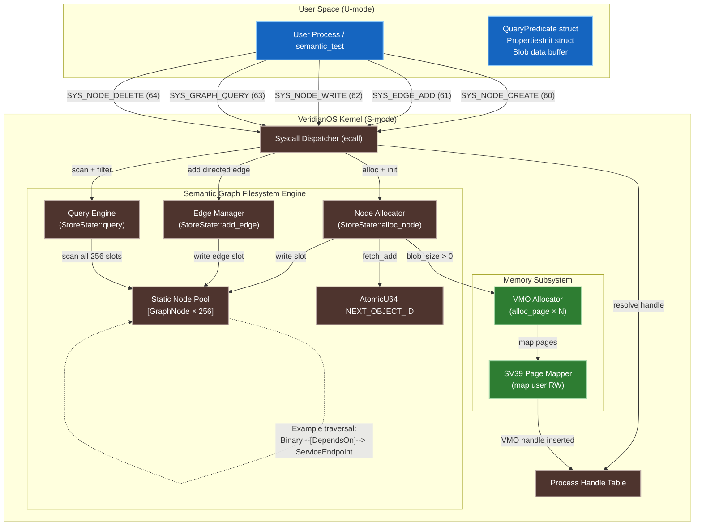

# VeridianOS Phase 8 Design Specification: Semantic Graph Filesystem

| Attribute | Specification Details |
| :--- | :--- |
| **Document Version** | 1.1.0 |
| **Status** | Complete |
| **Target Architecture** | RISC-V 64-bit (Sv39 Paging, Supervisor Mode) |
| **Kernel Model** | Capability-Secured Microkernel |
| **Subsystem** | Semantic Graph Filesystem (SGF) |
| **Syscall Range** | 60 – 64 |
| **Verification Binary** | `user_programs/semantic_test` |

---

## 1. Executive Summary

Traditional filesystems locate data by hierarchical path strings — an artifact of 1970s disk
geometry, not semantic meaning. A path like `/home/alice/projects/invoices/q4-acme.pdf` encodes
physical storage layout, not the relationships between entities: who created the document, which
project it belongs to, which company it invoices, or how it relates to a service binary. Any
meaningful query over such a layout requires either rigid naming conventions enforced by humans or
an out-of-band database. VeridianOS Phase 8 replaces this model entirely with a
**Semantic Graph Filesystem (SGF)**: a directed, labeled property graph managed as a first-class
kernel object store. Every entity — a document, a binary, a configuration file, an AI agent state
blob — is a `GraphNode` identified by a monotonically-increasing `ObjectId`. Relationships between
entities are typed, directed edges (`Edge`) stored directly on each node. Queries traverse these
edges and filter by type and property without knowledge of any path. The SGF is capability-secured:
every node is wrapped in a `Handle` inside the owning process's handle table, and all operations
require the appropriate `Rights` flags. This design positions the SGF as the persistent memory
substrate for the Phase 9 Agent Runtime, where `AgentState` nodes and their dependency graphs are
first-class citizens of the same store.

---

## 2. System Architecture



---

## 3. Design Goals

### 3.1 Semantic Query Replaces Path Lookup

The SGF has no concept of a directory or filename. Data is located by describing what it is and
how it relates to other things. A query such as "find all `Code` nodes that `DependsOn` the
`ServiceEndpoint` node with ID 7" is expressed as a `QueryPredicate` struct passed directly to
`SYS_GRAPH_QUERY`. The kernel scans the static node pool, applies the type and edge filters, and
returns a list of matching `ObjectId` values — no path construction, no directory traversal, no
out-of-band index required.

### 3.2 Capability-Secured Node Access

Every `GraphNode` is exposed to user space only as a `Handle` inside the process's handle table.
The handle carries a `Rights` bitmask that governs what the process may do:

| Rights Flag | Permitted Operation |
| :--- | :--- |
| `Rights::READ` | Read node metadata; query the graph |
| `Rights::WRITE` | Add edges; write blob data via VMO |
| `Rights::DUPLICATE` | Clone the handle and send it to another process via IPC |

A process that receives a read-only handle copy through a capability channel can inspect the node
but cannot modify its edges or blob content. The kernel enforces this at every syscall boundary
before touching the underlying `GraphNode` in the static pool.

### 3.3 O(degree) Traversal for Relationship Queries

Traversing from node X to all neighbors via a specific edge type scans only the edge list stored
on X — a fixed array of at most `MAX_EDGES = 16` entries. This is O(degree) in the out-degree of
X, independent of total graph size. Full-graph queries (type or property scans) are O(N) in the
pool size (currently N=256), bounded by the static allocation limit. Phase 9 will layer a hash
index over `ObjectType` to reduce full scans to O(matches).

---

## 4. Core Data Structures

All structs are `#[repr(C)]` and live in `kernel/src/semantic_graph/types.rs`.
No heap allocation is used anywhere in the subsystem.

### 4.1 Primitive Types

```rust
// kernel/src/semantic_graph/types.rs

pub type ObjectId = u64;
pub const OBJECT_ID_NULL: ObjectId = 0;

pub const MAX_PROPERTIES: usize = 8;
pub const MAX_EDGES:      usize = 16;
pub const MAX_STR_LEN:    usize = 32;
```

### 4.2 ObjectType Enum

```rust
#[repr(u8)]
#[derive(Debug, Clone, Copy, PartialEq, Eq)]
pub enum ObjectType {
    Blob        = 0,  // Raw bytes — replaces file inodes
    Document    = 1,  // Structured text, PDF, etc.
    Image       = 2,  // Raster image data
    Code        = 3,  // Executable binary or source file
    Config      = 4,  // Key-value configuration data
    Contact     = 5,  // Person or organization entity
    Project     = 6,  // Logical grouping concept
    Session     = 7,  // Login or authentication session
    Agent       = 8,  // AI agent entity (Phase 9 primary type)
    Custom      = 9,  // Application-defined extension
}
```

### 4.3 RelType Enum (Edge Labels)

```rust
#[repr(u16)]
#[derive(Debug, Clone, Copy, PartialEq, Eq)]
pub enum RelType {
    Contains     = 0,  // A contains B (directory-like containment)
    IsPartOf     = 1,  // A is a component of B
    CreatedBy    = 2,  // A was produced by B (Person or Agent)
    IsVersionOf  = 3,  // A is a newer version of B
    DependsOn    = 4,  // A requires B to function (code/config dependency)
    RelatedTo    = 5,  // Generic, untyped association
    IsInvoiceFor = 6,  // Document A is an invoice for entity B
    BelongsTo    = 7,  // A belongs to project or group B
    Generates    = 8,  // Agent A created or emitted B
    Custom       = 9,  // Application-defined edge semantics
}
```

### 4.4 Edge Struct

```rust
#[repr(C)]
#[derive(Debug, Clone, Copy)]
pub struct Edge {
    pub relationship: RelType,  // Labeled edge type
    pub target:       ObjectId, // Destination node (never OBJECT_ID_NULL)
}
```

### 4.5 Property and PropertyStore

```rust
#[repr(C)]
#[derive(Debug, Clone, Copy)]
pub struct Property {
    pub key: [u8; MAX_STR_LEN],  // Null-padded UTF-8 key, max 32 bytes
    pub val: [u8; MAX_STR_LEN],  // Null-padded UTF-8 value, max 32 bytes
}

#[repr(C)]
#[derive(Debug, Clone, Copy)]
pub struct PropertyStore {
    pub count: usize,                      // Number of active properties
    pub store: [Property; MAX_PROPERTIES], // Fixed array of 8 slots
}
```

### 4.6 EdgeList

```rust
#[repr(C)]
#[derive(Debug, Clone, Copy)]
pub struct EdgeList {
    pub count: usize,               // Number of active outgoing edges
    pub store: [Edge; MAX_EDGES],   // Fixed array of 16 edge slots
}
```

### 4.7 GraphNode

The central kernel object. Each allocated slot in the static pool holds one `GraphNode`.

```rust
#[repr(C)]
#[derive(Debug, Clone, Copy)]
pub struct GraphNode {
    pub id:          ObjectId,     // Monotonically increasing; never reused after free
    pub object_type: ObjectType,   // Entity classification
    pub vmo_handle:  usize,        // Handle ID into process VMO table (0 = no blob)
    pub blob_size:   usize,        // Size of attached blob in bytes
    pub properties:  PropertyStore, // Up to 8 key-value string annotations
    pub edges:       EdgeList,     // Up to 16 labeled outgoing edges
    pub ref_count:   u32,          // Reference count; node freed when this reaches 0
    pub owner_pid:   u32,          // PID of the process that created this node
    pub allocated:   bool,         // Slot occupancy flag for the static pool
}
```

### 4.8 QueryPredicate

Passed by pointer from user space to `SYS_GRAPH_QUERY`. Multiple filter fields compose with
logical AND: all active filters must match for a node to be included in results.

```rust
#[repr(C)]
#[derive(Debug, Clone, Copy)]
pub struct QueryPredicate {
    pub has_object_type: bool,
    pub object_type:     ObjectType,           // Filter: node.object_type == object_type

    pub has_property:    bool,
    pub property_key:    [u8; MAX_STR_LEN],    // Filter: node has property with this key
    pub property_val:    [u8; MAX_STR_LEN],    //         and this value (exact match)

    pub has_edge:        bool,
    pub edge_type:       RelType,              // Filter: node has an outgoing edge of this type
    pub edge_target:     ObjectId,             //         pointing to this target ObjectId
}
```

---

## 5. Graph Storage

### 5.1 Static Node Pool

The SGF uses a lock-protected static array — no heap, no dynamic allocation.

```rust
// kernel/src/semantic_graph/store.rs

pub const MAX_GRAPH_NODES: usize = 256;

pub struct StoreState {
    pub nodes: [GraphNode; MAX_GRAPH_NODES],
}

pub static GRAPH_STORE: Mutex<StoreState> = Mutex::new(StoreState::new());
static NEXT_OBJECT_ID: AtomicU64 = AtomicU64::new(1);
```

### 5.2 Handle-Based Access

User space never holds a raw `ObjectId` as a dereferenceable pointer. The kernel returns a
`Handle` ID from every `SYS_NODE_CREATE` call. This handle lives in the process's handle table
and carries the `Rights` bitmask for that process's access to that node. The `ObjectId` inside
the handle is opaque to user space and is only dereferenced inside the kernel after rights
validation.

```
Process Handle Table:
  Handle[3] → { object_type: GraphNode, object_ptr: <ObjectId=5>, rights: READ|WRITE }
  Handle[4] → { object_type: VMO,       object_ptr: 0x5000_0000,  rights: READ|WRITE }
```

### 5.3 Slot Allocation

`StoreState::alloc_node` scans the 256-slot array for the first entry where `allocated == false`,
initializes it, and returns the freshly-assigned `ObjectId`. Allocation is O(N) worst case on a
full store; at 256 nodes the worst-case scan is negligible. The `NEXT_OBJECT_ID` counter uses
`fetch_add(1, SeqCst)` and is never reset — freed node IDs are not reused, preventing
use-after-free from stale handles.

---

## 6. Syscall ABI (60–64)

All syscalls use the standard RISC-V Supervisor ABI:
- `a7` — syscall number
- `a0`–`a4` — arguments
- `a0` — return value (≥ 0 for success; negative errno for failure)

### 6.1 Full Syscall Table

| Syscall | Number | Description |
| :--- | :---: | :--- |
| `SYS_NODE_CREATE` | 60 | Allocate a new graph node, optionally with a VMO blob |
| `SYS_EDGE_ADD` | 61 | Add a directed labeled edge from one node to another |
| `SYS_NODE_WRITE` | 62 | Write data into a node's VMO blob buffer |
| `SYS_GRAPH_QUERY` | 63 | Query all nodes matching a `QueryPredicate` |
| `SYS_NODE_DELETE` | 64 | Free a node, unmap its VMO pages, and clean up stale edges |

### 6.2 SYS_NODE_CREATE (60)

Allocates a `GraphNode` in the static pool, optionally allocates and maps VMO pages for blob
data, and returns a `Handle` ID.

**Register mapping:**

| Register | Value |
| :--- | :--- |
| `a7` | `60` |
| `a0` | `object_type` — `u8` discriminant of `ObjectType` |
| `a1` | `blob_size` — bytes to allocate for blob VMO; `0` for no blob |
| `a2` | `properties_init_ptr` — user pointer to `PropertiesInit` struct; `0` if none |

**Returns:** Handle ID on success (≥ 0). Error codes: `-ENOMEM` (-12) pool full or out of
physical pages; `-EFAULT` (-14) invalid pointer; `-EPERM` (-3) no current process.

### 6.3 SYS_EDGE_ADD (61)

Adds a typed directed edge from the node identified by `src_node_handle` to the node with
`ObjectId` equal to `target_id`. Duplicate edges (same relationship and target) are silently
ignored.

**Register mapping:**

| Register | Value |
| :--- | :--- |
| `a7` | `61` |
| `a0` | `src_node_handle` — handle ID for the source node; requires `Rights::WRITE` |
| `a1` | `rel_type` — `u16` discriminant of `RelType` |
| `a2` | `target_id` — `u64` `ObjectId` of the destination node (low 64 bits via usize cast) |

**Returns:** `0` on success. Error codes: `-EBADF` (-9) invalid handle; `-EACCES` (-13)
missing `WRITE` right; `-EINVAL` (-22) target does not exist or edge limit exceeded.

### 6.4 SYS_NODE_WRITE (62)

Copies `length` bytes from user-space address `src_ptr` into the node's VMO starting at
`offset`. Both the source buffer and the VMO bounds are validated before the copy.

**Register mapping:**

| Register | Value |
| :--- | :--- |
| `a7` | `62` |
| `a0` | `node_handle` — handle for the target node; requires `Rights::WRITE` |
| `a1` | `src_ptr` — user-space pointer to source data |
| `a2` | `length` — number of bytes to write |
| `a3` | `offset` — byte offset into the node's VMO |

**Returns:** Bytes written on success (equals `length`). Error codes: `-EBADF` (-9) invalid
handle; `-EACCES` (-13) missing `WRITE` right; `-EFAULT` (-14) bad pointer or out-of-bounds
write; `-EINVAL` (-22) node has no blob VMO.

### 6.5 SYS_GRAPH_QUERY (63)

Scans all allocated nodes in the static pool, applies the `QueryPredicate` filters (AND
semantics), and writes matching `ObjectId` values into the caller's output buffer.

**Register mapping:**

| Register | Value |
| :--- | :--- |
| `a7` | `63` |
| `a0` | `predicate_ptr` — user pointer to a `QueryPredicate` struct |
| `a1` | `out_buf_ptr` — user pointer to a `u64[]` output array |
| `a2` | `max_results` — capacity of the output array |

**Returns:** Count of matching nodes written to `out_buf`. Error codes: `-EFAULT` (-14) invalid
pointer or output buffer too small.

### 6.6 SYS_NODE_DELETE (64)

Frees a graph node: unmaps and releases its VMO pages, removes the node and VMO handles from the
process's handle table, marks the pool slot as unallocated, and scrubs all outgoing edges from
other nodes that pointed to the deleted node.

**Register mapping:**

| Register | Value |
| :--- | :--- |
| `a7` | `64` |
| `a0` | `node_handle` — handle for the node to delete; requires `Rights::WRITE` |

**Returns:** `0` on success. Error codes: `-EBADF` (-9) invalid handle; `-EACCES` (-13) missing
`WRITE` right; `-EPERM` (-3) no current process.

---

## 7. Query Model

`SYS_GRAPH_QUERY` applies the three `QueryPredicate` filter fields as a conjunction. A node
passes the filter only if every active predicate matches:

1. **Type filter** (`has_object_type = true`): `node.object_type == predicate.object_type`
2. **Property filter** (`has_property = true`): at least one entry in `node.properties.store`
   has `key == predicate.property_key` AND `val == predicate.property_val` (exact byte match
   within the fixed 32-byte arrays).
3. **Edge filter** (`has_edge = true`): at least one entry in `node.edges.store` has
   `relationship == predicate.edge_type` AND `target == predicate.edge_target`.

### 7.1 Example: Find All DependsOn Neighbors of Node X

To find all nodes that have a `DependsOn` edge pointing from them to `ObjectId` X:

```rust
// User-space construction (no_std, stack-allocated)
let predicate = QueryPredicate {
    has_object_type: false,       // match any type
    object_type: ObjectType::Blob,
    has_property: false,
    property_key: [0; MAX_STR_LEN],
    property_val: [0; MAX_STR_LEN],
    has_edge: true,
    edge_type: RelType::DependsOn,
    edge_target: X,               // ObjectId of the dependency target
};

let mut results = [0u64; 16];
let count = syscall5(SYS_GRAPH_QUERY,
    &predicate as *const _ as usize,
    results.as_mut_ptr() as usize,
    16, 0, 0);
// results[0..count] now contains ObjectIds of all nodes that DependsOn X
```

The kernel's scan visits all 256 slots. For each allocated node it checks the edge list —
at most 16 entries — for a matching `(DependsOn, X)` pair. This is O(N × degree) in the
absolute worst case, bounded at O(256 × 16) = O(4096) comparisons regardless of query shape.

### 7.2 Example Traversal: Binary DependsOn ServiceEndpoint

```
Node[id=3, type=Code,    props={name:"runtime_agent"}]
  └─[DependsOn]──► Node[id=7, type=Config, props={name:"ServiceEndpoint", port:"9090"}]

Node[id=5, type=Code,    props={name:"scheduler_module"}]
  └─[DependsOn]──► Node[id=7, ...]

Query: has_edge=true, edge_type=DependsOn, edge_target=7
→ Returns [3, 5]
```

---

## 8. Comparison with Traditional Filesystems

| Property | Hierarchical Filesystem | Semantic Graph Filesystem |
| :--- | :--- | :--- |
| Data location primitive | Path string (e.g. `/a/b/c`) | `ObjectId` (monotonic `u64`) |
| Relationship representation | Directory containment only | Typed labeled edges (10 built-in types) |
| Query model | Path traversal + `grep`/`find` | `QueryPredicate` scan over node pool |
| Traversal complexity | O(path depth × directory size) | O(degree) for edge traversal; O(N) for full scan |
| Security model | POSIX `rwx` permission bits | Capability handles with `Rights` bitmask |
| Metadata | Inode timestamps + xattrs (limited) | Up to 8 typed key-value properties per node |
| Blob storage | File inode pointing to data blocks | VMO handle mapped into process address space |
| Rename/move cost | O(directory size) | O(1) — update one edge's `target` field |
| Cross-entity relationships | Symlinks (fragile) or databases (out-of-band) | First-class typed edges in the kernel object store |
| Agent-native storage | Not applicable | `ObjectType::Agent` + `Generates`/`DependsOn` edges |

---

## 9. Verification

The `user_programs/semantic_test` binary exercises the full SGF syscall surface in sequence.
Run `make run` and confirm the UART output matches exactly the log below.

### 9.1 Expected UART Log

```
[SEMANTIC_FS] Semantic Knowledge Graph Filesystem Initialized.
[USER] Starting Semantic Knowledge Graph Filesystem Verification program...
[USER] Created Document node capability successfully.
[USER] Created Blob node capability successfully.
[USER] Wrote text content into Blob node VMO successfully.
[USER] Successfully queried Document node ID by properties.
[USER] Added directed edge (Document -[Contains]-> Blob) successfully.
[USER] Relational edge query verification SUCCESS!
[USER] Semantic Knowledge Graph Filesystem Verification SUCCESS!
```

### 9.2 Verification Sequence Explained

The test binary executes seven operations in sequence, each exercising one aspect of the ABI:

1. **SYS_NODE_CREATE (Document, no blob)** — allocates a `GraphNode` with `ObjectType::Document`
   and two properties (`title="OS_Plan"`, `quarter="Q2"`). Kernel returns Handle ID for the node.

2. **SYS_NODE_CREATE (Blob, 32 bytes)** — allocates a `GraphNode` with `ObjectType::Blob` and
   a 32-byte VMO. Kernel allocates one physical page, maps it at `0x5000_0000` into the process's
   address space, and returns a Handle ID.

3. **SYS_NODE_WRITE** — copies the 32-byte literal `"VeridianOS Phase 8 works great!!"` from
   the user's stack into the Blob node's VMO at offset 0.

4. **SYS_GRAPH_QUERY (type + property filter)** — queries for `Document` nodes with
   `title="OS_Plan"`. Returns the `ObjectId` of the document created in step 1.

5. **SYS_GRAPH_QUERY (type-only filter)** — queries for all `Blob` nodes to retrieve the
   Blob node's `ObjectId`.

6. **SYS_EDGE_ADD** — adds a `Contains` edge from the Document node to the Blob node.
   Kernel validates the source handle's `WRITE` right and confirms the target `ObjectId` exists.

7. **SYS_GRAPH_QUERY (type + edge filter)** — queries for `Document` nodes that have a
   `Contains` edge pointing to the Blob `ObjectId` retrieved in step 5. The returned `ObjectId`
   is compared against the document's `ObjectId` from step 4. A mismatch causes the binary to
   exit with code 1.

### 9.3 Failure Modes

| Symptom in UART | Root Cause |
| :--- | :--- |
| `[USER] Error creating document node!` | GraphStore pool full (> 256 nodes) or handle table full |
| `[USER] Error creating blob node!` | Physical page allocator exhausted or VMO mapping failed |
| `[USER] Error writing to blob node!` | Node has no VMO (blob_size was 0) or write out of bounds |
| `[USER] Query found no matching nodes!` | Property key/value encoding mismatch (check `MAX_STR_LEN` padding) |
| `[USER] Error adding edge from Document to Blob!` | Target ObjectId not found in store (creation failed silently) |
| `[USER] Relational query verification failed!` | Edge was not stored or query predicate encoding incorrect |

---

## 10. Integration with Agent Runtime (Phase 9)

The SGF is the persistent memory substrate for Phase 9. Each AI agent process registers its
state as an `ObjectType::Agent` node in the graph at spawn time. The Agent Runtime uses the
following edge patterns to represent the agent knowledge graph:

| Edge | Meaning |
| :--- | :--- |
| `Agent --[Generates]--> Document` | Agent produced an output artifact |
| `Agent --[DependsOn]--> Config` | Agent requires a configuration node to function |
| `Agent --[Contains]--> Session` | Agent owns an active session object |
| `Agent --[CreatedBy]--> Agent` | Spawned sub-agent, forming a capability hierarchy |
| `Code --[DependsOn]--> Agent` | Service binary requires the agent to be alive |

Phase 9 will add `SYS_AGENT_SPAWN` (syscall 70) which internally calls `SYS_NODE_CREATE` with
`ObjectType::Agent` and stores the resulting `ObjectId` as the agent's identity token. All
subsequent IPC capability grants to and from the agent are recorded as edges in the SGF, giving
the kernel a queryable audit graph of the entire agent dependency tree at any point in time.

Phase 9 will also introduce the O(1) hash index over `ObjectType` deferred from Phase 8,
reducing full-graph `Agent` lookups from O(256) to O(1) expected time.

---

## 11. Academic References

| Paper | Year | Relevance |
| :--- | :--- | :--- |
| *The Semantic File System* (Gifford, Jouvelot, Sheldon, O'Toole) | SOSP '91 | Original concept of attribute-based file retrieval without path hierarchy |
| *Haystack: Finding a Needle in Facebook's Photo Storage* (Beaver et al.) | OSDI '10 | Append-only blob store design; informs VMO-backed blob attachment model |
| *WiscKey: Separating Keys from Values in SSD-Conscious Storage* | FAST '16 | Key-value separation; informs Phase 9 persistent graph backend design |
| *RDF: Resource Description Framework* (W3C) | 1999+ | Subject-predicate-object triples; direct inspiration for `Edge` labeled relationships |
| *Property Graph Model* (Neo4j, Apache TinkerPop) | 2010+ | Typed node and edge properties; basis for `ObjectType` + `RelType` design |
| *AIOS: LLM Agent Operating System* (Mei et al.) | arXiv 2024 | AI-native storage for agent memory; validates SGF as Phase 9 substrate |
