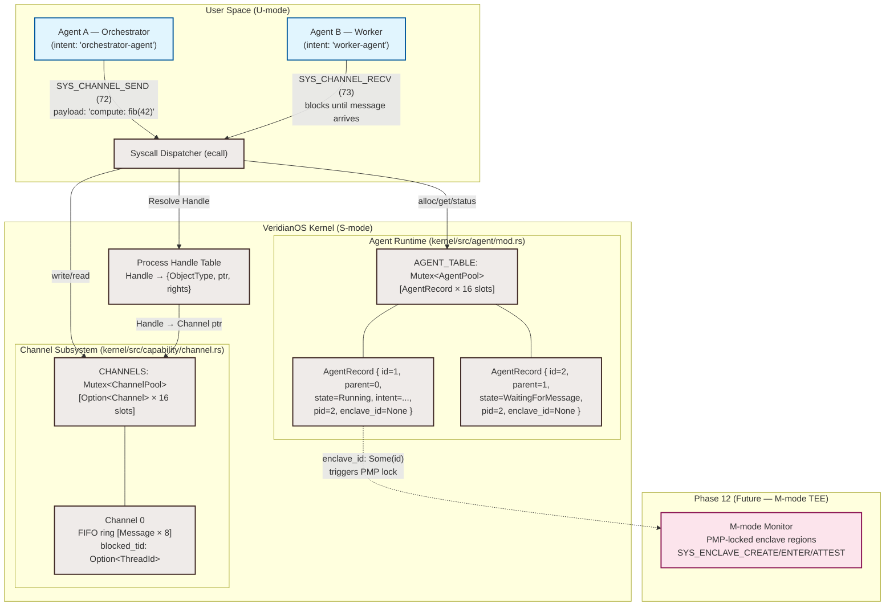

# VeridianOS Phase 9 Design Specification: AI Agent Runtime & Capability-Secured IPC

| Attribute | Specification Details |
| :--- | :--- |
| **Document Version** | 1.0.0 |
| **Status** | Complete |
| **Target Architecture** | RISC-V 64-bit (Sv39 Paging, Supervisor Mode) |
| **Kernel Model** | Capability-Secured Microkernel |
| **Subsystem** | Agent Runtime & Inter-Process Communication |

---

## 1. Executive Summary & Architecture Overview

Modern AI systems deploy many concurrent reasoning processes: planners, tool executors, memory retrievers, and output formatters. In conventional operating systems all of these run either as threads inside a single monolithic process — sharing a flat address space with no isolation — or as heavyweight processes communicating through files and sockets, which introduces both security gaps and latency overheads unsuitable for real-time inference pipelines.

VeridianOS Phase 9 introduces **AI Agents as first-class kernel objects**. Rather than bolting agent semantics onto POSIX primitives, the kernel tracks every agent as an `AgentRecord` with a monotonically allocated `AgentId`, an immutable intent label, a parent chain, a lifecycle state machine, and an optional Phase 12 TEE `enclave_id`. Agents do not share address space by default; they communicate exclusively through capability-secured `Channel` objects managed in the kernel's handle table. A process cannot address another agent's memory by arithmetic — it must present a valid `Handle` carrying the appropriate rights.

This design draws directly from AIOS: LLM Agent Operating System (Mei et al., 2024), which argues that OS-level scheduling and isolation primitives are the correct layer for managing agent concurrency, resource budgets, and fault containment. Phase 9 implements the kernel-side foundation; Phase 12 extends it with hardware-attested TEE enclaves so that sensitive agent state (model weights, private context) can be sealed away from even the kernel itself.

### System Architecture



---

## 2. Design Goals

### 2.1 Isolated Agent Memory via Capabilities

Every agent interaction with kernel state goes through a capability handle. There is no shared global mutable pointer that any agent can call without presenting a handle with sufficient rights. When an agent is spawned, the kernel records its `pid` — the RISC-V process whose page table governs its reachable memory. The agent cannot address another agent's pages by incrementing a pointer; it must obtain a `Channel` handle via `SYS_CHANNEL_CREATE` and then pass messages through the kernel's validated copy path.

This contrasts with thread-based agent frameworks (LangChain workers, Python asyncio tasks) where all "agents" share one heap. In VeridianOS, a bug or compromised tool call in Agent B cannot corrupt Agent A's intent buffer or model context because the kernel enforces address space boundaries enforced at the page-table level, not by software convention.

### 2.2 Non-Blocking Mailbox with Backpressure

Channels are bounded FIFO queues. When `SYS_CHANNEL_SEND` is called and the queue is full, the kernel returns `-EAGAIN` (-11) immediately rather than blocking the sender. This backpressure signal allows the orchestrator to implement flow control without deadlock risk.

On the receiver side, `SYS_CHANNEL_RECV` uses a cooperative blocking mechanism: if no message is available, the kernel records the caller's `ThreadId` in `Channel.blocked_tid` and calls `block_current_thread()`. The scheduler parks the thread and resumes it when the next `SYS_CHANNEL_SEND` writes to the channel and triggers a wakeup. This design avoids busy-waiting on the receiver without requiring a second system call to register a wait condition.

### 2.3 Phase 12 TEE Integration via `enclave_id`

Every `AgentRecord` carries an `enclave_id: Option<u8>` field. When `None`, the agent executes in ordinary S-mode kernel-managed memory, the same trust domain as all other processes. When `Some(id)`, the `id` maps to a hardware TEE enclave created by Phase 12's M-mode monitor via `SYS_ENCLAVE_CREATE` (syscall 120).

The `enclave_id` field is reserved in Phase 9 but its presence in the struct at this phase prevents any future ABI break. Kernel code that checks agent state can already branch on `enclave_id.is_some()` to prepare for attested execution paths; the actual PMP-locking and SHA-256 measurement happen in Phase 12.

---

## 3. Core Abstractions & Rust Implementations

### 3.1 Agent State Machine

```rust
// kernel/src/agent/mod.rs

#[derive(Debug, Clone, Copy, PartialEq, Eq)]
#[repr(u8)]
pub enum AgentState {
    Idle             = 0,  // Spawned but not yet executing
    Running          = 1,  // Actively executing or scheduled
    WaitingForMessage = 2, // Blocked in SYS_CHANNEL_RECV
    Dead             = 3,  // Exited or killed; slot available for reuse
}
```

State transitions follow a strict DAG: `Idle → Running` on spawn, `Running ↔ WaitingForMessage` on channel operations, and `Running → Dead` on exit or `SYS_AGENT_KILL`. Transitions into `Dead` are irreversible; the slot is reclaimed by the next `AgentPool::alloc` call that finds `valid == false`.

### 3.2 AgentRecord Struct

```rust
// kernel/src/agent/mod.rs

pub type AgentId = u32;
pub const AGENT_ID_NULL: AgentId = 0;
pub const MAX_AGENTS:    usize   = 16;
pub const MAX_INTENT_LEN: usize  = 32;

#[derive(Debug, Clone, Copy, PartialEq, Eq)]
#[repr(C)]
pub struct AgentRecord {
    pub id:        AgentId,             // Unique monotonic ID (never reused)
    pub parent_id: AgentId,             // Spawning agent; 0 = kernel root
    pub state:     AgentState,          // Current lifecycle state
    pub intent:    [u8; MAX_INTENT_LEN],// UTF-8 null-padded purpose label
    pub pid:       usize,               // Owning process PID (page table owner)
    pub valid:     bool,                // Pool slot occupancy flag
    /// Phase 12 TEE integration:
    /// Some(id) → agent executes inside M-mode PMP-locked enclave `id`.
    /// None     → ordinary S-mode execution, no hardware attestation.
    pub enclave_id: Option<u8>,
}
```

The `intent` field is a fixed 32-byte label (e.g. `"orchestrator-agent-00000000000000"`, `"worker-agent-000000000000000000"`). It is set at spawn time and never mutated. This label is visible to the kernel for logging, scheduling priority hints, and future Phase 12 attestation measurements.

### 3.3 AgentPool Static Allocator

```rust
// kernel/src/agent/mod.rs

pub struct AgentPool {
    records:  [AgentRecord; MAX_AGENTS],
    next_id:  u32,  // Monotonically increasing; wraps at u32::MAX
}

pub static AGENT_TABLE: Mutex<AgentPool> = Mutex::new(AgentPool::new());

impl AgentPool {
    pub fn alloc(
        &mut self,
        parent_id: AgentId,
        intent: &[u8],
        pid: usize,
    ) -> Result<AgentId, &'static str> {
        for record in self.records.iter_mut() {
            if !record.valid {
                let id = self.next_id;
                self.next_id += 1;
                record.id        = id;
                record.parent_id = parent_id;
                record.state     = AgentState::Running;
                let copy_len = core::cmp::min(intent.len(), MAX_INTENT_LEN);
                record.intent[..copy_len].copy_from_slice(&intent[..copy_len]);
                record.pid       = pid;
                record.valid     = true;
                record.enclave_id = None;
                return Ok(id);
            }
        }
        Err("Agent pool exhausted")
    }
}
```

The pool is a fixed array of 16 slots — no heap allocation in `no_std` kernel space. Linear scan on `alloc` is acceptable at 16 elements; at Phase 12 scale, the pool limit will be raised or a bitmap index added.

### 3.4 Channel: Bidirectional FIFO

Channels are the sole IPC primitive. A channel is a bounded FIFO of `Message` frames. Both send and receive sides access the same channel object; "bidirectional" means the same handle can be used for either direction by separate agents, though the typical pattern is one writer and one reader.

```rust
// kernel/src/capability/channel.rs (representative structure)

pub const MSG_PAYLOAD_SIZE: usize = 512;  // max bytes per message frame
pub const CHANNEL_RING_SIZE: usize = 8;   // max queued messages

#[repr(C)]
#[derive(Clone, Copy)]
pub struct Message {
    pub data: [u8; MSG_PAYLOAD_SIZE],
    pub len:  usize,
}

pub struct Channel {
    pub ring:        [Message; CHANNEL_RING_SIZE],
    pub head:        usize,           // Write index (kernel increments on send)
    pub tail:        usize,           // Read index  (kernel increments on recv)
    pub blocked_tid: Option<usize>,   // Thread parked in SYS_CHANNEL_RECV
}

impl Channel {
    pub fn write(&mut self, payload: &[u8], _sender: Option<AgentId>)
        -> Result<(), &'static str>
    {
        let next_head = (self.head + 1) % CHANNEL_RING_SIZE;
        if next_head == self.tail {
            return Err("channel full"); // caller receives -EAGAIN
        }
        let msg = &mut self.ring[self.head];
        let len = core::cmp::min(payload.len(), MSG_PAYLOAD_SIZE);
        msg.data[..len].copy_from_slice(&payload[..len]);
        msg.len = len;
        self.head = next_head;
        Ok(())
    }

    pub fn read(&mut self) -> Result<Message, &'static str> {
        if self.head == self.tail {
            return Err("channel empty"); // caller blocks
        }
        let msg = self.ring[self.tail];
        self.tail = (self.tail + 1) % CHANNEL_RING_SIZE;
        Ok(msg)
    }
}
```

**Capacity**: 8 messages × 512 bytes = 4 KB maximum in-flight data per channel. This is intentionally small; large data transfers use VMO handles (Phase 7) shared through the channel as serialized handle IDs, not by copying raw bytes.

**Sender encoding**: The user-space convention encodes the sending `AgentId` as 4 little-endian bytes at positions `[60..64]` of a 64-byte message payload. The kernel does not enforce this — it is a userspace protocol visible in `agent_test/src/main.rs`. A future kernel version may stamp a trusted sender field that userspace cannot forge.

---

## 4. Capability-Secured Resource Access

The process interacts with the Agent Runtime exclusively through handles in its `HandleTable`. The isolation flow:

```
[User-Space Agent Process (PID 2)]
       │
       ├─► Handle 0 → ObjectType::Channel    → Kernel Channel slot 0
       │               Rights: READ | WRITE | DUPLICATE
       ├─► Handle 1 → ObjectType::TaskGraph  → NES graph (Phase 7, inherited)
       └─► Handle 4 → ObjectType::DeviceQueue → GPU/NPU queue (Phase 7, inherited)
```

| Action | Required Object Type | Required Rights | Kernel Enforcement |
| :--- | :--- | :--- | :--- |
| **Spawn agent** | — (no handle required; parent_id is advisory) | Caller must be a valid process | `SYS_AGENT_SPAWN` validates intent buffer via `validate_user_buffer` |
| **Create channel** | — (allocates new channel) | Caller must be a valid process | `SYS_CHANNEL_CREATE` checks `owner_agent_id` exists in `AGENT_TABLE` |
| **Send message** | `ObjectType::Channel` | `Rights::WRITE` | `SYS_CHANNEL_SEND` checks handle type and rights before writing to ring |
| **Receive message** | `ObjectType::Channel` | `Rights::READ` | `SYS_CHANNEL_RECV` checks handle type and rights before reading from ring |
| **Query agent state** | — (agent_id is public) | None (read-only status) | `SYS_AGENT_STATUS` validates output pointer via `validate_user_buffer` |

The key security property: a process cannot forge a channel write to an agent it does not hold a `WRITE`-capable handle for, and cannot intercept a channel's messages without a `READ`-capable handle. Handles cannot be fabricated by userspace arithmetic — they are opaque indices into the kernel's `HandleTable`.

---

## 5. System Call Interface Specification

System calls use the standard RISC-V Supervisor Binary Interface:
- **`a7`**: System call number
- **`a0` – `a4`**: Input arguments
- **`a0`**: Return value (≥ 0 for success; negative errno for failure)

```
SYS_AGENT_SPAWN    = 70
SYS_CHANNEL_CREATE = 71
SYS_CHANNEL_SEND   = 72
SYS_CHANNEL_RECV   = 73
SYS_AGENT_STATUS   = 74
```

### 5.1 `SYS_AGENT_SPAWN` (70)

Allocates an `AgentRecord` in the kernel's static `AGENT_TABLE` and returns the new `AgentId`.

| Register | Role | Value |
| :--- | :--- | :--- |
| `a7` | Syscall number | `70` |
| `a0` | `parent_id` | `AgentId` of spawning agent (0 = kernel root) |
| `a1` | `intent_ptr` | User-space pointer to UTF-8 intent string |
| `a2` | `intent_len` | Byte length (max `MAX_INTENT_LEN` = 32) |

**C-style signature**:
```c
int32_t sys_agent_spawn(uint32_t parent_id,
                        const char* intent,
                        size_t intent_len);
```

**Return values**:
- Success: new `AgentId` (1 ≤ id ≤ 2³²−2)
- `-EFAULT` (-14): `intent_ptr` is null, zero-length, or outside process address space
- `-ENOMEM` (-12): all 16 `AgentPool` slots are occupied
- `-EINVAL` (-22): `intent_len` is 0

**Implementation notes**: The kernel copies `intent` bytes into the fixed `[u8; 32]` field with `copy_nonoverlapping`. The intent is null-padded if shorter than 32 bytes and silently truncated if longer. The new record starts in `AgentState::Running`.

---

### 5.2 `SYS_CHANNEL_CREATE` (71)

Allocates a new `Channel` in the kernel's `CHANNELS` pool and returns a `Handle` ID pointing to it with `READ | WRITE | DUPLICATE` rights.

| Register | Role | Value |
| :--- | :--- | :--- |
| `a7` | Syscall number | `71` |
| `a0` | `owner_agent_id` | `AgentId` that logically owns this channel (0 = anonymous) |

**C-style signature**:
```c
int sys_channel_create(uint32_t owner_agent_id);
```

**Return values**:
- Success: Handle ID (0 ≤ id < 64) registered in the calling process's `HandleTable`
- `-EINVAL` (-22): `owner_agent_id` ≠ 0 and not found in `AGENT_TABLE`
- `-ENOMEM` (-12): channel pool or handle table is full
- `-EPERM` (-3): called outside a valid process context

---

### 5.3 `SYS_CHANNEL_SEND` (72)

Copies a payload from user space into the channel's ring buffer. Returns immediately; does not block.

| Register | Role | Value |
| :--- | :--- | :--- |
| `a7` | Syscall number | `72` |
| `a0` | `channel_handle_id` | Handle ID for the target channel |
| `a1` | `payload_ptr` | User-space pointer to payload bytes |
| `a2` | `payload_len` | Byte count (max 512) |

**C-style signature**:
```c
int sys_channel_send(size_t channel_handle_id,
                     const void* payload,
                     size_t payload_len);
```

**Return values**:
- Success: `0`
- `-EINVAL` (-22): `payload_ptr` is null or `payload_len` > 512
- `-EFAULT` (-14): payload buffer outside process address space
- `-EBADF` (-9): handle does not exist or is not `ObjectType::Channel`
- `-EACCES` (-13): handle lacks `Rights::WRITE`
- `-EAGAIN` (-11): channel ring buffer is full (backpressure signal)

**Kernel steps**:
1. Validate `payload_ptr` via `validate_user_buffer`
2. Copy payload into a stack buffer
3. Resolve `channel_handle_id` through the process `HandleTable`
4. Verify `object_type == Channel` and `rights ∋ WRITE`
5. Call `channel.write(payload_slice, None)`
6. If `channel.blocked_tid.is_some()`, wake the blocked receiver thread

---

### 5.4 `SYS_CHANNEL_RECV` (73)

Reads one message from the channel ring buffer into a user-space output buffer. Blocks if the channel is empty, parking the calling thread until a message arrives.

| Register | Role | Value |
| :--- | :--- | :--- |
| `a7` | Syscall number | `73` |
| `a0` | `channel_handle_id` | Handle ID for the source channel |
| `a1` | `out_buf_ptr` | User-space pointer to receive buffer |
| `a2` | `out_len_ptr` | User-space pointer to `usize` that receives the message length |

**C-style signature**:
```c
int32_t sys_channel_recv(size_t channel_handle_id,
                         void*  out_buf,
                         size_t* out_len);
```

**Return values**:
- Success: `AgentId` decoded from the last 4 bytes of the message payload (sender convention)
- `-EFAULT` (-14): `out_buf_ptr` or `out_len_ptr` is null or invalid
- `-EBADF` (-9): handle does not exist or is not `ObjectType::Channel`
- `-EACCES` (-13): handle lacks `Rights::READ`

**Blocking behavior**: When the ring is empty, the kernel records `channel.blocked_tid = Some(current_tid)`, disables supervisor interrupts to prevent a lost-wakeup race, drops the channel pool lock, and calls `block_current_thread()`. The thread resumes when `SYS_CHANNEL_SEND` writes a message and calls the wakeup path.

---

### 5.5 `SYS_AGENT_STATUS` (74)

Reads the current `AgentState` (as a `u8`) into a user-space output byte.

| Register | Role | Value |
| :--- | :--- | :--- |
| `a7` | Syscall number | `74` |
| `a0` | `agent_id` | Target `AgentId` to query |
| `a1` | `out_state_ptr` | User-space pointer to `u8` output |

**C-style signature**:
```c
int sys_agent_status(uint32_t agent_id, uint8_t* out_state);
```

**Return values**:
- Success: `0` (state written to `*out_state`)
- `-EFAULT` (-14): `out_state_ptr` is null or outside process address space
- `-EINVAL` (-22): `agent_id` not found in `AGENT_TABLE`

**State encoding** (`AgentState as u8`):

| Value | State | Meaning |
| :--- | :--- | :--- |
| `0` | `Idle` | Spawned, not yet scheduled |
| `1` | `Running` | Active or scheduled |
| `2` | `WaitingForMessage` | Blocked in `SYS_CHANNEL_RECV` |
| `3` | `Dead` | Exited; slot available for reclaim |

---

## 6. Phase 12 TEE Integration Path

The `enclave_id: Option<u8>` field in `AgentRecord` is the bridge between Phase 9 and Phase 12's hardware-attested execution model. The integration works as follows:

**When `enclave_id == None`** (all Phase 9 agents):
The agent executes in S-mode kernel-managed memory. Its intent, channel buffers, and any VMO-backed tensors are visible to the kernel. This is the default trust model appropriate for agents processing non-sensitive data.

**When `enclave_id == Some(id)`** (Phase 12 agents):
1. Before spawn, the orchestrator calls `SYS_ENCLAVE_CREATE` (120) with a NAPOT-aligned physical region. The M-mode monitor installs a PMP entry locking that region to U-mode only.
2. The `AgentRecord.enclave_id` is set to the returned `u8` enclave identifier.
3. The agent's entry point runs inside the PMP-locked region via `SYS_ENCLAVE_ENTER` (121). The kernel cannot read the enclave's memory while it executes.
4. `SYS_ENCLAVE_ATTEST` (123) returns a 73-byte attestation report: `[enclave_id(1) | phys_start(8) | size(8) | sha256(32) | hmac(24)]`.
5. Channel sends from an enclave agent carry the `enclave_id` as a provenance tag, allowing receivers to verify the source is attested.

The Phase 9 kernel already allocates the `enclave_id` slot to avoid a struct layout change at Phase 12. Any code path that checks `agent.enclave_id.is_some()` is a no-op in Phase 9 (all `None`), but the branch will be activated without an ABI break.

---

## 7. Verification: Expected UART Output from `agent_test`

The `user_programs/agent_test/src/main.rs` program exercises the complete Phase 9 lifecycle. The following UART trace is the expected output on a successful run under QEMU `virt`:

```
[USER] VeridianOS Phase 9 Agent Runtime Verification
[USER] =============================================
[AGENT] Agent Runtime initialized. Max agents: 16, Max channels: 16
[AGENT] Syscalls registered: SYS_AGENT_SPAWN(70)..SYS_AGENT_STATUS(74)
[USER] Agent A (orchestrator) spawned successfully.
[AGENT] Spawned agent 1 with parent 0
[USER] Agent B (worker) spawned successfully.
[AGENT] Spawned agent 2 with parent 1
[USER] IPC channel created successfully.
[AGENT] Created channel 0 owned by agent 1
[USER] Task message sent via IPC channel successfully.
[USER] Task message received from IPC channel successfully.
[USER] IPC message content verified: 'compute: fib(42)' intact.
[USER] Sender agent ID verified in message payload.
[USER] Agent A status queried successfully.
[USER] Agent B status (child of A) queried successfully.
[USER] =============================================
[USER] Agent Runtime Verification SUCCESS!
[USER] Phase 9 Complete: Agents, Channels, IPC all working!
```

**Verification checkpoints**:

| Step | What is verified | Pass condition |
| :--- | :--- | :--- |
| Agent A spawn | `SYS_AGENT_SPAWN(0, intent_a, 32)` | Returns `AgentId = 1` |
| Agent B spawn | `SYS_AGENT_SPAWN(1, intent_b, 31)` | Returns `AgentId = 2` |
| Channel create | `SYS_CHANNEL_CREATE(1)` | Returns Handle ID ≥ 0 |
| Send | `SYS_CHANNEL_SEND(ch, msg, 64)` | Returns `0` |
| Recv | `SYS_CHANNEL_RECV(ch, buf, &len)` | Returns sender `AgentId = 1` |
| Content verify | `buf[0..16] == b"compute: fib(42)"` | Byte-for-byte match |
| Sender verify | `u32::from_le_bytes(buf[60..64]) == 1` | Integer equality |
| Status A | `SYS_AGENT_STATUS(1, &state)` | Returns `0`, `state != 255` |
| Status B | `SYS_AGENT_STATUS(2, &state)` | Returns `0`, `state != 255` |

---

## 8. Academic References

| Source | Year | Relevance |
| :--- | :--- | :--- |
| *AIOS: LLM Agent Operating System* (Mei et al.) | arXiv 2024 | Motivates OS-level agent scheduling and isolation as the correct abstraction layer |
| *Zircon Kernel Objects* (Fuchsia project) | 2018+ | Handle-table and channel IPC design patterns |
| *seL4 Formal Verification* (Klein et al.) | SOSP 2009 | Capability security proofs for microkernel isolation |
| *RISC-V SBI Specification* | 2022 | `ecall` register conventions, M-mode/S-mode separation |
| *Keystone: A Framework for Architecting TEEs* (Lee et al.) | EuroSys 2020 | PMP-based enclave isolation; basis for Phase 12 design |
